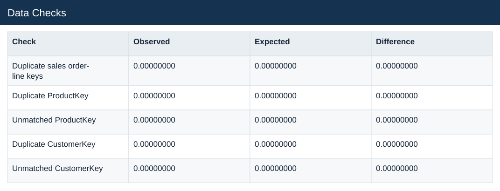
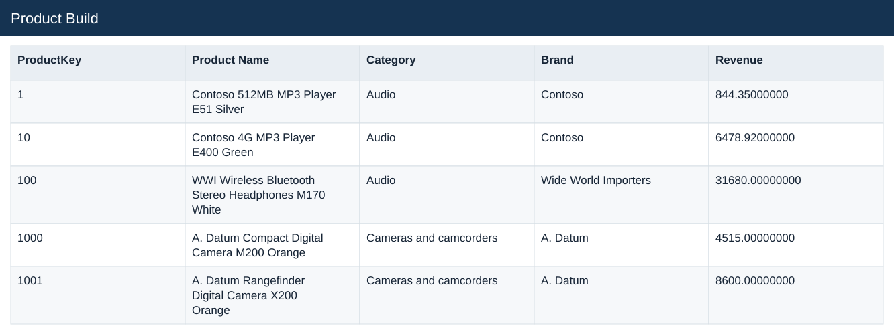
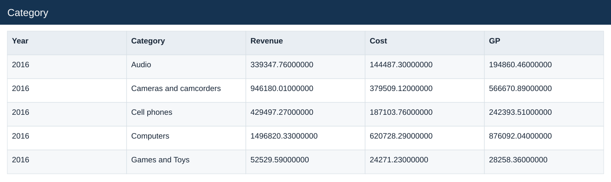
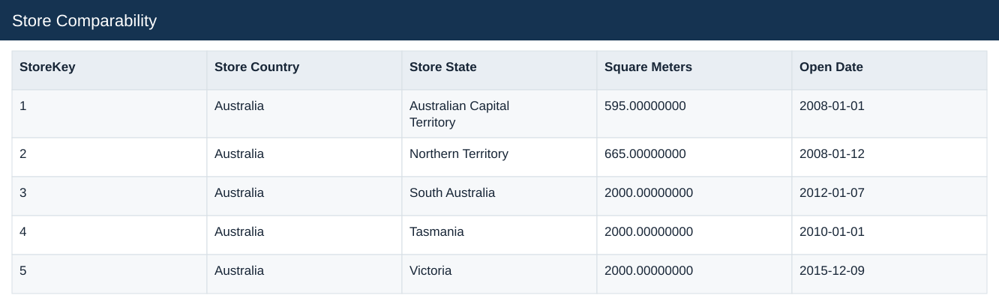
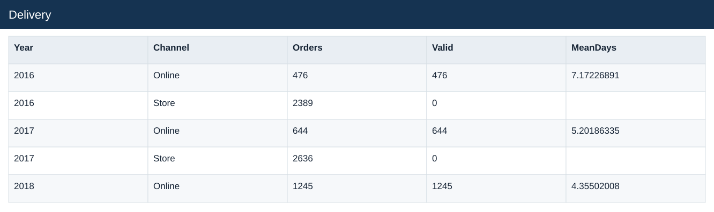
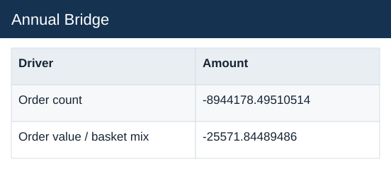
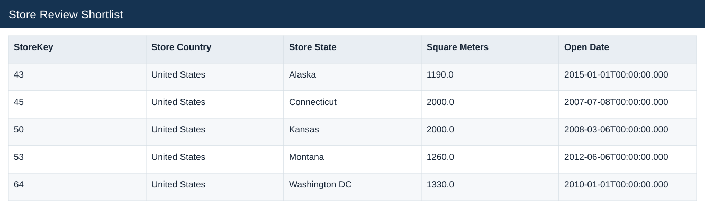
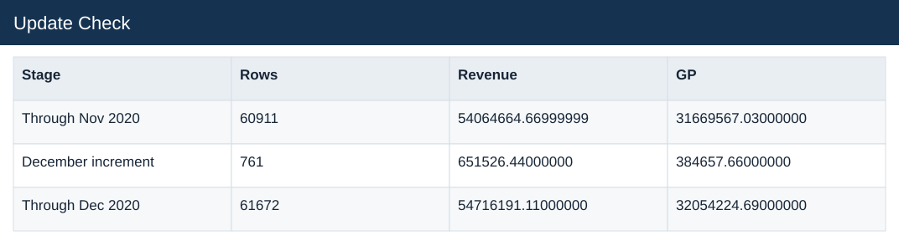

# Global Electronics: Retail Performance

[← Portfolio](https://github.com/HoiChen-bayes/finance-powerbi-portfolio) · [Source Data](raw_data/README.md) · [Analysis Outputs](processed_data/README.md)

## Dataset overview

- 62,884 sales lines and 26,326 distinct orders, January 2016–February 2021.
- Sales linked to customer, product and store dimensions, plus exchange rates.
- Static USD product prices and costs support estimated revenue and gross profit.
- The main annual comparison is 2020 versus 2019; 2021 is incomplete.

[Explore source tables, real data excerpts and field formats →](raw_data/README.md)

## Analysis questions

- Sales and order drivers
- Product and store contribution
- Strict same-store comparison
- Repeat-purchase cohorts
- Delivery performance
- Management review

## Analysis data and outputs

[Explore the processed tables, worksheet contents and calculation evidence →](processed_data/README.md)

The output guide separates Analysis data, calculation workbooks and analytical outputs. Each illustrated file page explains its purpose and fields.

## Visualisation

[Open the interactive Dashboard](https://app.powerbi.com/view?r=eyJrIjoiMjY0ZTExNjctN2RmZC00ZjY5LTk0ODEtMmJhZjQ5ZmQ0YTk2IiwidCI6IjljNzNiMWYxLWY0ZGYtNDhkYy05ZDg5LWE0M2NjNjQ4YmJhNSJ9&language=en-US) — no sign-in or dataset download required. Select a page and use its filters to explore the analysis.

[Download Power BI file](report.pbix)

## Results and evidence

### E1 — Do the tables join correctly?

**Result.** All 62,884 sales lines and quantities are preserved; dimension keys are unique with no unmatched sales keys.

**How and why.** Validate keys and joins, then compare row and quantity totals before and after preparation.

[View the data](processed_data/field_guides/85d1f2d278.md)

View the supporting data excerpt

### E2 — What revenue and gross profit can be estimated?

**Result.** Full-period estimated sales are $55.755M and gross profit $32.663M across 197,757 units.

**How and why.** Multiply quantities by static product prices and costs; deduct estimated cost from estimated sales.

[View the data](processed_data/field_guides/70e6712348.md)

View the supporting data excerpt

### E3 — Are orders or basket values driving the decline?

**Result.** 2020 orders fall from 9,083 to 4,635 (about 49.0%); average estimated order value falls only 0.27%.

**How and why.** Count distinct orders, then divide revenue by order count and compare channel totals.

[View the data](processed_data/field_guides/8a20bf94e0.md)

View the supporting data excerpt

### E4 — Which category and store contributions stand out?

**Result.** Computers lose about $3.293M sales versus 2019, the largest category decline. Kansas Store 50 has the highest 2020 physical-store estimated gross profit, about $179K.

**How and why.** Aggregate by product category and store while retaining separate customer and store geography.

[View the data](processed_data/field_guides/bd58016c24.md)

View the supporting data excerpt

### E5 — Does the decline remain on a same-store basis?

**Result.** The strict 11-store cohort declines 44.0%, from $4.315M to $2.415M; it covers only 30.1% of 2019 physical-store sales.

**How and why.** Require the stated opening and monthly coverage criteria before comparing the same stores.

[View the data](processed_data/field_guides/37f4b0f1fe.md)

View the supporting data excerpt

### E6 — How many customers return within 90 days?

**Result.** 1,078 of 11,745 eligible customers return: 9.18%. There are 11,887 observed buyers overall.

**How and why.** Identify each first order and allow a full 90-day observation window before counting a second order.

[View the data](processed_data/field_guides/d7d3dc200c.md)

View the supporting data excerpt

### E7 — What can delivery dates establish?

**Result.** All 5,580 online orders have delivery dates; all 20,746 store orders lack them. Online mean delivery falls from about 7.17 days in 2016 to 4.03 days in 2020.

**How and why.** Measure valid online order-to-delivery intervals. Do not treat missing store delivery dates as zero days.

[View the data](processed_data/field_guides/22d6390870.md)

View the supporting data excerpt

### E8 — What reconciles the annual sales fall?

**Result.** Sales fall by about $8.970M: approximately $8.944M from order volume and $0.026M from order-value/basket effects.

**How and why.** Bridge orders at prior average order value, then current orders at the change in average order value. The arithmetic explains the movement, not its external cause.

[View the data](processed_data/field_guides/e49f3d39f6.md)

View the supporting data excerpt

### E9 — Which stores warrant management review?

**Result.** Kansas 50 and Connecticut 45 combine material gross profit with sales declines. Alaska 43 needs a coverage check first.

**How and why.** Rank comparable-store evidence and distinguish gross profit from store net profit; rent, payroll and investment data are absent.

[View the data](processed_data/field_guides/4a0c26a3d3.md)

View the supporting data excerpt

### E10 — Does the update reproduce the complete totals?

**Result.** Restoring the held-out December batch reproduces the full 2020 row, quantity and estimated-sales totals.

**How and why.** Validate required fields and order-line keys, then reconcile the updated data with the complete-period benchmark.

[View the data](processed_data/field_guides/04b98f329e.md)

View the supporting data excerpt

## Source and measurement notes

**Period:** January 2016–February 2021; executive focus on 2020 versus 2019.  
**Scope:** 62,884 sales lines and 26,326 orders, linked to product, store and customer dimensions.  
**Source:** [Maven Analytics — Global Electronics Retailer](https://mavenanalytics.io/data-playground/global-electronics-retailer) · [Downloaded data mirror](https://github.com/DimitriKneur/Global-Electronics-Retailer-Analysis/tree/main/0_Data_Sources).

Fictional retailer supplied for practice. Sales and gross profit are estimates based on static product prices and costs, not transaction-level realised prices. KPI goals use prior-year benchmarks, not a source budget. 2021 is partial; the project does not attribute the decline to an unobserved business cause.

