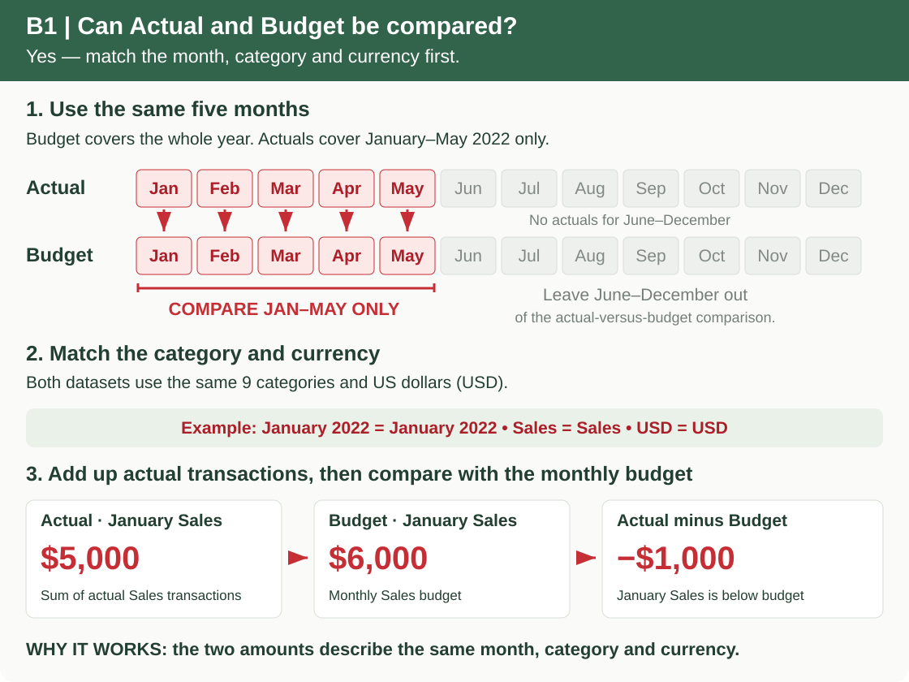
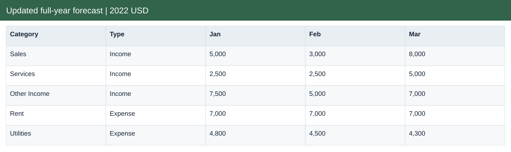

# Pets & More: Budget, Forecast & Cash

[← Portfolio](https://github.com/HoiChen-bayes/finance-powerbi-portfolio) · [Source Data](raw_data/README.md) · [Analysis Outputs](processed_data/README.md)

## Dataset overview

- 55 actual income and expense records, January–May 2022.
- 108 monthly budget records across nine categories, January–December 2022.
- Dates, categories, descriptions and amounts in USD.

[Explore source tables, real data excerpts and field formats →](raw_data/README.md)

## Analysis questions

Click a question to jump to its answer and evidence.

| Analysis area | Questions |
|---|---|
| Prepare a fair comparison | [B1 — Can actuals and budget be compared?](#b1) |
| Monthly performance | [B2 — Which months generated a surplus?](#b2) [B3 — How did May perform against budget?](#b3) |
| Explain the budget gap | [B4 — What deserves immediate review?](#b4) [B5 — What explains the YTD gap?](#b5) |
| Forecast and recovery | [B6 — What is the revised full-year result?](#b6) [B7 — Which recovery scenario improves the model most?](#b7) |
| Close and management review | [B8 — What should be checked before close?](#b8) [B9 — What should the business review focus on?](#b9) |
| Cash and funding | [B10 — When could funding be needed?](#b10) |

## Analysis data and outputs

[Explore the processed tables, worksheet contents and calculation evidence →](processed_data/README.md)

The output guide separates Analysis data, calculation workbooks and analytical outputs. Each illustrated file page explains its purpose and fields.

## Visualisation

[Open the interactive Dashboard](https://app.powerbi.com/view?r=eyJrIjoiZDUxM2MxNDYtMzZhMy00ZDhlLTkzZjQtMGRiYTRlNDMxYjUxIiwidCI6IjljNzNiMWYxLWY0ZGYtNDhkYy05ZDg5LWE0M2NjNjQ4YmJhNSJ9&language=en-US) — no sign-in or dataset download required. Select a page and use its filters to explore the analysis.

[Download Power BI file](report.pbix)

## Results and evidence

### B1 — Can actuals and budget be compared?

**Yes — compare January–May 2022 by month and category, in USD.** The budget includes those same five months. Both datasets use the same nine income and expense categories.

**What to do.** Take January–May from the budget. Add up the actual transactions for each month and category, then place each total beside its matching budget. Leave June–December out of this comparison.

**Example.** January Sales actuals total **$5,000**, against a January Sales budget of **$6,000**: **$1,000 below budget**. These amounts are comparable because the month, category and currency match. The two files do not need the same number of records.

[See the matching data and how the January example was calculated](processed_data/field_guides/4710152f65.md)

### B2 — Which months generated a surplus?

**Result.** March is the only positive month, at $1,700; YTD income less expenses is ($15,934).

**How and why.** Sum income and expense categories separately for each month, then subtract expenses from income.

[View the data](processed_data/field_guides/6b09eb26ef.md)

View the supporting data excerpt

### B3 — How did May perform against budget?

**Result.** May income was $1,200 below budget and expenses $811 below budget, leaving a $389 unfavourable net variance.

**How and why.** Compare May with May. Reverse expense variances when calculating their contribution to the net result.

[View the data](processed_data/field_guides/6c9b7e1dbb.md)

View the supporting data excerpt

### B4 — What deserves immediate review?

**Result.** May Sales is $3,000 below plan, Transport is $900 above plan, and Other Expenses is $1,680 below plan.

**How and why.** Rank material dollar gaps, inspect transaction descriptions and identify evidence needed to distinguish timing from operational changes.

[View the data](processed_data/field_guides/4e494bbe31.md)

View the supporting data excerpt

### B5 — What explains the YTD gap?

**Result.** The YTD result is $3,734 worse than budget. Sales and Other Income contribute $4,400 and $4,700 of downside, partly offset by $7,470 lower Other Expenses.

**How and why.** Sum January–May actuals and matching budgets by category; reconcile signed contributions to the total net gap.

[View the data](processed_data/field_guides/4f1a41b2e5.md)

View the supporting data excerpt

### B6 — What is the revised full-year result?

**Result.** The base forecast is ($11,468.33), an improvement of $2,731.67 versus the original ($14,200) budget.

**How and why.** Keep January–May actuals and add June–December estimates using the documented category assumptions.

[View the data](processed_data/field_guides/340f921e89.md)

View the supporting data excerpt

### B7 — Which recovery scenario improves the model most?

**Result.** Service recovery improves the result by $2,250; the cost-control scenario improves it by $4,389. All three scenarios remain in deficit.

**How and why.** Change only future-period drivers. Compare each evaluated case with the same base; the workbook comparison is a saved scenario snapshot.

[View the data](processed_data/field_guides/4a0dce2d95.md)

View the supporting data excerpt

### B8 — What should be checked before close?

**Result.** Two identical $300 insurance entries and potential timing/completeness issues are flagged; no unsupported correction is posted.

**How and why.** Compare record attributes and request invoices, ledger balances and accrual evidence. A duplicate-looking record is not proof of duplicate accounting.

[View the data](processed_data/field_guides/bb44cca228.md)

View the supporting data excerpt

### B9 — What should the business review focus on?

**Result.** The review prioritises Sales, Transport and Other Expenses and links them to the full-year forecast.

**How and why.** Combine monthly and YTD evidence with a specific question, proposed owner role and next step; no meeting outcome is invented.

[View the data](processed_data/field_guides/1a4d21dfdf.md)

View the supporting data excerpt

### B10 — When could funding be needed?

**Result.** The illustrative model needs $1,121.67 in October to maintain a $5,000 cash floor.

**How and why.** Roll opening cash plus modelled collections less payments, tax and capex. This depends on the stated opening cash and collection assumptions.

[View the data](processed_data/field_guides/bd66ba59ac.md)

View the supporting data excerpt

## Source and measurement notes

**Period:** January–May 2022 actuals; January–December 2022 budget.  
**Scope:** 55 actual records and 108 monthly category budgets.  
**Source:** [Arnav Chaturvedi — Budget vs Actuals model](https://github.com/arnavchaturvedi17/FinancialAnalysis-Variance-Model-Simple-Budget-vs-Actuals-).

Public practice model; the company identity and operational history are not independently verified. May is treated as complete for the exercise. Forecasts, cash timing and funding assumptions are illustrative. Close checks and review questions are preparation work, not an audit or completed business meeting.

