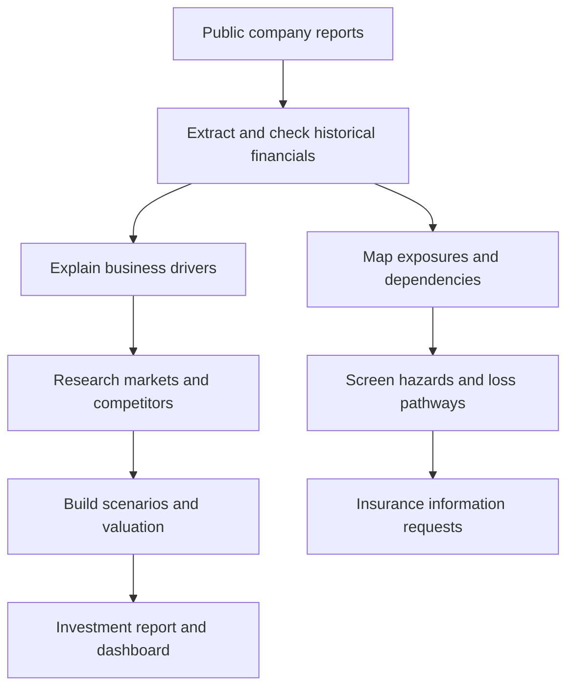

# P&G External Financial Analysis

- **Goal:** Use public information to assess P&G from an investment perspective and an insurance risk-screening perspective.
- **Start here:** [1. Financial statements, revenue drivers and margins](investment/01_financial_statements.md).
- **Completed:** Three-statement extraction and checks, revenue drivers, segment contribution and margin analysis; seven questions with original-report and Excel evidence.
- **Files:** [Original data](raw_data/README.md) · [Analysis outputs](processed_data/README.md) · [Agents](agents/README.md).

## Two perspectives

| Module | Decision it supports | Current stage |
|---|---|---|
| Investment analysis | Earnings quality, cash generation and valuation for a CIO or investment committee. | Historical statements and business-driver analysis completed. |
| Insurance risk screening | Publicly visible exposures, disruption paths and information requests for a CUO or CRO. | Planned. |

## Project sequence

This stage analyses reported results. Forecasts, valuation and insurance scenarios are later stages. Insurance work will identify exposures and missing underwriting information; it will not produce a premium quote from public data.
