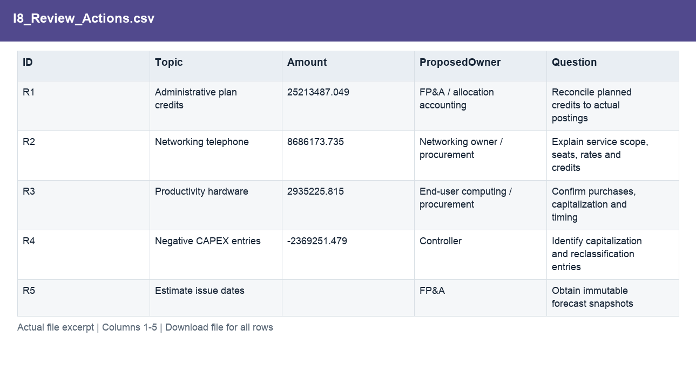

# IT Finance: Cost Control & Forecast Review

[← Portfolio](https://github.com/HoiChen-bayes/finance-powerbi-portfolio) · [Source Data](raw_data/README.md) · [Analysis Outputs](processed_data/README.md)

## Dataset overview

- 166,216 model fact records for January–December 2014.
- Actual, Plan, LE1, LE2 and LE3 scenarios, linked to cost and organisational dimensions.
- Original Excel facts are stored in Power Pivot; the Info sheet is attribution.
- Amounts follow the sample reporting scale: source Value × 0.3.

[Explore source tables, real data excerpts and field formats →](raw_data/README.md)

## Analysis questions

- Actual versus Plan
- Cost-driver investigation
- Estimate-version diagnostics
- Monthly variance patterns
- Cost-action scenarios
- Rolling outlook

## Prepared data and outputs

[Explore the processed tables, worksheet contents and calculation evidence →](processed_data/README.md)

The output guide separates prepared inputs, calculation workbooks and analytical outputs. Each illustrated file page explains its purpose and fields.

## Visualisation

[Open the interactive Dashboard](https://app.powerbi.com/view?r=eyJrIjoiOTMyMjlmZDAtODE2YS00Njc5LTlhMTktMjZhOTFhZDliYmFhIiwidCI6IjljNzNiMWYxLWY0ZGYtNDhkYy05ZDg5LWE0M2NjNjQ4YmJhNSJ9&language=en-US) — no sign-in or dataset download required. Select a page and use its filters to explore the analysis.

[Download Power BI file](report.pbix)

## Results and evidence

### I1 — Are the source models consistent?

**Result.** 166,216 fact rows reconcile across the source models; 12 preparation checks show zero differences.

**How and why.** Compare rows and amounts at the natural key and validate dimension joins; retain negative and zero values.

[Inspect the supporting file and field definitions](processed_data/field_guides/a9c25443d1.md)

View the supporting data excerpt

### I2 — How much was spent?

**Result.** Actual spend is $257.53M versus $243.29M plan: $14.24M or 5.85% over plan.

**How and why.** Aggregate monthly source amounts separately by scenario; do not sum cumulative YTD measures across months.

[Inspect the supporting file and field definitions](processed_data/field_guides/50d6143c52.md)

View the supporting data excerpt

### I3 — Which area explains the gap?

**Result.** Infrastructure is $24.32M above plan. Administrative contains a planned credit of about $25.21M with no Actual records.

**How and why.** Compare the same scope across cost and IT-area dimensions; investigate missing credits or mapping before labelling them additional spending.

[Inspect the supporting file and field definitions](processed_data/field_guides/c167c79dbf.md)

View the supporting data excerpt

### I4 — Can the drivers be traced further?

**Result.** Telephone contributes +$8.69M and Computer Hardware +$2.94M; Telecom partly offsets Telephone by about $6.04M.

**How and why.** Filter the hierarchy and reconcile department, country and month contributions back to each parent driver.

[Inspect the supporting file and field definitions](processed_data/field_guides/061ba80852.md)

View the supporting data excerpt

### I5 — How do the latest estimates differ?

**Result.** LE1 totals $242.83M, LE2 $257.37M and LE3 $260.09M, compared with $243.29M plan.

**How and why.** Sum each version over the same year, then calculate its revision versus Plan and its gap to Actual.

[Inspect the supporting file and field definitions](processed_data/field_guides/8bcf1c0244.md)

View the supporting data excerpt

### I6 — Does LE2 prove better forecast accuracy?

**Result.** No. LE2 matches Actual in eight months and LE3 in six; issue dates and frozen historical versions are absent.

**How and why.** Inspect month-level overlap and absolute errors. Annual closeness alone cannot distinguish forecasting from actualisation.

[Inspect the supporting file and field definitions](processed_data/field_guides/8bcf1c0244.md)

View the supporting data excerpt

### I7 — Is the gap persistent across months?

**Result.** Infrastructure is above plan in 11 of 12 months; January is the only favourable month.

**How and why.** Compare monthly and cumulative variances. Persistence is observable, but its operational cause still requires evidence.

[Inspect the supporting file and field definitions](processed_data/field_guides/f8a92ddc76.md)

View the supporting data excerpt

### I8 — What should budget owners review?

**Result.** Seven targeted evidence requests cover credits, telephone costs, hardware, CAPEX, estimate dates, commitments and contract constraints.

**How and why.** Turn each material exception into a question and evidence request; proposed owners are roles, not completed assignments.

[Inspect the supporting file and field definitions](processed_data/field_guides/72a5b13ff4.md)

View the supporting data excerpt

### I9 — How much could the proposed action save?

**Result.** The illustrative telephone action yields $38,807.72 gross benefit and $13,807.72 after a $25,000 one-off cost.

**How and why.** Apply a 10% reduction to a 25% eligible share from November onward. Do not equate total overspend with achievable savings.

[Inspect the supporting file and field definitions](processed_data/field_guides/c167c79dbf.md)

View the supporting data excerpt

### I10 — What does the updated outlook show?

**Result.** The no-action outlook is about $254.31M; the proposal produces $254.292M, still $11.006M above plan.

**How and why.** Combine January–September actuals with October–December LE3, then adjust remaining months for gross benefit and implementation cost.

[Inspect the supporting file and field definitions](processed_data/field_guides/801098a6d9.md)

View the supporting data excerpt

## Source and measurement notes

**Period:** January–December 2014.  
**Scope:** 166,216 fact records across Actual, Plan and three latest estimates.  
**Source:** [Microsoft / obviEnce — IT Spend Analysis sample](https://learn.microsoft.com/en-us/power-bi/create-reports/sample-it-spend).

An anonymised obviEnce business sample distributed by Microsoft, not Microsoft’s own IT budget. Amounts use the original reporting scale (raw value × 0.3); $ denotes sample reporting dollars rather than a verified ISO currency. Cost actions are proposals, not realised savings.

