# Commercial Finance: Growth, Margin & FP&A

[← Portfolio](https://github.com/hoichengit/Portfolio-Guide) · [Source Data](raw_data/README.md) · [Analysis Outputs](processed_data/README.md)

## Dataset overview

- 700 monthly records covering September 2013–December 2014.
- Six products, five countries and five market segments.
- Units, gross sales, discounts, net sales, COGS and sample profit.
- Planning and close models are separately labelled extensions to the source sample.

[Explore source tables, real data excerpts and field formats →](raw_data/README.md)

## Analysis questions

Click a question to jump to its answer and evidence.

| Analysis area | Questions |
|---|---|
| Sales and profitability | [1 — Do the revenue and profit fields reconcile?](#f1) [2 — What is overall performance?](#f2) [3 — Which products and segments matter most?](#f3) [4 — Where is discount quality weak?](#f4) |
| Growth and pricing | [5 — How much did comparable sales grow?](#f5) [6 — What explains that growth?](#f6) [7 — Could a discount change improve profit?](#f7) |
| Commercial review | [8 — What should the quarterly review highlight?](#f8) [9 — What should commercial managers prioritise?](#f9) |
| Monthly updates | [10 — Can monthly input be refreshed without duplication?](#f10) [18 — Can an approved data version be preserved?](#f18) |
| Forecast and decisions | [11 — Which forecast baseline performs best?](#f11) [12 — How does the scenario become a decision proposal?](#f12) [15 — Why did the Q4 forecast change?](#f15) |
| Present and repeat the analysis | [13 — How is the work presented for review?](#f13) [14 — How can the analysis be reproduced as practice?](#f14) |
| Cash and month-end close | [16 — Can positive profit coexist with a funding gap?](#f16) [17 — How do close adjustments affect the accounts?](#f17) |

## Analysis data and outputs

[Explore the processed tables, worksheet contents and calculation evidence →](processed_data/README.md)

The output guide separates Analysis data, calculation workbooks and analytical outputs. Each illustrated file page explains its purpose and fields.

## Visualisation

[Open the interactive Dashboard](https://app.powerbi.com/view?r=eyJrIjoiZDcyNmZhMDItYWY0Yy00MDQ4LTgwNDktNzYxNDAxZmRkYzNjIiwidCI6IjljNzNiMWYxLWY0ZGYtNDhkYy05ZDg5LWE0M2NjNjQ4YmJhNSJ9&language=en-US) — no sign-in or dataset download required. Select a page and use its filters to explore the analysis.

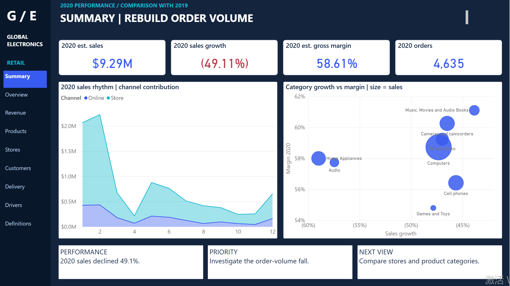

[Download Power BI file](report.pbix)

## Results and evidence

### 1 — Do the revenue and profit fields reconcile?

**Result.** All 700 records reconcile within $0.01 across the gross sales, net sales and sample profit checks.

**How and why.** Compare units × sale price with gross sales, deduct discounts, then deduct COGS; retain fractional units.

View evidence

[View the data](processed_data/field_guides/1bc15fbc8d.md)

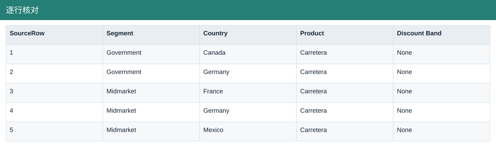

### 2 — What is overall performance?

**Result.** Net sales are $118.73M and sample profit $16.89M, giving a 14.23% margin.

**How and why.** Sum monetary fields by month and calculate margin from total profit divided by total sales.

View evidence

[View the data](processed_data/field_guides/8bdc1bd1cc.md)

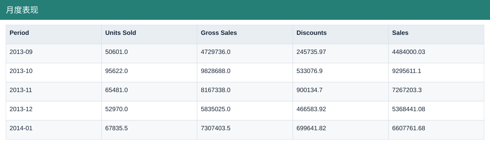

### 3 — Which products and segments matter most?

**Result.** Paseo leads product sales. Government contributes about 67.4% of sample profit; Enterprise loses about $0.615M.

**How and why.** Compare scale, profit contribution and weighted margin by product, country and segment.

View evidence

[View the data](processed_data/field_guides/a0944d798a.md)

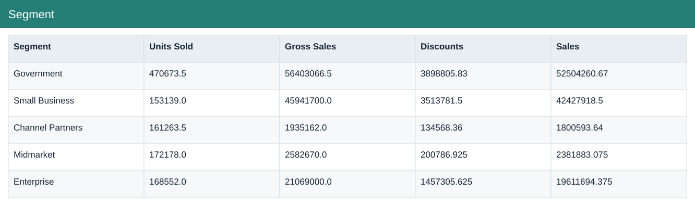

### 4 — Where is discount quality weak?

**Result.** 58 loss-making records total about ($0.78M); the High discount band has about 9.1% margin versus 21.9% for None.

**How and why.** Aggregate by discount band and inspect negative-profit records; this association does not prove a discount-only cause.

View evidence

[View the data](processed_data/field_guides/00a5999f80.md)

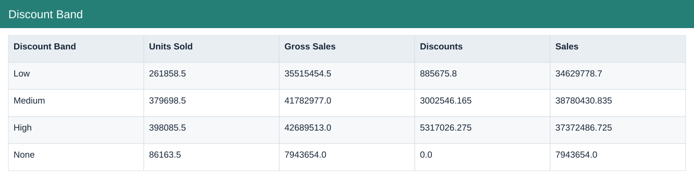

### 5 — How much did comparable sales grow?

**Result.** September–December sales rose from $26.42M to $36.16M, up $9.74M or 36.9%.

**How and why.** Compare the same four months in both years and classify matched, new-coverage and lost-coverage combinations.

View evidence

[View the data](processed_data/field_guides/989d798a35.md)

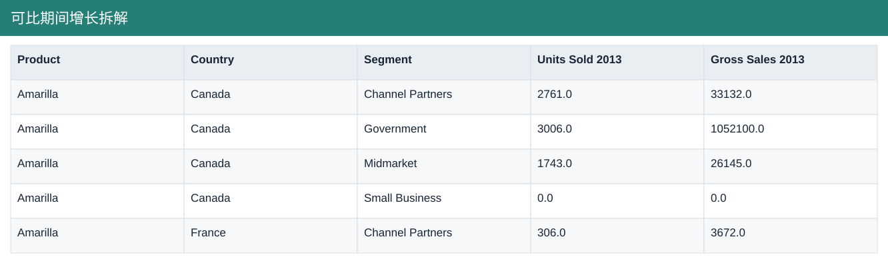

### 6 — What explains that growth?

**Result.** The $9.74M bridge comprises $5.06M volume, $0.29M realised price and $4.39M coverage effects.

**How and why.** Apply the stated volume-first decomposition at product × country × segment level. Realised price includes discount and within-group mix effects.

View evidence

[View the data](processed_data/field_guides/989d798a35.md)

### 7 — Could a discount change improve profit?

**Result.** The modelled pilot adds about $159K profit; the downside reduces profit by about $110K.

**How and why.** For 2014 Paseo / Small Business, change discount and volume assumptions while holding gross price and unit COGS fixed.

View evidence

[View the data](processed_data/field_guides/820ddf1e13.md)

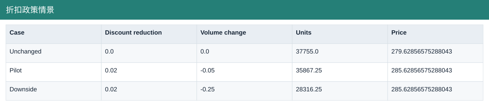

### 8 — What should the quarterly review highlight?

**Result.** Q4 sales grow 35.7% and profit 41.7%; margin improves about 0.62 percentage points.

**How and why.** Compare October–December only, then reconcile product contributions to the quarterly profit movement.

View evidence

[View the data](processed_data/field_guides/6647307b2e.md)

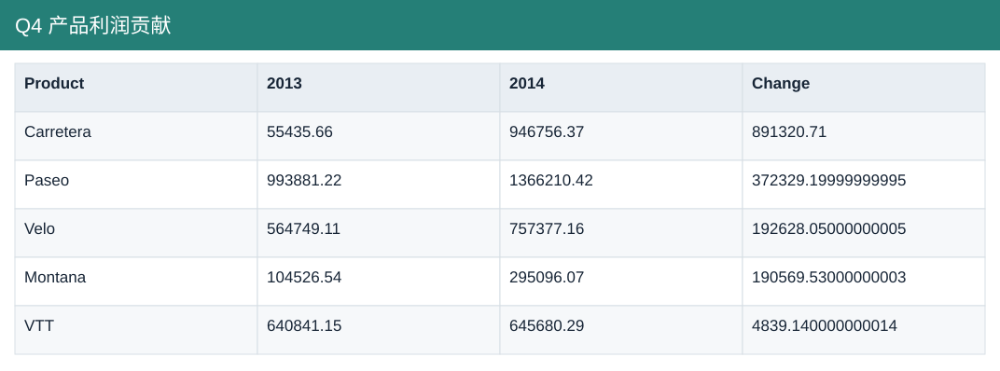

### 9 — What should commercial managers prioritise?

**Result.** Investigate Enterprise losses, assess Government opportunities and consider a bounded Paseo / Small Business pricing pilot.

**How and why.** Combine profit contribution, growth and discount exposure; request operating costs and capacity evidence before allocating resources.

View evidence

[View the data](processed_data/field_guides/41014485aa.md)

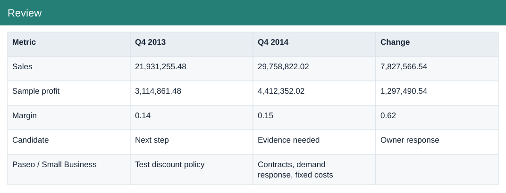

### 10 — Can monthly input be refreshed without duplication?

**Result.** Adding December restores 700 records; replacing the same monthly batch does not double the totals.

**How and why.** Use complete month-level batches and reconcile rows, sales and profit after replacement.

View evidence

[View the data](processed_data/field_guides/6396fbea58.md)

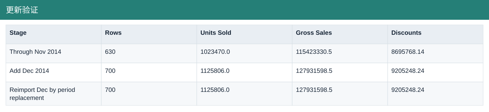

### 11 — Which forecast baseline performs best?

**Result.** The selected trailing-three-month baseline has holdout WAPE of 41.6% and bias of −22.5%.

**How and why.** Select on April–September results, then evaluate October–December with one-month rolling forecasts. The short historical test does not establish production reliability.

View evidence

[View the results](processed_data/field_guides/F11-backtest.md) · [Backtest and version outputs](processed_data/README.md)

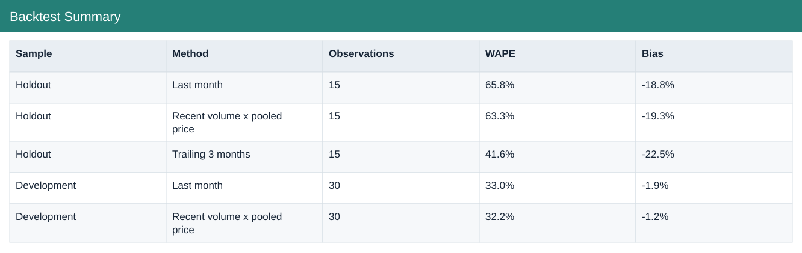

### 12 — How does the scenario become a decision proposal?

**Result.** A written pilot proposal sets decision conditions, implementation-cost considerations and stopping criteria.

**How and why.** Convert the 7 scenario into a testable recommendation rather than treating modelled benefits as achieved results.

View evidence

[View the data](processed_data/field_guides/820ddf1e13.md) · [Supporting document](processed_data/outputs/FP&A_extensions/F12_Commercial_Decision_Memo.md)

### 13 — How is the work presented for review?

**Result.** A concise project review connects questions, evidence, findings and model limits.

**How and why.** Prioritise the executive story and direct readers to supporting calculations, rather than repeating every chart.

View evidence

[View the data](processed_data/field_guides/41014485aa.md) · [Supporting document](processed_data/outputs/FP&A_extensions/F13_Portfolio_Review.md)

### 14 — How can the analysis be reproduced as practice?

**Result.** A separate exercise and answer key provide a repeatable review of the work.

**How and why.** Use the task questions and compare the rebuilt calculations with the supplied answer materials.

View evidence

[View the data](processed_data/field_guides/41014485aa.md) · [Supporting document](processed_data/outputs/FP&A_extensions/F14_独立实操_题目.md)

### 15 — Why did the Q4 forecast change?

**Result.** The reconstructed forecast increases from $20.366M to $28.802M, a $8.436M revision.

**How and why.** Bridge $5.587M October actualisation, $2.619M remaining-volume change and $0.230M realised-price change. This is Forecast vs Prior Forecast.

View evidence

[View the data](processed_data/field_guides/db4a6469d4.md)

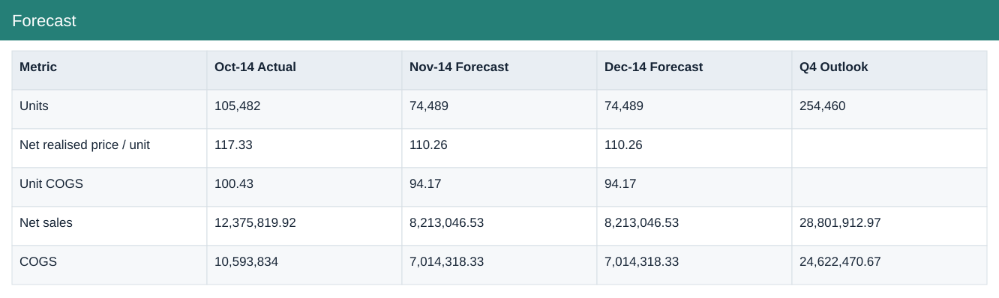

### 16 — Can positive profit coexist with a funding gap?

**Result.** Yes. The downside retains $3.013M Q4 sample profit but needs a peak $3.572M buffer to maintain the modelled minimum cash.

**How and why.** Roll receivables, inventory, payables and cash under the scenario timing assumptions; use the peak balance gap, not a sum of monthly gaps.

View evidence

[View the data](processed_data/field_guides/db4a6469d4.md)

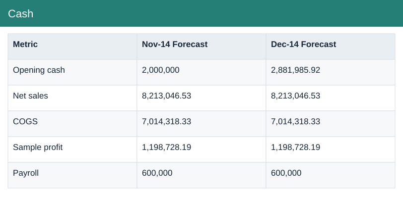

### 17 — How do close adjustments affect the accounts?

**Result.** The synthetic ledger demonstrates accruals, prepayment release, capitalisation, depreciation and deferred revenue with balanced entries.

**How and why.** Post each illustrative debit and credit, then reconcile the adjusted trial balance and the effect on profit and net assets.

View evidence

[View the data](processed_data/field_guides/db4a6469d4.md)

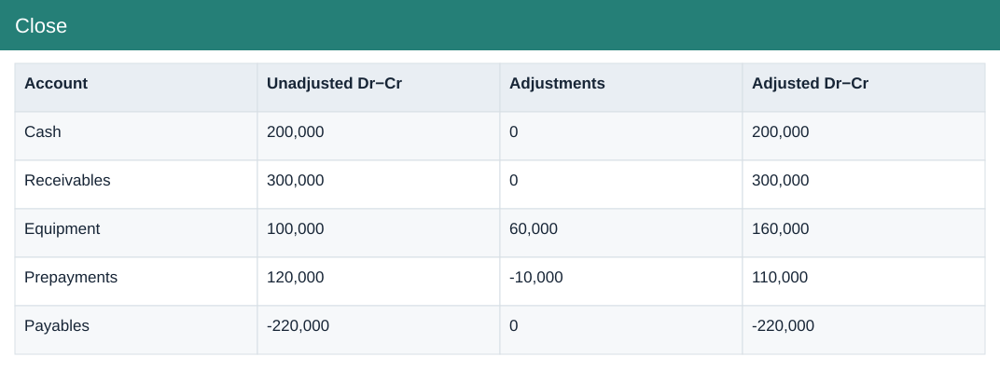

### 18 — Can an approved data version be preserved?

**Result.** The frozen practice version holds 700 rows; repeated identical input is unchanged, while inconsistent or changed input is rejected.

**How and why.** Validate monthly completeness and revenue identities before publishing a new version. This is a local workflow, not scheduled cloud refresh.

View evidence

[View the results](processed_data/field_guides/F18-validation.md) · [Backtest and version outputs](processed_data/README.md)

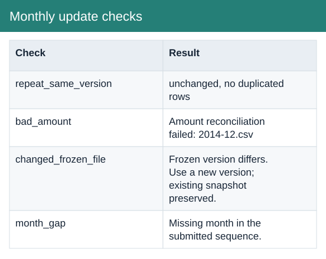

## Source and measurement notes

**Period:** September 2013–December 2014.  
**Scope:** 700 monthly sample records, six products, five countries and five segments.  
**Source:** [Microsoft — Financial Sample](https://learn.microsoft.com/en-us/power-bi/create-reports/sample-financial-download).

Microsoft’s sample does not identify a real company. Profit is Sales − COGS, before operating expenses, interest and tax. $ is a presentation convention because the source does not specify an ISO currency. Planning scenarios and the close ledger are synthetic extensions; the report is a saved snapshot, not a live production finance system.
