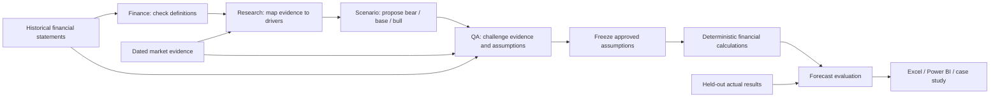

# Financial scenario research | P&G and Travelers

Two real-company financial analysis projects, supported by a reusable four-agent workflow. Each forecasts April–June 2026 from a dated information set, then evaluates the forecast against the reported quarter.

| Case study | Business question | Deliverables |
|---|---|---|
| [P&G](docs/public_cases/PG.md) | How do demand, pricing and input costs affect earnings and cash? | [Excel](outputs/PG_Financial_Scenarios.xlsx) · [Power BI](outputs/PG_Financial_Scenarios.pbix) |
| [Travelers](docs/public_cases/TRV.md) | How do premiums, claims, catastrophes and investment income affect insurance profit? | [Excel](outputs/TRV_Financial_Scenarios.xlsx) · [Power BI](outputs/TRV_Financial_Scenarios.pbix) |

## Four comparisons, three scenarios each

1. **March history only:** financial information published by 31 March 2026.
2. **March with research:** the same history plus market evidence available by that date.
3. **May history only:** financial information published by 15 May 2026.
4. **May with research:** the same updated history plus market evidence available by that date.

Each comparison contains bear, base and bull assumptions. The March–May history comparison isolates newly released financial information. Research is evaluated against its matching history-only control, not against an older information set.

This is a retrospective reconstruction performed in October 2026. Publication controls restrict the deliberate inputs; they do not erase a model's pretrained knowledge. These are analyst forecasts, not official company budgets. Scenario ranges are illustrative cases, not calibrated prediction intervals.

## How the agents work



Read the [agent guide](docs/public_agents/README.md), [role instructions](agents), [source review](docs/historical_finance.md) and [market research](docs/market_research.md). Agents provide judgment; calculations, date checks and reconciliations are deterministic code. QA findings are retained even when a run passes.

## Reproduce the analysis

The workflow requires Python 3.11+ and the official [Codex CLI](https://developers.openai.com/codex/noninteractive), authenticated with your own account. Do not put credentials in this repository.

```sh
python3 src/prepare_packets.py
python3 src/run_case_studies.py --run-root outputs/my_new_run
python3 src/calculate.py --runs-dir outputs/my_new_run
python3 -m unittest discover -s tests -p '*test.py'
```

A genuine rerun calls the model and may produce different assumptions. To verify the original frozen assumptions without model calls:

```sh
python3 src/workflow.py replay --run outputs/runs/PG_pre_history
python3 src/calculate.py --runs-dir outputs/runs
```

See `python3 src/workflow.py --help` for the generic one-role and four-role interfaces. Each role runs in a fresh session with tools disabled. Packets contain dated historical rows and eligible research excerpts; actuals are separate. All eight freeze manifests must verify before the evaluation process reads actuals.

The Excel authoring script uses the artifact runtime bundled with Codex; it is not a standalone public npm dependency. Delivered Excel files work independently. The Power BI builder uses standard Python and produces editable PBIP source; Power BI Desktop is required to open the project and save a native PBIX. Refreshing Power BI does not call the agents: rerun the workflow and rebuild the report to incorporate a new forecast vintage.

## Files and evidence

- `data/history`: sourced historical observations and publication dates.
- `data/research`: dated evidence, explicit judgment and overlap warnings.
- `data/holdout`: latest reported results, admitted only during evaluation.
- `outputs/runs`: actual role inputs, outputs, timestamps and freeze manifests.
- `outputs/analysis.json` and CSV: financial results, sensitivities and reconciled bridges.
- `outputs/screenshots`: previews and application screenshots, labelled by their origin.
- `outputs/powerbi`: editable native Power BI project source.

Complete downloaded source webpages remain in the local archive. Public extracts contain financial facts, short attributed quotations and links to original releases. Private Chinese notes are kept in a separate private repository and are excluded from this public history.

## Interpretation limits

P&G cash flow is a conversion-ratio model, not a complete working-capital/debt forecast. Travelers uses an explicit prior-year adjustment between reported combined-ratio calculations and reported underwriting income; future changes in that adjustment appear as a residual. Its per-share proxy excludes preferred and participating-security adjustments and must not be presented as reported core EPS. Public data do not disclose every operational driver. No invented unit counts, headcount or customer records are treated as actuals.

One quarter per company cannot establish that agents or market research generally improve forecast accuracy. The case studies report both improvements and deterioration.
