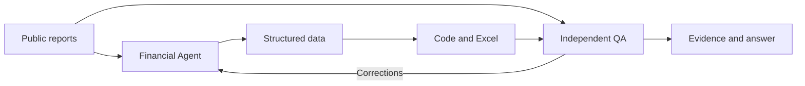

# Agent workflow

**Purpose:** Separate financial judgement from independent checking, while code and Excel perform the calculations.

| Agent | Responsibility | This sample |
|---|---|---|
| [Financial Statements & Quality](financial.md) | Check financial inputs, comparability and earnings quality. | Independently reviewed three years of reported income statements. |
| Business Driver | Explain volume, price, mix, FX, segments and concentration. | Planned. |
| Market & Competitor Research | Compare company claims with external evidence. | Planned. |
| Forecast, Scenario & Valuation | Propose assumptions and interpret calculated scenarios and value. | Planned. |
| [Independent QA & Evidence](qa.md) | Find inconsistencies between source, data, Excel and claims. | Separate review of this sample. |

[Actual review record](review.md) · [Two worked examples](../investment/01_financial_statements.md) · [Rerun instructions](../src/README.md)

Only the Financial and QA roles were used for this pilot. The five-agent investment workflow and insurance module are not yet implemented end to end.
