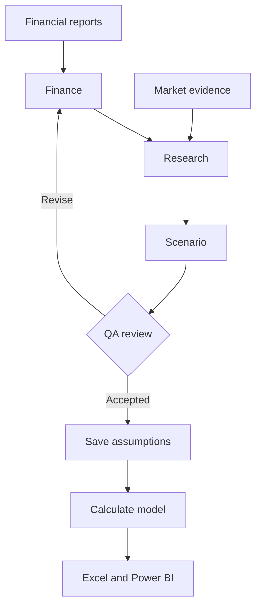

# The Analysis Team

**Four agents turn financial reports and market evidence into reviewed scenarios, then a calculation engine produces the Excel and Power BI results.**

| Agent | One job | Problem solved |
|---|---|---|
| [Finance](finance.md) | Map reported figures to clearly defined inputs. | Wrong periods, units or accounting measures. |
| [Research](research.md) | Connect dated market evidence to business drivers. | Unsupported or overlapping market adjustments. |
| [Scenario](scenario.md) | Propose bear, base and bull assumptions. | An outlook that hides uncertainty behind one number. |
| [QA](qa.md) | Challenge evidence and assumptions before acceptance. | Unsupported claims and inconsistencies reaching the final model. |

- **[Start with the Finance Agent](finance.md)** — Purpose, short questions and real source-versus-result examples.
- **[Explore Finance skills](finance-skills.md)** — Input selection, date alignment and ratio checks.
- **[Follow the P&G example](https://github.com/hoichengit/Portfolio-Guide/blob/codex/financial-scenarios/docs/public_cases/PG/01_agents.md)** — See the team build the starting analysis.

Execution details and reproducibility

[Actual run record](https://github.com/hoichengit/Portfolio-Guide/blob/codex/financial-scenarios/docs/agents-execution.md) · [Workflow instructions](https://github.com/hoichengit/Portfolio-Guide/blob/codex/financial-scenarios/docs/agents.md) · [Complete project](https://github.com/hoichengit/Portfolio-Guide/tree/codex/financial-scenarios)

The saved project contains 50 production model calls and eight accepted final assumption sets; model arithmetic is performed outside the agents, and the work is a retrospective reconstruction with dated inputs.

