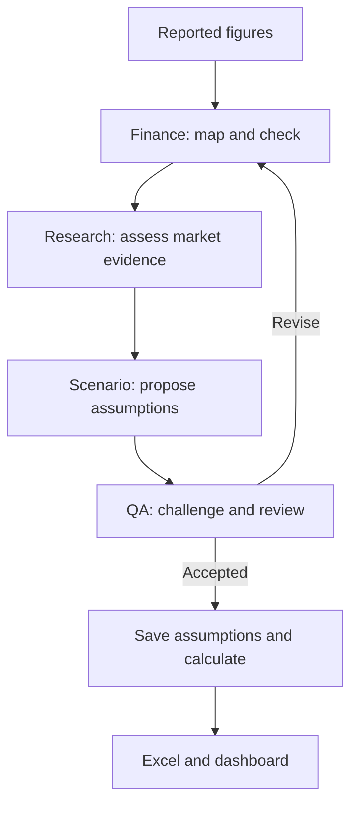

# Finance Agent

**Purpose:** Turn reported financial figures into clearly defined model inputs, so the forecast uses the right amount, period and accounting measure.

[Skills and examples](https://github.com/hoichengit/Portfolio-Guide/blob/main/agents/finance-skills.md) · [Reusable instructions](https://github.com/hoichengit/Portfolio-Guide/blob/codex/financial-scenarios/agents/finance.md) · [Actual P&G run](https://github.com/hoichengit/Portfolio-Guide/blob/codex/financial-scenarios/outputs/runs/PG_mid_history/finance/output.json) · [P&G Part 1](https://github.com/hoichengit/Portfolio-Guide/blob/codex/financial-scenarios/docs/public_cases/PG/01_agents.md)

## Problems it handles

| Area | Click a question | What Finance checks |
|---|---|---|
| Revenue inputs | [Quarterly revenue](#quarterly-revenue) | Quarter versus full year; the amount passed to the model. |
| Information timing | [Report cutoff](#report-cutoff) | Publication date versus forecast date. |
| Profit drivers | [Gross margin](#gross-margin) | Gross profit and sales belong to the same period and unit. |

## How it cooperates

**Handoff:** Finance supplies checked inputs and unresolved issues; the other agents use that record instead of interpreting the financial statements again.

## Real P&G examples

Each comparison below is an Excel evidence view: the left side transcribes source data, and the right side shows its treatment in this project; the source links and actual agent output remain available for checking.

### Quarterly revenue

**Answer:** Finance selects **$20,889M** of quarterly sales and excludes **$84,284M** of annual sales from the quarterly baseline.

Open the source-versus-input comparison

**Look for red 20,889 on both sides:** the amount matches, and its three-month period matches the forecast's seasonal reference.

[Original P&G report](https://www.pginvestor.com/news/news-details/2025/PG-Announces-Fourth-Quarter-and-Fiscal-Year-2025-Results/default.aspx) · [Actual Finance mapping](https://github.com/hoichengit/Portfolio-Guide/blob/codex/financial-scenarios/outputs/runs/PG_mid_history/finance/output.json)

### Report cutoff

**Answer:** The report published on **24 April 2026** is too late for the **31 March** forecast but available for the **15 May** forecast.

Open the date-versus-cutoff comparison

**Look for the red publication date:** eligibility depends on when the information became available, not when the quarter ended.

[Source dates](https://github.com/hoichengit/Portfolio-Guide/blob/codex/financial-scenarios/data/history/source_manifest.json) · [March packet](https://github.com/hoichengit/Portfolio-Guide/blob/codex/financial-scenarios/outputs/runs/PG_pre_history/packet.json) · [May Finance output](https://github.com/hoichengit/Portfolio-Guide/blob/codex/financial-scenarios/outputs/runs/PG_mid_history/finance/output.json)

### Gross margin

**Answer:** Finance maps **$10,258M** of gross profit and **$20,889M** of sales to a **49.11%** historical gross-margin reference.

Open the reported-amounts-versus-ratios comparison

**Follow the red gross profit and sales:** dividing those same-period amounts produces the margin on the right.

The actual agent output rounds the ratio to 0.4911; this is historical evidence for Scenario to consider, not a promise that the next quarter will have the same margin.

[Actual Finance output](https://github.com/hoichengit/Portfolio-Guide/blob/codex/financial-scenarios/outputs/runs/PG_mid_history/finance/output.json) · [Evidence workbook](https://github.com/hoichengit/Portfolio-Guide/blob/codex/financial-scenarios/outputs/guide_evidence/Finance_Evidence.xlsx)

[Back to questions](#problems-it-handles) · [Skills and examples](https://github.com/hoichengit/Portfolio-Guide/blob/main/agents/finance-skills.md) · [All agents](https://github.com/hoichengit/Portfolio-Guide/blob/main/agents/README.md)

Scope of the role

Finance checks supplied excerpts and dates; it does not browse independently, certify the original statements, or approve its own work, and the calculation engine performs the final model arithmetic.

