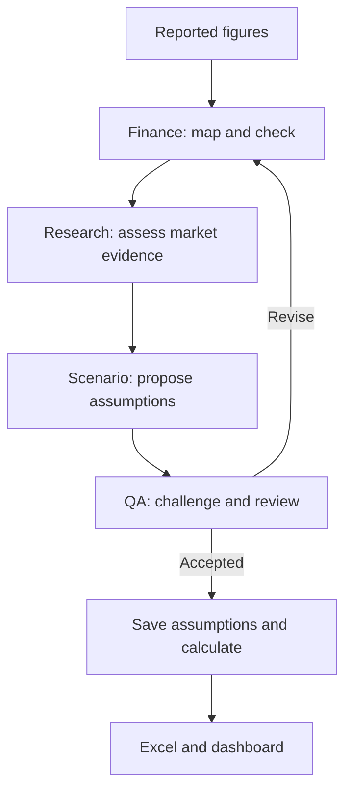

# Finance Agent

**Purpose:** Check reported financial figures and their Excel mapping before analysing past performance and building forecasts.

[Skills and examples](https://github.com/hoichengit/Portfolio-Guide/blob/main/agents/finance-skills.md) · [Reusable instructions](https://github.com/hoichengit/Portfolio-Guide/blob/codex/financial-scenarios/agents/finance.md) · [Actual P&G run](https://github.com/hoichengit/Portfolio-Guide/blob/codex/financial-scenarios/outputs/runs/PG_mid_history/finance/output.json) · [P&G Part 1](https://github.com/hoichengit/Portfolio-Guide/blob/codex/financial-scenarios/docs/public_cases/PG/01_agents.md)

## Problems it handles

| Area | Click a question | What Finance checks |
|---|---|---|
| Revenue inputs | [Revenue extraction](#revenue-extraction) | Reported amount, financial period, currency and unit against Excel. |
| Information timing | [Report cutoff](#report-cutoff) | Publication date versus forecast date. |
| Profit drivers | [Gross margin](#gross-margin) | Gross profit and sales belong to the same period and unit. |

## How it cooperates

**Handoff:** Finance supplies checked inputs and unresolved issues; the other agents use that record instead of interpreting the financial statements again.

## Real P&G examples

The revenue example compares the original company report directly with the full Excel historical-financials worksheet. The later examples retain the earlier comparison format for now.

### 1. Revenue extraction: How do we transfer reported revenue into Excel accurately?

**Answer:** The original report's **$20,889 million** of April–June 2025 net sales matches **$20,889.0M** in the Excel historical financial statements, cell **I14**.

Compare the original report with the full Excel worksheet

**Follow the red marks:** NET SALES of **$20,889 million** in the report matches **$20,889.0M** in Excel; the extra decimal is display formatting, and M means million.

| Original company report — page 8 | Actual Excel workbook — Historical Financials |
|---|---|
|  |  |
| Three months ended 30 June 2025, 2025 column; NET SALES. | FY2025Q4 column; Net Sales row; cell I14. |

Click either image to open it at full size.

**Check:** Same amount (**20,889**), period (**April–June 2025 / FY2025 Q4**), currency (**USD**) and scale (**millions**).

[Original report PDF](https://s204.q4cdn.com/332108499/files/doc_financials/2025/q4/FY2425-Q4-AMJ-Press-Release-Final.pdf#page=8) · [Actual Excel workbook](https://github.com/hoichengit/Portfolio-Guide/blob/codex/financial-scenarios/outputs/PG_Financial_Scenarios.xlsx)

The left image is the original PDF page with red outlines added. The right image is a genuine Microsoft Excel screenshot showing every populated row and period of the historical-financials worksheet, with temporary red emphasis; the workbook's data and formulas are unchanged.

### Report cutoff

**Answer:** The report published on **24 April 2026** is too late for the **31 March** forecast but available for the **15 May** forecast.

Open the date-versus-cutoff comparison

**Look for the red publication date:** eligibility depends on when the information became available, not when the quarter ended.

[Source dates](https://github.com/hoichengit/Portfolio-Guide/blob/codex/financial-scenarios/data/history/source_manifest.json) · [March packet](https://github.com/hoichengit/Portfolio-Guide/blob/codex/financial-scenarios/outputs/runs/PG_pre_history/packet.json) · [May Finance output](https://github.com/hoichengit/Portfolio-Guide/blob/codex/financial-scenarios/outputs/runs/PG_mid_history/finance/output.json)

### Gross margin

**Answer:** Finance maps **$10,258M** of gross profit and **$20,889M** of sales to a **49.11%** historical gross-margin reference.

Open the reported-amounts-versus-ratios comparison

**Follow the red gross profit and sales:** dividing those same-period amounts produces the margin on the right.

The actual agent output rounds the ratio to 0.4911; this is historical evidence for Scenario to consider, not a promise that the next quarter will have the same margin.

[Actual Finance output](https://github.com/hoichengit/Portfolio-Guide/blob/codex/financial-scenarios/outputs/runs/PG_mid_history/finance/output.json) · [Evidence workbook](https://github.com/hoichengit/Portfolio-Guide/blob/codex/financial-scenarios/outputs/guide_evidence/Finance_Evidence.xlsx)

[Back to questions](#problems-it-handles) · [Skills and examples](https://github.com/hoichengit/Portfolio-Guide/blob/main/agents/finance-skills.md) · [All agents](https://github.com/hoichengit/Portfolio-Guide/blob/main/agents/README.md)

Scope of the role

Finance checks supplied excerpts and dates; it does not browse independently, certify the original statements, or approve its own work, and the calculation engine performs the final model arithmetic.

