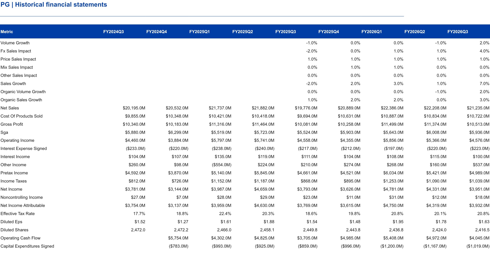
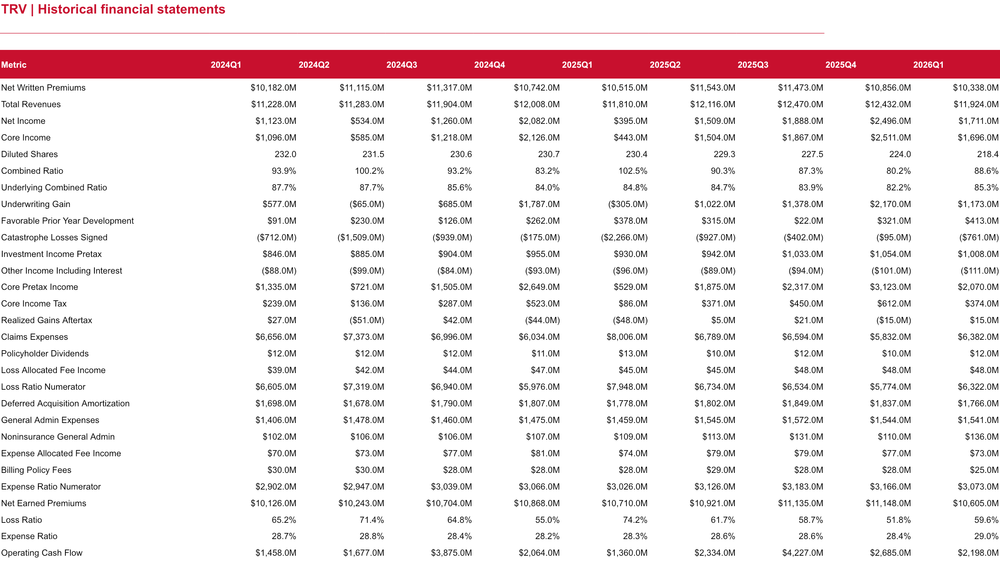

# Source data

These are public-company quarterly disclosures, not a fictional transaction dataset. P&G reports consumer-product sales and expenses; Travelers reports property-and-casualty insurance results. Raw financial tables and the prepared observations preserve the companies' different accounting definitions.

| Data | What it contains | Read / download |
|---|---|---|
| Historical release register | Original release URLs, publication dates, periods and file hashes | [Manifest](history/source_manifest.json) |
| Historical financial observations | Nine calendar quarters, source labels, units and exact table references | [CSV](history/history_tidy.csv) · [JSON](history/history_tidy.json) |
| Market information | Dated macroeconomic and company evidence, driver implications and confidence | [Evidence register](research/market_evidence.csv) |
| Latest reported quarter | April–June 2026 results, excluded from forecast packets | [Actual results](holdout/actuals.json) · [Source register](holdout/manifest.json) |

## Read the columns

- `company`: `PG` or `TRV`.
- `period_start`, `period_end`: dates in `YYYY-MM-DD` format.
- `calendar_quarter`, `fiscal_period`: calendar and company reporting labels. P&G's April–June quarter is fiscal Q4.
- `period_basis`: `quarter`, `fiscal_ytd` or `instant`; do not sum or compare these as though they were the same.
- `segment`, `metric`: business segment and financial definition.
- `value`: a numeric financial fact. `unit` specifies USD millions, million shares, USD per share or percentages.
- `publication_date`: when the information became available, which determines forecast eligibility.
- `source_id`, `source_url`, `source_locator`, `source_excerpt`: the original statement and table row supporting the value.
- `value_status`, `notes`: whether the value is reported or derived, including cash-flow subtraction details.

Raw ratios are reported percentages, such as `84.1`; calculation inputs use decimals, such as `0.841`. Numerators expressed in dollars stay in dollars. The prepared data retain those distinctions explicitly.

See the financial data in the delivered workbook

These are rendered previews of the actual delivered worksheets, not screenshots of original company filings. Source links above lead to the original releases. Downloaded original webpages are also retained in the local project archive.

