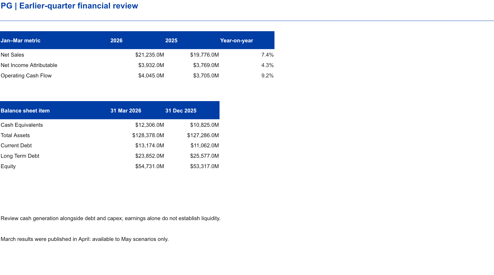
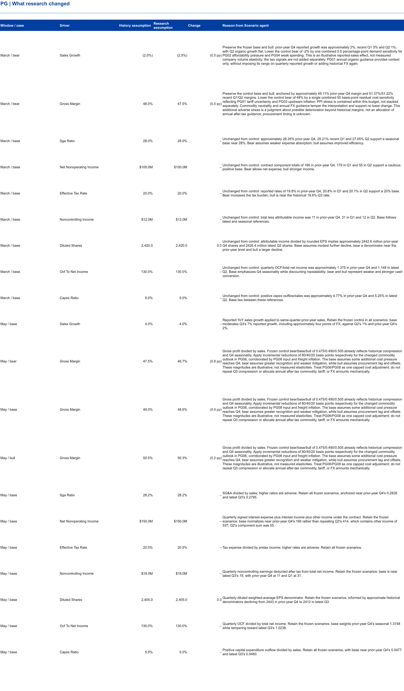
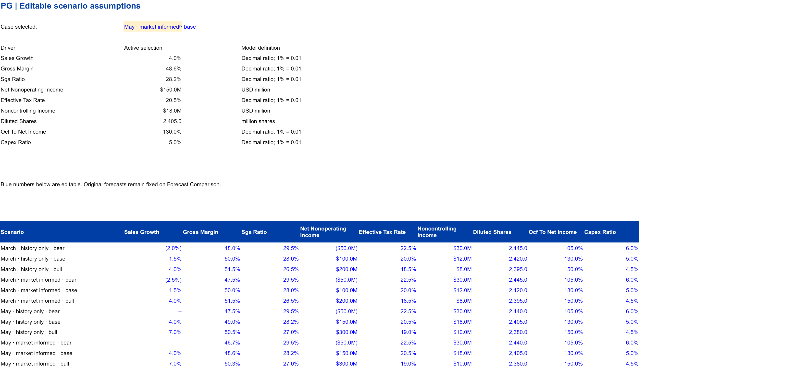
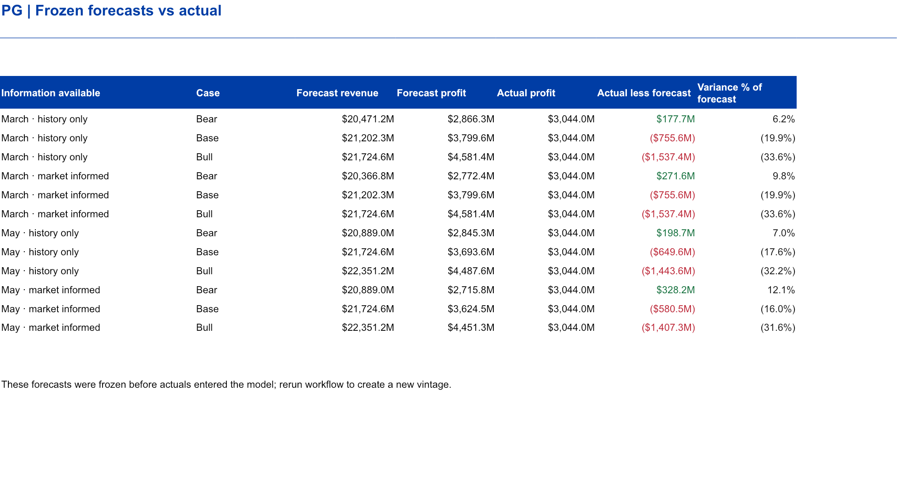
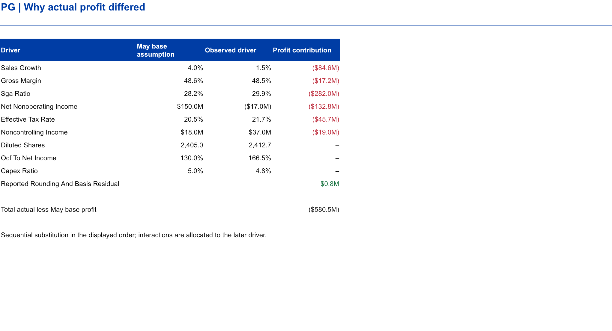

# P&G: can pricing and cost evidence improve a seasonal forecast?

The target is P&G fiscal 2026 Q4, April–June 2026. The model links sales, gross margin, operating expenses, earnings and simplified cash generation. It keeps company observations separate from analyst assumptions.

[Editable Excel model](../../outputs/PG_Financial_Scenarios.xlsx) · [Dashboard PBIX](../../outputs/PG_Financial_Scenarios.pbix) · [Validation and usage notes](../../outputs/README.md)

Questions: [1. Baseline](#q1) · [2. Demand](#q2) · [3. Costs](#q3) · [4. Earnings and cash](#q4) · [5. Results](#q5) · [6. Decisions](#q6)

## 1. What could the forecaster actually know?

Use the same quarter of the prior year as the seasonal sales reference, then evaluate subsequent eligible financial history. The March cutoff includes the January release; the April release becomes available only to May's runs. Publication dates govern eligibility, not the quarter-end date printed on the financial statement.

Inspect the baseline and time controls

- [Prepared historical data](../../data/history/history_tidy.csv) preserve periods, units and source IDs.
- [Source manifest](../../data/history/source_manifest.json) identifies original official releases.
- [Market register](../../data/research/market_evidence.json) marks pre-quarter and mid-quarter eligibility.
- The original historical control and refreshed historical control must stay separate. A better May forecast may reflect newly published company history, not market research.

### The preceding quarter: calendar Q1 2026 / fiscal Q3 2026

Amounts are USD millions. These April-published results enter only the May information set.

| Metric | Calendar Q1 2026 (FY26 Q3) | Calendar Q1 2025 (FY25 Q3) | YoY |
|---|---:|---:|---:|
| Net sales | 21,235 | 19,776 | +7.4% |
| Attributable net income | 3,932 | 3,769 | +4.3% |
| Operating cash flow | 4,045 | 3,705 | +9.2% |

Sales grew faster than attributable earnings. Cash generation increased, but the March 31 balance sheet also shows current debt of $13,174m against cash of $12,306m. Total debt rose from $36,639m at December 31 to $37,026m, while equity rose from $53,317m to $54,731m. These selected balances support a funding review; they do not by themselves establish a liquidity shortfall.

View the financial-health worksheet

Actual workbook-library render; native application checks are documented separately.

## 2. Does nominal spending justify stronger volume assumptions?

Nominal spending can increase while real growth stays modest. Consumer-price evidence is not P&G's realized pricing, and peer growth does not establish P&G market-share loss. The research informs a combined demand scenario; it does not supply a measured company elasticity.

Demand and competitive evidence

Records PG02, PG04, PG07 and PG09 combine dated BLS inflation and BEA real-consumption releases. PG10 uses Unilever's first-quarter trading statement as a competitive check. Strong peer volumes support a resilient-category interpretation but can also increase pressure on P&G's pricing and marketing. The different geographic and product mixes prevent a mechanical transfer of peer growth.

Sources: [BEA January release](https://www.bea.gov/sites/default/files/2026-03/pi0126.pdf), [BEA March release](https://www.bea.gov/sites/default/files/2026-04/pi0326.pdf), [Unilever first-quarter release](https://www.unilever.com/files/unilever-q1-2026-full-announcement.pdf).

## 3. Why adjust gross margin rather than add every inflation signal?

Company cost guidance is more specific than broad producer-price inflation, but it is annual guidance. Procurement, inventory and pricing lags determine when costs enter the quarter. An annual cost change cannot be assigned entirely to the target period without supporting timing evidence.

Cost evidence and scenario translation

PG01 and PG06 record the company's initial and updated commodity, tariff and FX outlook. PG03 and PG08 provide producer-cost context. CPI, PPI, freight inflation and management guidance can describe overlapping pressures, so use a capped combined cost adjustment. A bearish scenario combines weaker sales and less favorable margins; a bullish scenario allows better demand, productivity or cost absorption. These are coherent financial scenarios, not quantified probabilities.

Sources: [January guidance](https://www.pginvestor.com/news/news-details/2026/PG-Announces-Fiscal-Year-2026-Second-Quarter-Results/default.aspx), [April guidance](https://www.pginvestor.com/news/news-details/2026/PG-Announces-Fiscal-Year-2026-Third-Quarter-Results/default.aspx), [dated PPI archive](https://www.bls.gov/news.release/archives/ppi_05132026.htm).

## 4. What converts the operating scenario into EPS and cash?

Sales times gross margin produces gross profit; deducting sales times SG&A ratio produces operating income. Add net non-operating income, deduct tax and noncontrolling income, then divide attributable earnings by diluted shares for EPS. Dollar amounts and shares are both in millions, so their ratio is dollars per share.

Operating cash flow is a disclosed model proxy: consolidated net income times an assumed conversion ratio. Capex is a share of sales, and free cash flow is operating cash flow less capex. This is not a full working-capital, debt or liquidity forecast. Share repurchases can support EPS without improving operating profit.

## 5. Did the research adjustment improve this case?

All eight selected workflows passed independent model QA and froze before evaluation. [Execution record](../agents-execution.md) documents the retained failures and supplemental reviews. Money below is USD millions.

### Actual calendar Q2 2026 / fiscal Q4 2026 and financial health

| Metric | Calendar Q2 2026 actual (FY26 Q4) | YoY | Versus calendar Q1 2026 (FY26 Q3) |
|---|---:|---:|---:|
| Net sales | 21,203 | +1.5% | -0.2% |
| Operating income | 3,949 | -9.3% | -13.7% |
| Attributable net income | 3,044 | -15.8% | -22.6% |
| Operating cash flow | 5,131 | +2.9% | +26.8% |

Actual sales rose 1.5% YoY, but attributable earnings fell 15.8%. Gross margin was 48.50%; SG&A reached $6,334m. Operating cash flow of $5,131m less $1,023m capex produced $4,108m simplified free cash flow. Higher cash flow alongside lower earnings illustrates why cash conversion requires separate scrutiny.

### What management explained after the outcome

**Post-outcome explanation only; not a forecast input.** P&G attributed the quarter’s EPS decline to higher SG&A and lower gross margin. Core SG&A rose 130 basis points of sales: 410 basis points of reinvestment, mainly marketing, and 20 of other items were partly offset by 300 of productivity savings. Non-core restructuring explained 90 basis points of the 220-basis-point reported operating-margin decline. These disclosures give economic context to the expense miss. Other non-operating income also fell to $112m from $274m; the release does not establish a specific cause for that quarterly decline, so none is assigned here. [July 29 results release](https://us.pg.com/newsroom/news-releases/PG-Announces-Fourth-Quarter-and-Fiscal-Year-2026-Results/).

### What research actually changed on matched history

| Cutoff | Driver and case | History-only → market-informed | Why |
|---|---|---|---|
| March | Sales growth, bear | −2.0% → −2.5% | Demand uncertainty; no measured company elasticity |
| March | Gross margin, bear | 48.0% → 47.5% | Cost pressure widens downside |
| May | Gross margin, bear / base / bull | 47.5 / 49.0 / 50.5% → 46.7 / 48.6 / 50.3% | Updated commodity outlook and producer/freight evidence, applied as one capped cost adjustment |

Other assumptions stayed unchanged. Company guidance and macro evidence overlap; the adjustment is analyst judgment, not a measured allocation of annual cost guidance to this quarter.

View research changes and editable assumptions

### Forecast accuracy

| Information set | Base earnings | Absolute error | Error / actual | Actual inside bear–bull? |
|---|---:|---:|---:|---|
| March history | 3,799.6 | 755.6 | 24.82% | Yes |
| March + research | 3,799.6 | 755.6 | 24.82% | Yes |
| May history | 3,693.6 | 649.6 | 21.34% | Yes |
| May + research | 3,624.5 | 580.5 | 19.07% | Yes |

May research reduced absolute error by **$69.1m**, or **2.27 percentage points** of actual earnings, relative to May history-only. The separate historical refresh reduced error by $106.0m. March research changed only downside assumptions and did not improve base accuracy. Even the best base remained $580.5m above actual.

All four intervals covered actual earnings, but these are broad judgmental ranges, not calibrated confidence intervals. One quarter per company cannot demonstrate general forecasting superiority.

Sequential bridge: May market base to actual earnings

Each row replaces one forecast driver with its actual value in model order. Contributions depend on that order and describe arithmetic, not proven economic causation. Positive values increase actual earnings relative to the base.

| Replaced driver | Earnings change, USD m |
|---|---:|
| sales growth | -84.6 |
| gross margin | -17.2 |
| sga ratio | -282.0 |
| net nonoperating income | -132.8 |
| effective tax rate | -45.7 |
| noncontrolling income | -19.0 |
| Reported rounding and basis residual | +0.8 |

SG&A and net non-operating income explain more of the remaining model miss than gross margin. A cost-focused research adjustment therefore improved this case only modestly.

The residual preserves reported rounding and accounting-basis differences rather than silently forcing the reported result into the model. [Complete evaluation data](../../outputs/analysis.json) · [Metric comparisons](../../outputs/forecast_results.csv).

View the forecast comparison and actual-variance bridge

These are rendered views of the delivered workbook; the Excel file contains the editable model.

## 6. What should a decision-maker do with the scenarios?

- Challenge volume assumptions when nominal spending and real spending diverge.
- Use procurement timing and company guidance to constrain cost adjustments; avoid stacking overlapping macro signals.
- Review demand investment and productivity together before assuming margin expansion.
- Treat the cash-conversion ratio as a sensitivity, and request a working-capital schedule before using the result for financing decisions.

[Editable workbook](../../outputs/PG_Financial_Scenarios.xlsx) · [Summary screenshot](../../outputs/screenshots/PG/Summary.png) · [Financial-health screenshot](../../outputs/screenshots/PG/Financial_Health.png). Screenshots are workbook-library renders; native application checks are reported separately. This is an integrated earnings model with selected cash and balance-sheet diagnostics, not a complete three-statement forecast. [Return to the case-study index](README.md).
