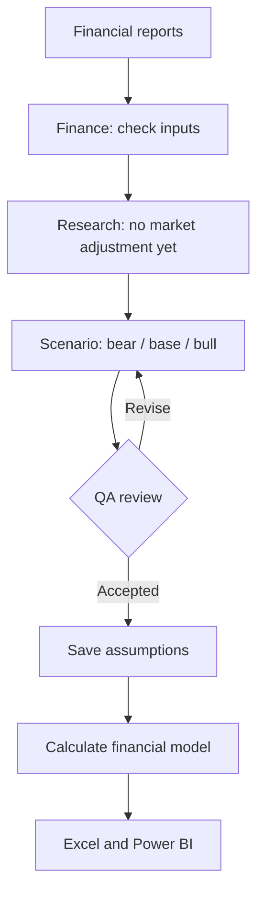
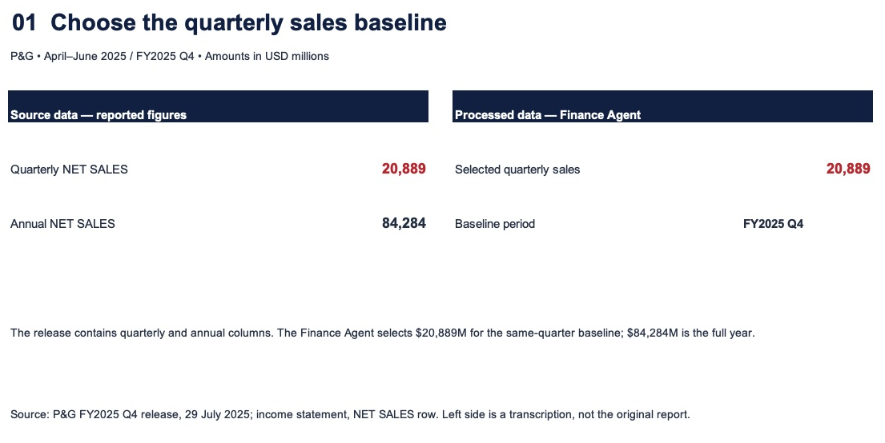

# 1. Build the analysis team

- **Goal:** Build three P&G profit scenarios for April–June 2026 using only information available at each forecast date.
- **Output:** Checked financial inputs, bear/base/bull assumptions, and an editable Excel model.

## My datasets

| Dataset | Contents | Link |
|---|---|---|
| Financial reports | Quarterly sales, costs, earnings and cash flow. | [FY2025 Q4](https://www.pginvestor.com/news/news-details/2025/PG-Announces-Fourth-Quarter-and-Fiscal-Year-2025-Results/default.aspx) · [FY2026 Q3](https://www.pginvestor.com/news/news-details/2026/PG-Announces-Fiscal-Year-2026-Third-Quarter-Results/default.aspx) |
| Historical data | Reported values with periods, units and sources. | [Data](../../../data/history/history_tidy.csv) · [Report list](../../../data/history/source_manifest.json) |
| Analysis workbook | Financial history, assumptions, calculations and results. | [Excel model](../../../outputs/PG_Financial_Scenarios.xlsx) |
| Evidence workbook | Short source-versus-result examples for this guide. | [Evidence Excel](../../../outputs/guide_evidence/Finance_Evidence.xlsx) |

## Questions to solve

| Area | Click a question | Purpose |
|---|---|---|
| Financial inputs | [1. Revenue baseline](#revenue-baseline) | Select quarterly sales, not annual sales. |
| Information timing | [2. Report availability](#report-availability) | Exclude reports published after the forecast date. |
| Profit drivers | [3. Margin baseline](#margin-baseline) | Turn reported sales and costs into comparable ratios. |
| Starting forecast | [4. Three scenarios](#three-scenarios) | Compare earnings under different assumptions. |

## One job for each agent

- **[Finance](https://github.com/hoichengit/Portfolio-Guide/blob/main/agents/finance.md):** Check each input's period, amount and accounting meaning.
- **Research:** Keep market adjustments out of this history-only baseline; introduce them in Part 2.
- **Scenario:** Propose bear, base and bull assumptions from the checked history.
- **QA:** Flag unsupported assumptions and inconsistencies before saving the forecast.

## How they work together

The agents check and propose inputs; the calculation engine performs the arithmetic and the workbook makes it inspectable.

## Answers and evidence

### 1. Revenue baseline: Which past quarter’s revenue should we use to forecast April–June 2026?

**Meaning:** Revenue baseline is the historical revenue amount we use as the starting point before applying forecast growth assumptions.

**Why this quarter:** April–June 2025 covers the same three calendar months as the forecast quarter, giving us a prior-year seasonal reference.

**Answer:** Use **$20,889M** of April–June 2025 sales as the seasonal starting point, rather than **$84,284M** of full-year sales.

Compare source figures with the selected input

**Left:** Quarterly and annual reported sales transcribed into Excel. **Right:** The quarterly amount retained for the model.

The matching red **20,889** shows the same three-month amount carried across; annual sales are excluded because the forecast covers one quarter.

[Finance Agent's actual output](../../../outputs/runs/PG_mid_history/finance/output.json) · [Evidence Excel](../../../outputs/guide_evidence/Finance_Evidence.xlsx)

### 2. Report availability

**Answer:** The January–March report was published on **24 April 2026**, so it is excluded from the **31 March** forecast and included in the **15 May** forecast.

Compare the publication date with the two forecast cutoffs

**Left:** The report period and publication date. **Right:** The decision for each cutoff.

Follow the red publication date: a quarter ending in March does not mean its results were available in March.

[Report dates](../../../data/history/source_manifest.json) · [March inputs](../../../outputs/runs/PG_pre_history/packet.json) · [May inputs](../../../outputs/runs/PG_mid_history/packet.json)

### 3. Margin baseline

**Answer:** Quarterly gross profit of **$10,258M** divided by sales of **$20,889M** gives a **49.11% gross-margin reference**, not an automatic forecast assumption.

Compare reported amounts with the calculated ratios

**Left:** Reported sales, gross profit and SG&A. **Right:** The same figures converted into margin and expense ratios.

Trace the red amounts into the margin calculation; Scenario then decides whether the future assumption should differ.

[Finance Agent's actual mapping](../../../outputs/runs/PG_mid_history/finance/output.json) · [Excel model](../../../outputs/PG_Financial_Scenarios.xlsx)

### 4. Three scenarios

**Answer:** The March history-only base case produces **$3,799.6M** of attributable net income, alongside separate bear and bull cases.

Compare starting assumptions with calculated results

**Left:** Analyst assumptions, not reported actuals. **Right:** The corresponding calculated scenarios.

The red base-case values connect the chosen inputs with the earnings result.

[Scenario Agent assumptions](../../../outputs/runs/PG_pre_history/scenario/output.json) · [Calculated results](../../../outputs/forecast_results.csv)

[Back to the three parts](../PG.md) · [Next: challenge the scenarios](../PG_legacy.md#q2)

*This is a retrospective exercise with dated inputs; the scenarios are analyst estimates, not P&G's official budget.*
