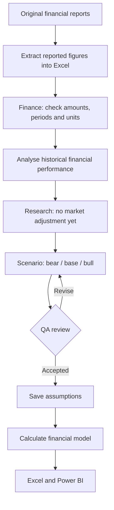
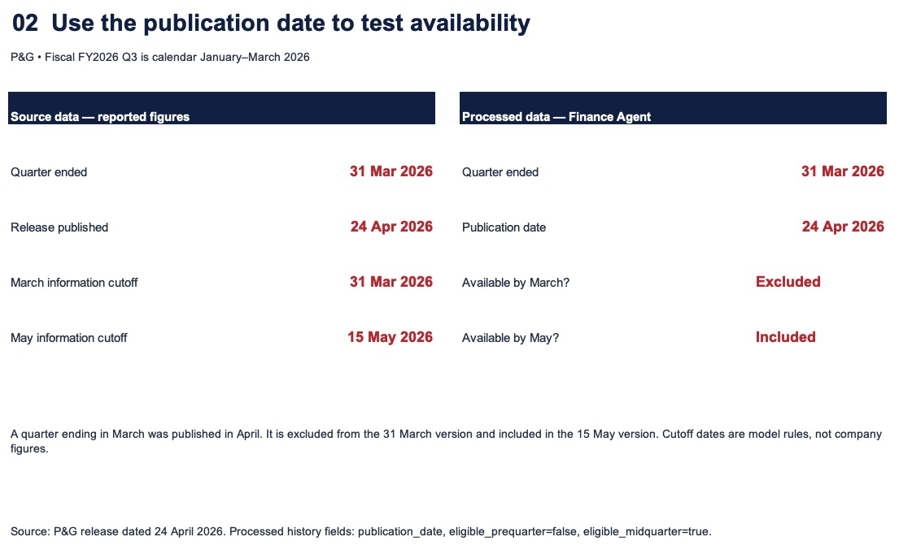
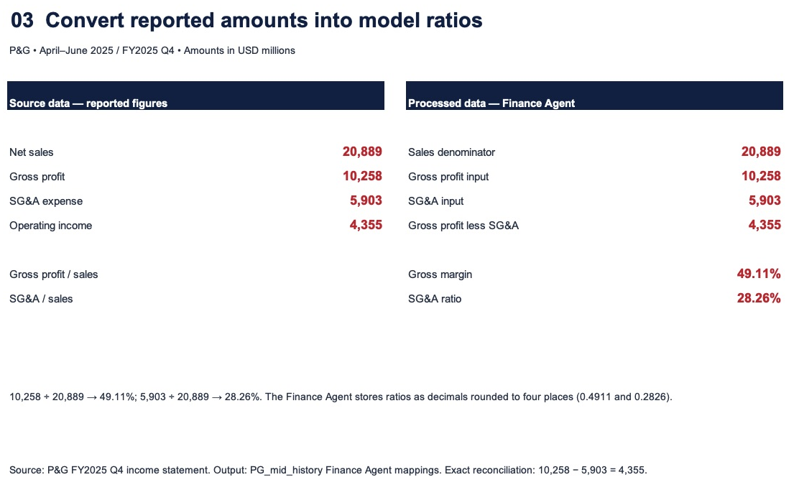
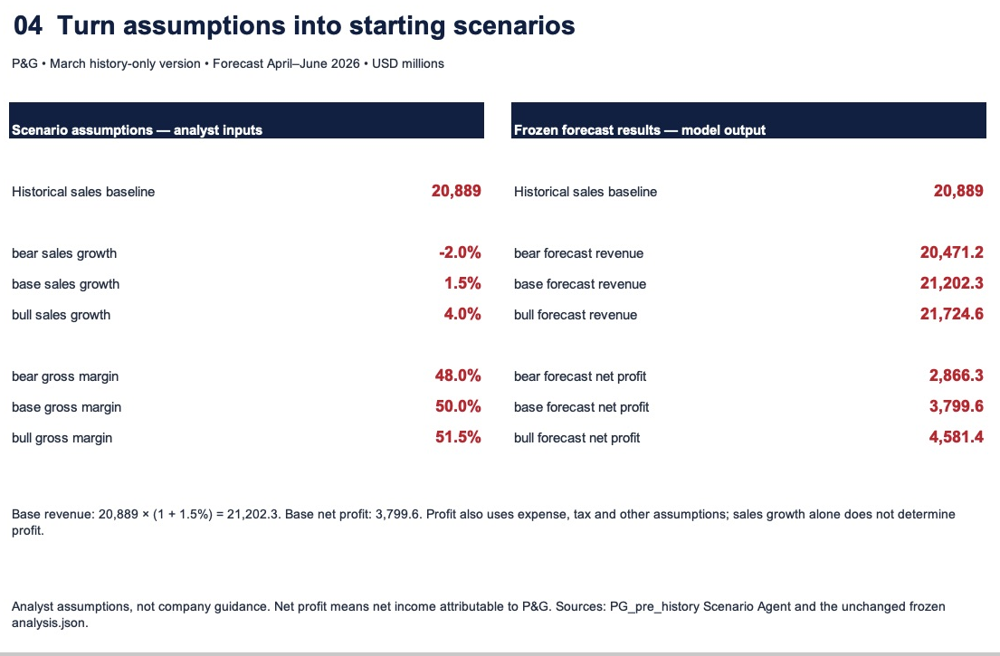

# 1. Build the analysis team

- **Goal:** Organise P&G’s reported financial data in Excel, check and analyse it, then build three profit scenarios for April–June 2026.
- **First step:** Transfer historical reported figures into Excel; forecasting starts after the historical data has been checked.
- **Output:** Checked financial inputs, bear/base/bull assumptions, and an editable Excel model.

## My datasets

| Dataset | Contents | Link |
|---|---|---|
| Financial reports | Quarterly sales, costs, earnings and cash flow. | [FY2025 Q4](https://www.pginvestor.com/news/news-details/2025/PG-Announces-Fourth-Quarter-and-Fiscal-Year-2025-Results/default.aspx) · [FY2026 Q3](https://www.pginvestor.com/news/news-details/2026/PG-Announces-Fiscal-Year-2026-Third-Quarter-Results/default.aspx) |
| Historical data | Reported values with periods, units and sources. | [Data](../../../data/history/history_tidy.csv) · [Report list](../../../data/history/source_manifest.json) |
| Analysis workbook | Financial history, assumptions, calculations and results. | [Excel model](../../../outputs/PG_Financial_Scenarios.xlsx) |
| Evidence workbook | Short source-versus-result examples for this guide. | [Evidence Excel](../../../outputs/guide_evidence/Finance_Evidence.xlsx) |

## Questions to solve

| Area | Click a question | Purpose |
|---|---|---|
| Financial inputs | [1. Revenue extraction](#revenue-extraction) | Transfer reported revenue into Excel and check amount, period and unit. |
| Information timing | [2. Report availability](#report-availability) | Exclude reports published after the forecast date. |
| Profit drivers | [3. Margin baseline](#margin-baseline) | Turn reported sales and costs into comparable ratios. |
| Starting forecast | [4. Three scenarios](#three-scenarios) | Compare earnings under different assumptions. |

## One job for each agent

- **[Finance](https://github.com/hoichengit/Portfolio-Guide/blob/main/agents/finance.md):** Check each input's period, amount and accounting meaning.
- **Research:** Keep market adjustments out of this history-only baseline; introduce them in Part 2.
- **Scenario:** Propose bear, base and bull assumptions from the checked history.
- **QA:** Flag unsupported assumptions and inconsistencies before saving the forecast.

## How they work together

The agents check and propose inputs; the calculation engine performs the arithmetic and the workbook makes it inspectable.

## Answers and evidence

### 1. Revenue extraction: How do we transfer reported revenue into Excel accurately?

**Meaning:** Revenue extraction means taking the revenue amount from the original financial report and recording it in Excel under the correct period and unit.

**Task:** Read the original report's NET SALES row, then check the same figure in the Historical Financials worksheet.

**Answer:** The report's **$20,889 million** of April–June 2025 net sales matches **$20,889.0M** in Excel under **FY2025Q4**.

Compare the original report with the full Excel worksheet

**Follow the red marks:** NET SALES of **$20,889 million** in the report matches **$20,889.0M** in Excel; the extra decimal is display formatting, and M means million.

| Original company report — page 8 | Actual Excel workbook — Historical Financials |
|---|---|
|  |  |
| Three months ended 30 June 2025, 2025 column; NET SALES. | FY2025Q4 column; Net Sales row; cell I14. |

Click either image to open it at full size.

**Check:** Same amount (**20,889**), period (**April–June 2025 / FY2025 Q4**), currency (**USD**) and scale (**millions**).

[Original report PDF](https://s204.q4cdn.com/332108499/files/doc_financials/2025/q4/FY2425-Q4-AMJ-Press-Release-Final.pdf#page=8) · [Actual Excel workbook](https://github.com/hoichengit/Portfolio-Guide/blob/codex/financial-scenarios/outputs/PG_Financial_Scenarios.xlsx)

The left image is the original PDF page with red outlines added. The right image is a genuine Microsoft Excel screenshot showing every populated row and period of the historical-financials worksheet, with temporary red emphasis; the workbook's data and formulas are unchanged.

### 2. Report availability

**Answer:** The January–March report was published on **24 April 2026**, so it is excluded from the **31 March** forecast and included in the **15 May** forecast.

Compare the publication date with the two forecast cutoffs

**Left:** The report period and publication date. **Right:** The decision for each cutoff.

Follow the red publication date: a quarter ending in March does not mean its results were available in March.

[Report dates](../../../data/history/source_manifest.json) · [March inputs](../../../outputs/runs/PG_pre_history/packet.json) · [May inputs](../../../outputs/runs/PG_mid_history/packet.json)

### 3. Margin baseline

**Answer:** Quarterly gross profit of **$10,258M** divided by sales of **$20,889M** gives a **49.11% gross-margin reference**, not an automatic forecast assumption.

Compare reported amounts with the calculated ratios

**Left:** Reported sales, gross profit and SG&A. **Right:** The same figures converted into margin and expense ratios.

Trace the red amounts into the margin calculation; Scenario then decides whether the future assumption should differ.

[Finance Agent's actual mapping](../../../outputs/runs/PG_mid_history/finance/output.json) · [Excel model](../../../outputs/PG_Financial_Scenarios.xlsx)

### 4. Three scenarios

**Answer:** The March history-only base case produces **$3,799.6M** of attributable net income, alongside separate bear and bull cases.

Compare starting assumptions with calculated results

**Left:** Analyst assumptions, not reported actuals. **Right:** The corresponding calculated scenarios.

The red base-case values connect the chosen inputs with the earnings result.

[Scenario Agent assumptions](../../../outputs/runs/PG_pre_history/scenario/output.json) · [Calculated results](../../../outputs/forecast_results.csv)

[Back to the three parts](../PG.md) · [Next: challenge the scenarios](../PG_legacy.md#q2)

*This is a retrospective exercise with dated inputs; the scenarios are analyst estimates, not P&G's official budget.*
