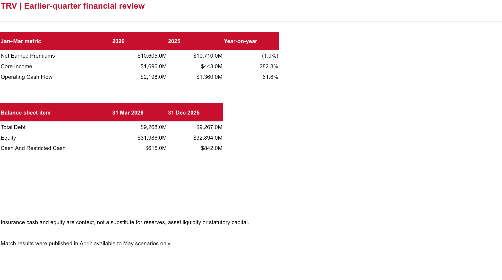
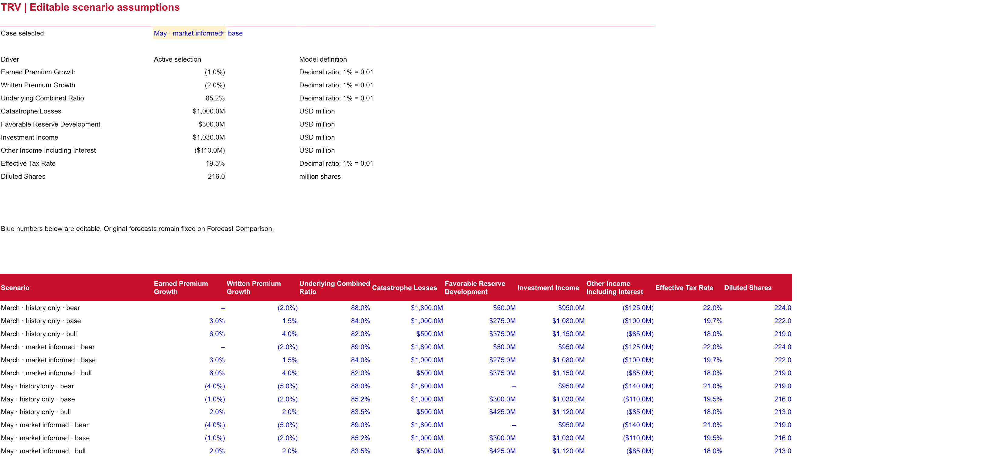

# Travelers: underwriting uncertainty and the premium-earning lag

The target is Travelers' calendar 2026 Q2, April–June. Insurance profit depends on premiums earned, claims and expenses, catastrophes, reserve development and investment income. It requires a different model from a consumer-products company.

[Editable Excel model](../../outputs/TRV_Financial_Scenarios.xlsx) · [Dashboard PBIX](../../outputs/TRV_Financial_Scenarios.pbix) · [Validation and usage notes](../../outputs/README.md)

Questions: [1. Baseline](#q1) · [2. Premiums](#q2) · [3. Claims](#q3) · [4. Investments](#q4) · [5. Results](#q5) · [6. Decisions](#q6)

## 1. Which information belongs in each forecast?

March's information set includes the January results release. The first-quarter release, published in April, belongs only in May's history refresh. The same-quarter prior-year reference preserves seasonal context; recent-quarter results challenge the assumptions without silently replacing that reference.

Inspect source and period controls

[Historical data](../../data/history/history_tidy.csv) retain consolidated and segment distinctions, units and source IDs. [Market evidence](../../data/research/market_evidence.json) separates actual observations, management guidance and agency forecasts. The company-specific [agent design](../public_agents/README.md) assigns independent roles to interpretation, research, scenario construction and challenge.

### The preceding quarter: January–March 2026

Amounts are USD millions. These April-published results enter only the May information set.

| Metric | Q1 2026 | Q1 2025 | YoY |
|---|---:|---:|---:|
| Net earned premiums | 10,605 | 10,710 | -1.0% |
| Core income | 1,696 | 443 | +282.8% |
| Operating cash flow | 2,198 | 1,360 | +61.6% |

Core income rebounded much faster than premiums; that does not imply equivalent recurring premium growth. The Q1 headline combined ratio was 88.6%, distinct from the 85.3% underlying ratio. At March 31 debt was $9,268m versus $9,267m at December 31; equity fell from $32,894m to $31,986m and cash plus restricted cash from $842m to $615m. A full insurer liquidity assessment also needs investments, liability duration and regulatory capital.

View the financial-health worksheet

Actual workbook-library render; native application checks are documented separately.

## 2. Will current pricing reach the income statement immediately?

No. Written premiums record business booked; earned premiums recognize coverage over time. Renewal premium change combines price and exposure changes, and total growth also depends on retention, new business, mix and disposals. Written growth is modeled separately from earned growth; it is not a second revenue stream.

Pricing evidence and why the scenario can change

TRV01 and TRV07 track company renewal momentum, retention and business mix. The Marsh record TRV06 is preserved for audit but excluded from revised model packets because its publication dates conflict. Even a verified broker index would not represent Travelers' exact US portfolio, so an industry rate decline cannot be copied into Travelers' earned-growth assumption. The model retains separate assumptions for written and earned growth rather than pretending to have a calibrated policy-level earning schedule.

Sources: [Travelers January release](https://investor.travelers.com/newsroom/press-releases/news-details/2026/Travelers-Reports-Excellent-Fourth-Quarter-and-Full-Year-Results/default.aspx), [Travelers April release](https://investor.travelers.com/newsroom/press-releases/news-details/2026/Travelers-Reports-Excellent-First-Quarter-Results/default.aspx), [Marsh Q4 release](https://www.marsh.com/ph/about/media/global-commercial-insurance-rates-fall-4-percent-in-q4-2025.html). Marsh's downloaded body and primary index conflict, so this record is excluded from model eligibility.

## 3. Which loss risks should remain separate?

The underlying combined ratio includes claims and underwriting expenses; it is not a claims-only ratio. Catastrophes and favorable prior-year reserve development enter separately. A good prior quarter does not establish recurring reserve releases or a quiet catastrophe season.

Severity, catastrophe evidence and accounting reconciliation

TRV04 provides older structural social-inflation evidence. TRV08 shows why declining injury frequency need not eliminate severity pressure. TRV09 supplies current replacement-cost context. These signals overlap and should inform one combined challenge to loss assumptions, not three full additive surcharges.

TRV05 uses a prospective NOAA outlook. It cannot reveal insured losses, Travelers' exposure, deductibles or reinsurance recovery. A catastrophe range remains a judgment under uncertainty.

The model reconciles the prior-year combined-ratio calculation with reported underwriting income through a separately visible accounting-basis adjustment. Carrying this fixed amount into the target quarter is illustrative; it is not a prediction that fee allocations and basis differences stay constant.

Sources: [Swiss Re structural study](https://www.swissre.com/dam/jcr%3A6bc7d3b7-0f42-4209-a01a-e22787b98685/sri-sigma4-2024-litigation-costs-claims-inflation-final.pdf), [Travelers injury report](https://investor.travelers.com/newsroom/press-releases/news-details/2026/Travelers-Injury-Impact-Report-Highlights-Longer-Recovery-Times-Amid-Declining-Injury-Rates/default.aspx), [NOAA outlook](https://www.noaa.gov/news-release/spring-outlook-drought-forecasted-to-expand-in-us-west-parts-of-plains).

## 4. Why does a rate decision not reprice the whole investment portfolio?

Existing fixed-income coupons persist until cash is reinvested, bonds mature or positions change. Separate invested-asset growth from portfolio-yield changes. A bond-yield increase may reduce fair values and equity today while supporting later investment income. The Fed target alone does not determine bond returns or equity-market performance.

TRV02 provides company investment-income context; TRV03 and TRV10 describe policy-rate decisions. The underwriting model adds investment and other income, deducts taxes and evaluates core earnings. Core measures must not be mislabeled as GAAP net income; realized investment gains require a separate reconciliation.

## 5. Did the research adjustment improve this case?

All eight selected workflows passed independent model QA and froze before evaluation. [Execution record](../agents-execution.md) documents the retained failures and supplemental reviews. Money below is USD millions.

### Actual quarter and financial health

| Metric | Q2 2026 actual | YoY | Versus Q1 2026 |
|---|---:|---:|---:|
| Net earned premiums | 10,753 | -1.5% | +1.4% |
| Net written premiums | 11,529 | -0.1% | +11.5% |
| Underwriting gain | 1,738 | +70.1% | +48.2% |
| Pretax investment income | 1,070 | +13.6% | +6.2% |
| Core income | 2,160 | +43.6% | +27.4% |

The headline combined ratio improved to 83.6%, versus 90.3% a year earlier and 88.6% in Q1; the underlying ratio was 84.1%, versus 84.7% and 85.3%. Actual catastrophe losses were $518m and favorable reserve development $578m. Core income of $2,160m plus $48m after-tax realized gains reconciles to $2,208m GAAP net income. The model’s income-per-diluted-share proxy is not reported core EPS.

### What management explained after the outcome

**Post-outcome explanation only; not a forecast input.** Travelers attributed Business Insurance’s higher earnings mainly to increased favorable reserve development, lower catastrophe losses and investment income. Its reserve improvement reflected better-than-expected workers’ compensation experience across multiple accident years and commercial-property experience in recent years. Personal Insurance also benefited from lower catastrophes; favorable reserves reflected better-than-expected recent-year homeowners and automobile experience. These are management’s explanations of realized performance, not evidence that the cutoff-date scenarios could have predicted the loss outcomes. [July 17 results release](https://investor.travelers.com/newsroom/press-releases/news-details/2026/Travelers-Reports-Excellent-Second-Quarter-and-Year-to-Date-Results/default.aspx).

### What research actually changed on matched history

| Cutoff | Driver and case | History-only → market-informed | Why |
|---|---|---|---|
| March | Underlying combined ratio, bear | 88.0% → 89.0% | Structural severity uncertainty |
| May | Underlying combined ratio, bear | 88.0% → 89.0% | Overlapping social, injury and replacement-cost evidence challenges the downside |

Base and bull assumptions stayed unchanged. Renewals and portfolio changes were already reflected in refreshed history, so research did not apply a second premium reduction. NOAA could not calibrate insured-loss dollars, so the catastrophe assumptions remained unchanged. The date-conflicted Marsh record was excluded.

View research changes and editable assumptions

### Forecast accuracy

| Information set | Base earnings | Absolute error | Error / actual | Actual inside bear–bull? |
|---|---:|---:|---:|---|
| March history | 1,620.3 | 539.7 | 24.98% | Yes |
| March + research | 1,620.3 | 539.7 | 24.98% | Yes |
| May history | 1,435.5 | 724.5 | 33.54% | Yes |
| May + research | 1,435.5 | 724.5 | 33.54% | Yes |

Research did **not improve base accuracy** at either cutoff: it widened the downside only. Historical refresh increased absolute error by **$184.8m**, or **8.56 percentage points**, because the May base fell while actual earnings proved stronger. This deterioration belongs to the history refresh, not the research adjustment.

All four intervals covered actual earnings, but these are broad judgmental ranges, not calibrated confidence intervals. One quarter per company cannot demonstrate general forecasting superiority.

Sequential bridge: May market base to actual earnings

Each row replaces one forecast driver with its actual value in model order. Contributions depend on that order and describe arithmetic, not proven economic causation. Positive values increase actual earnings relative to the base.

| Replaced driver | Earnings change, USD m |
|---|---:|
| earned premium growth | -7.0 |
| underlying combined ratio | +95.2 |
| catastrophe losses | +388.0 |
| favorable reserve development | +223.8 |
| investment income | +32.2 |
| other income including interest | +7.2 |
| effective tax rate | -19.1 |
| Reported rounding and basis residual | +4.1 |

Lower catastrophe losses and larger favorable reserve development dominate the miss. Actual catastrophe losses were $482m below the May base, while favorable reserve development was $278m above it. These outcomes do not establish that they were predictable at the cutoff.

The residual preserves reported rounding and accounting-basis differences rather than silently forcing the reported result into the model. [Complete evaluation data](../../outputs/analysis.json) · [Metric comparisons](../../outputs/forecast_results.csv).

View the forecast comparison and actual-variance bridge

These are rendered views of the delivered workbook; the Excel file contains the editable model.

## 6. What should a decision-maker do with the scenarios?

- Challenge the premium earning lag before using renewal price changes as immediate income growth.
- Stress catastrophe losses separately from the underlying combined ratio.
- Treat reserve releases as uncertain and review their effect on apparent recurring profit.
- Separate investment-income yield lag from equity valuation movements.
- Inspect component errors and the accounting-basis adjustment before accepting a favorable total-profit comparison.

[Editable workbook](../../outputs/TRV_Financial_Scenarios.xlsx) · [Summary screenshot](../../outputs/screenshots/TRV/Summary.png) · [Financial-health screenshot](../../outputs/screenshots/TRV/Financial_Health.png). Screenshots are workbook-library renders; native application checks are reported separately. This is an integrated earnings model with selected cash and balance-sheet diagnostics, not a complete three-statement forecast. [Return to the case-study index](README.md).
