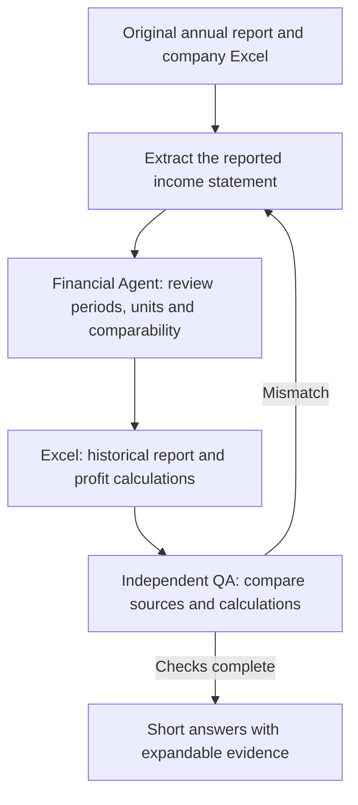
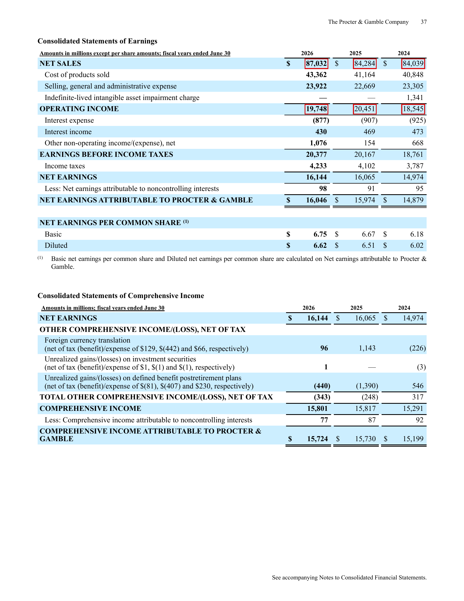
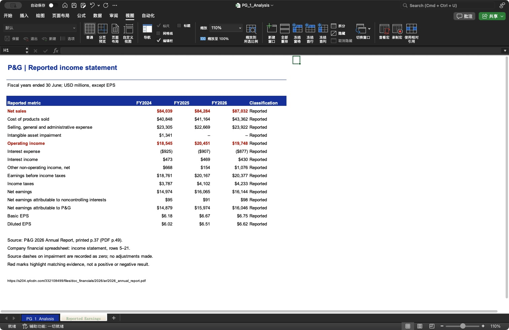
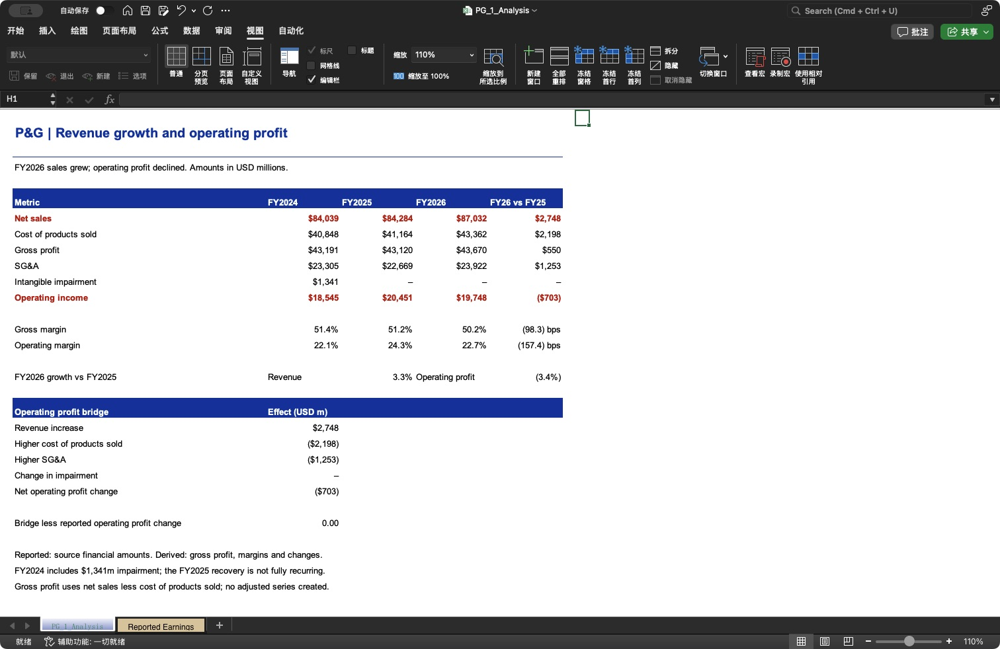

# 1. Financial statements

- **Goal:** Establish reliable historical figures and test whether revenue growth improved operating profit.
- **Audience:** CIO, investment committee and credit analyst.
- **Data:** [P&G 2026 annual report, p.37](https://s204.q4cdn.com/332108499/files/doc_financials/2026/ar/2026_annual_report.pdf#page=49) · [Company's original financial spreadsheet](../raw_data/PG_2026_Company_Financials.xlsx).
- **Output:** [Our Excel analysis](../outputs/PG_1_Analysis.xlsx) · [Structured financial history](../processed_data/financial_history.csv).
- **Scope:** Three full fiscal years ended 30 June, FY2024–FY2026; this sample covers the income statement.

## Analysis questions

| Area | Question | Who uses the answer? |
|---|---|---|
| Data accuracy | [1. Revenue extraction](#revenue-extraction) | Analyst checking the historical financial report. |
| Earnings quality | [2. Revenue vs operating profit](#revenue-vs-profit) | CIO assessing whether growth improves profitability. |

## Agent responsibilities

- **Financial Statements & Quality Agent:** Check the reported figures, accounting basis and explanation of the profit change.
- **Independent QA & Evidence Agent:** Independently compare sources, Excel values and calculations, then report mismatches.
- **Excel / Python:** Extract and calculate using explicit rules; they are tools used by the workflow.

## 1. Revenue extraction: Do the revenues in our Excel match the original annual report?

**Answer:** Yes — FY2024, FY2025 and FY2026 revenues are **$84,039m, $84,284m and $87,032m** in both the annual report and our Excel.

View original report and full Excel screenshot

| Original annual report — printed page 37 | Full Excel worksheet |
|---|---|
|  |  |

Click either image to enlarge it. Red marks identify the corresponding revenue and operating-income figures; they do not mean that every highlighted result is unfavorable.

[Unmarked source page](../raw_data/PG_2026_Earnings_Original_Page.pdf) · [Full original annual report](https://s204.q4cdn.com/332108499/files/doc_financials/2026/ar/2026_annual_report.pdf#page=49) · [Open the Excel analysis](../outputs/PG_1_Analysis.xlsx)

The source image preserves the original PDF page, with red outlines added. The Excel image was captured in Microsoft Excel and includes the complete populated worksheet.

How the figures were checked

- Read the original report's **NET SALES** row and its year headings.
- Compare those figures with **Reported Earnings**, cells **C7:E7**, in our workbook.
- Confirm the same full-year periods, USD currency and million-dollar scale.
- The report lists newest year first; Excel lists oldest year first, so compare year labels rather than column positions.

## 2. Revenue vs operating profit: Did higher FY2026 sales produce higher operating profit?

**Answer:** No — revenue increased **3.3%**, but operating profit fell **3.4% ($703m)** because the combined increase in product costs and SG&A exceeded the revenue increase.

View original report and full Excel screenshot

| Original annual report — printed page 37 | Full Excel worksheet |
|---|---|
|  |  |

Click either image to enlarge it. Red marks identify the corresponding revenue and operating-income figures; they do not mean that every highlighted result is unfavorable.

[Unmarked source page](../raw_data/PG_2026_Earnings_Original_Page.pdf) · [Full original annual report](https://s204.q4cdn.com/332108499/files/doc_financials/2026/ar/2026_annual_report.pdf#page=49) · [Open the Excel analysis](../outputs/PG_1_Analysis.xlsx)

The source image preserves the original PDF page, with red outlines added. The Excel image was captured in Microsoft Excel and includes the complete populated worksheet.

How the $703m decline is explained

| FY2026 compared with FY2025 | Effect on operating profit |
|---|---:|
| Additional revenue | +$2,748m |
| Higher cost of products sold | −$2,198m |
| Higher selling, general and administrative expense | −$1,253m |
| Change in intangible impairment | $0m |
| **Total operating profit change** | **−$703m** |

In Excel, subtract FY2025 from FY2026 for each line, then add the revenue effect and subtract the expense increases. The result equals the change in reported operating income: **$19,748m − $20,451m = −$703m**.

Operating margin falls from **24.3% to 22.7%**. This is an accounting explanation of the change; separating price, volume, mix and business causes belongs in the next Business Driver stage.

FY2024 included a **$1,341m intangible impairment charge**. Its absence helped FY2025 operating profit, so the three-year profit trend should not be treated as wholly recurring growth.

[Back to questions](#analysis-questions) · [Agent workflow and review](../agents/README.md) · [Project home](../README.md)
