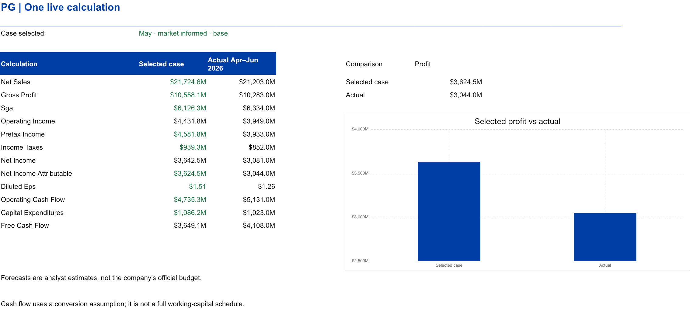
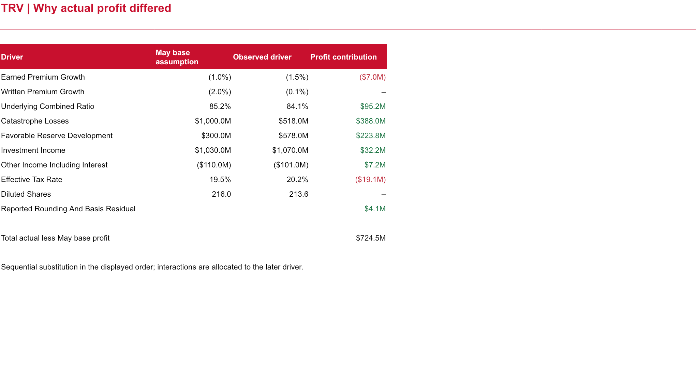
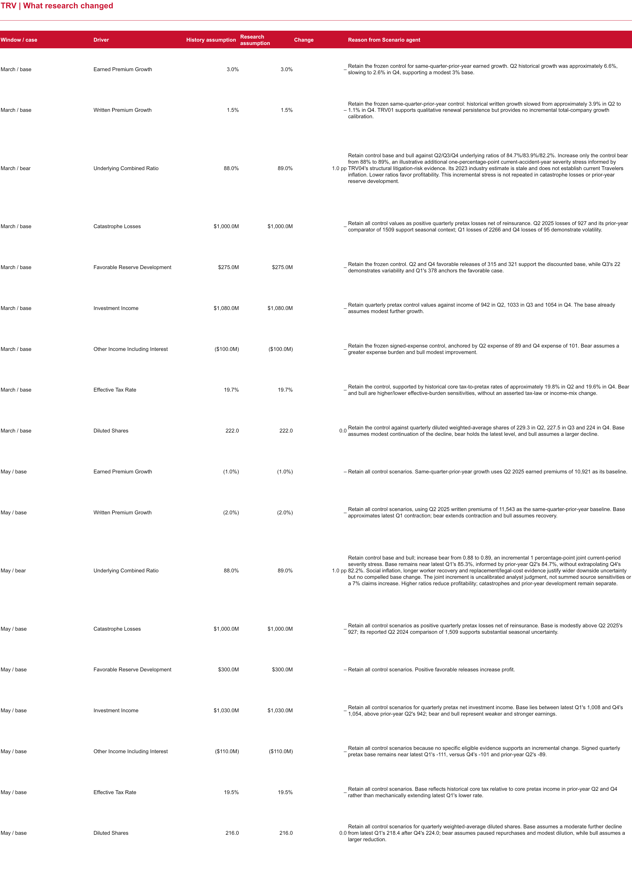
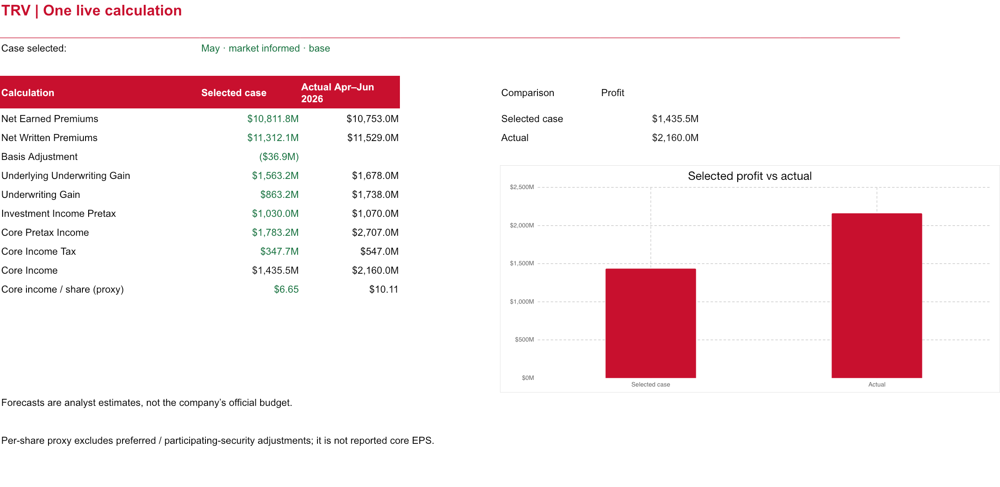
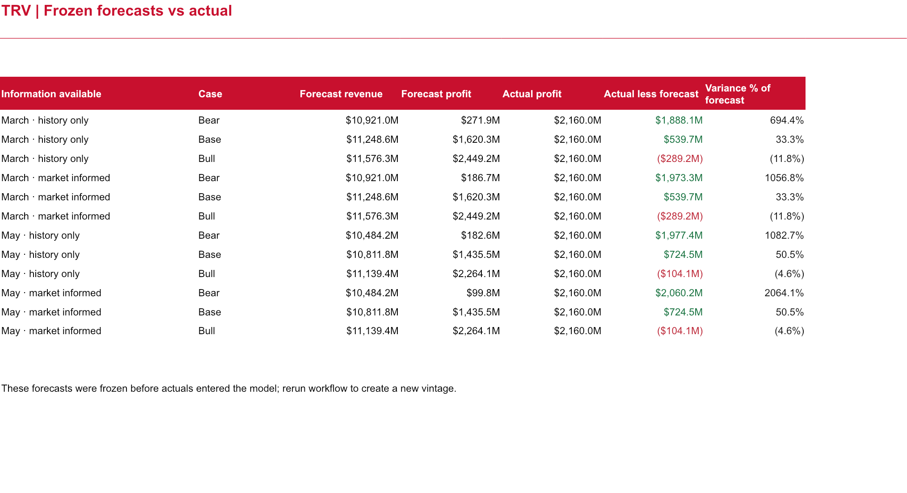

# Analysis outputs

| Company | Editable Excel model | Native Power BI report |
|---|---|---|
| P&G | [Financial scenarios](PG_Financial_Scenarios.xlsx) | [Dashboard PBIX](PG_Financial_Scenarios.pbix) |
| Travelers | [Financial scenarios](TRV_Financial_Scenarios.xlsx) | [Dashboard PBIX](TRV_Financial_Scenarios.pbix) |

## What each worksheet does

| Worksheet | Question it answers |
|---|---|
| Summary | What did the forecasts say, and where did actual profit land? |
| Financial Health | What did the earlier quarter show about earnings, cash and debt/equity? |
| Scenario Model | How do the selected drivers produce financial results? |
| Assumptions | Which inputs define each case, and what changes when I edit one? |
| Forecast Comparison | How far was each original forecast from actual performance? |
| Variance Drivers | Which financial drivers explain actual minus forecast profit? |
| Research Changes | Which assumptions changed when eligible market research was added? |
| Market Evidence | Which dated information justified an adjustment? |
| Historical Financials | Which earlier reported values support the baseline? |
| Sources and Checks | Where did the numbers come from, and does the supplied model reconcile? |

Select a case in the yellow cell on **Assumptions**. Blue inputs are editable; **Scenario Model** recalculates. **Forecast Comparison** retains the original frozen forecasts, so experimenting does not rewrite the original forecast record.

## Prepared results

- [Financial results CSV](forecast_results.csv): company, information vintage, scenario, financial metric and numeric result.
- [Complete analysis JSON](analysis.json): assumptions, actuals, variance bridges, sensitivities and forecast accuracy.
- [Calculation checks](calculation_checks.csv): named reconciliation differences and tolerances.
- [Model QA review](qa/independent_model_review.json): independent review scope and tests.

Currency values are USD millions unless the field explicitly says per share. Ratios in the calculation outputs are decimals. `difference` means actual minus forecast; `relative_difference` divides by absolute forecast. Absolute percentage error instead divides absolute error by absolute actual. Lower forecast error is better; a positive profit variance alone is not proof of greater accuracy.

Inspect the supplied model and comparison

Rendered previews of the delivered workbook sheets. Open the Excel files to edit assumptions and follow formulas.

The PBIX files contain interactive native visuals and slicers. Opening them requires Power BI Desktop; a PBIX download is not a publicly hosted Power BI service link. The editable PBIP projects are in [powerbi](powerbi). Rebuilding the snapshot incorporates newly run scenarios; ordinary Power BI refresh does not run agents.

Validation: workbook formulas and rendered sheets were checked with the authoring library; native Microsoft Excel was not installed in the validation environment. Both PBIX reports were saved in Power BI Desktop, with 142 native DAX comparisons and 12 page-level visual checks passing. See [P&G native validation](powerbi/PG/final_validation.json) and [Travelers native validation](powerbi/TRV/final_validation.json).
