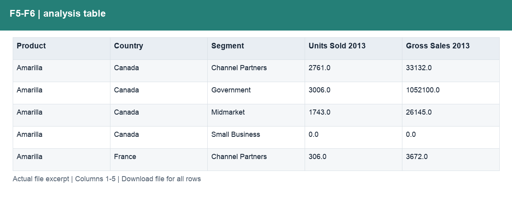
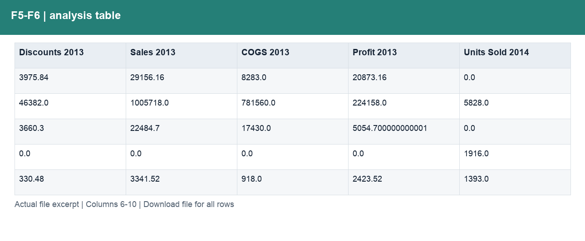
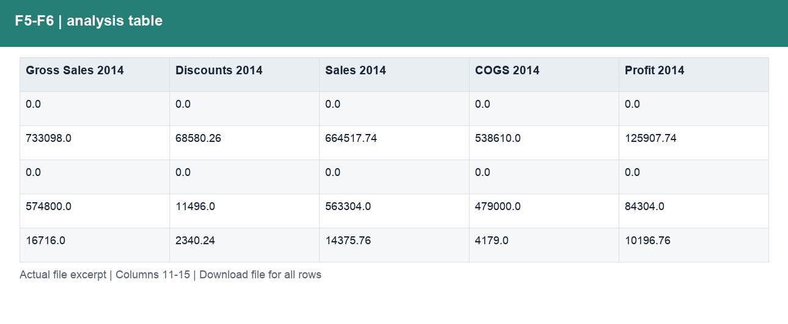
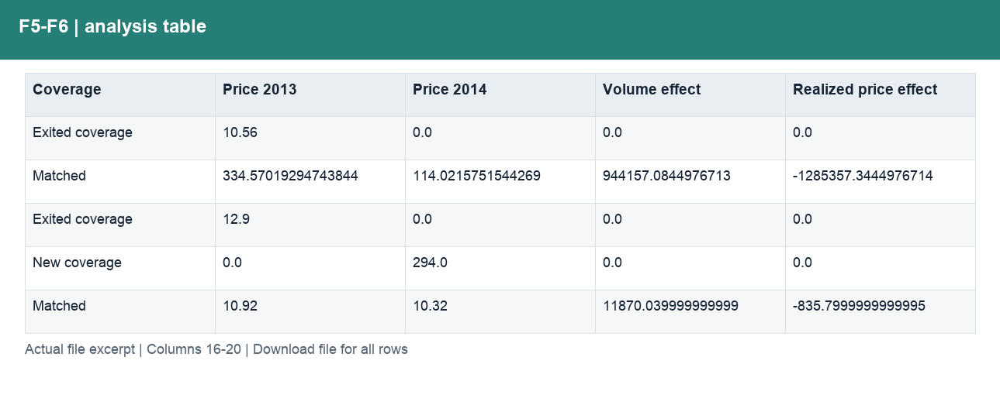
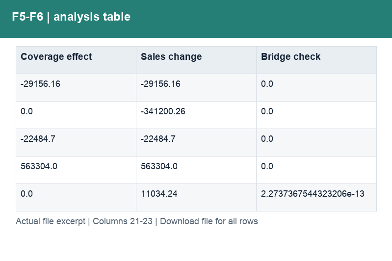

# F5-F6_可比期间增长拆解.csv

[Download the complete file](<../outputs/F5-F6_可比期间增长拆解.csv>) · [Back to data guide](../README.md)

**Purpose:** Explain growth over equal-length comparable periods.

**Rows:** 142. **Fields:** 23. CSV files store text; the type rules below describe how to interpret the values during import. The images render the actual first five records, with wide tables split into consecutive column panels. They are data excerpts, not screenshots of the Excel application.

## Fields and formats

| Field | Meaning / use | Import and display | Example |
|---|---|---|---|
| Product | Grouping, filter or comparison label for product. | Text / categorical label; preserve spelling and blanks | Amarilla |
| Country | Grouping, filter or comparison label for country. | Text / categorical label; preserve spelling and blanks | Canada |
| Segment | Grouping, filter or comparison label for segment. | Text / categorical label; preserve spelling and blanks | Channel Partners |
| Units Sold 2013 | Field retained under its source/output label; interpret with the table purpose and displayed example. | Numeric; counts as whole numbers, units/durations retain needed decimals | 2761.0 |
| Gross Sales 2013 | Field retained under its source/output label; interpret with the table purpose and displayed example. | Numeric; preserve full precision, display amount with 2 decimals where applicable | 33132.0 |
| Discounts 2013 | Field retained under its source/output label; interpret with the table purpose and displayed example. | Numeric; preserve full precision, display amount with 2 decimals where applicable | 3975.84 |
| Sales 2013 | Field retained under its source/output label; interpret with the table purpose and displayed example. | Numeric; preserve full precision, display amount with 2 decimals where applicable | 29156.16 |
| COGS 2013 | Field retained under its source/output label; interpret with the table purpose and displayed example. | Numeric; preserve full precision, display amount with 2 decimals where applicable | 8283.0 |
| Profit 2013 | Field retained under its source/output label; interpret with the table purpose and displayed example. | Numeric; preserve full precision, display amount with 2 decimals where applicable | 20873.16 |
| Units Sold 2014 | Field retained under its source/output label; interpret with the table purpose and displayed example. | Numeric; counts as whole numbers, units/durations retain needed decimals | 0.0 |
| Gross Sales 2014 | Field retained under its source/output label; interpret with the table purpose and displayed example. | Numeric; preserve full precision, display amount with 2 decimals where applicable | 0.0 |
| Discounts 2014 | Field retained under its source/output label; interpret with the table purpose and displayed example. | Numeric; preserve full precision, display amount with 2 decimals where applicable | 0.0 |
| Sales 2014 | Field retained under its source/output label; interpret with the table purpose and displayed example. | Numeric; preserve full precision, display amount with 2 decimals where applicable | 0.0 |
| COGS 2014 | Field retained under its source/output label; interpret with the table purpose and displayed example. | Numeric; preserve full precision, display amount with 2 decimals where applicable | 0.0 |
| Profit 2014 | Field retained under its source/output label; interpret with the table purpose and displayed example. | Numeric; preserve full precision, display amount with 2 decimals where applicable | 0.0 |
| Coverage | Coverage definition for this output; consult the analysis context. | Text / categorical label; preserve spelling and blanks | Exited coverage |
| Price 2013 | Field retained under its source/output label; interpret with the table purpose and displayed example. | Numeric; preserve full precision, display amount with 2 decimals where applicable | 10.56 |
| Price 2014 | Field retained under its source/output label; interpret with the table purpose and displayed example. | Numeric; preserve full precision, display amount with 2 decimals where applicable | 0.0 |
| Volume effect | Matched-combination units change × prior realised price. | Numeric; preserve full precision, display amount with 2 decimals where applicable | 0.0 |
| Realized price effect | Current units × realised-price change. | Numeric; preserve full precision, display amount with 2 decimals where applicable | 0.0 |
| Coverage effect | Sales effect from combinations present in only one compared period. | Numeric; preserve full precision, display amount with 2 decimals where applicable | -29156.16 |
| Sales change | Field retained under its source/output label; interpret with the table purpose and displayed example. | Numeric; preserve full precision, display amount with 2 decimals where applicable | -29156.16 |
| Bridge check | Difference between the sum of bridge components and the total change. | Numeric; preserve full precision, display amount with 2 decimals where applicable | 0.0 |
