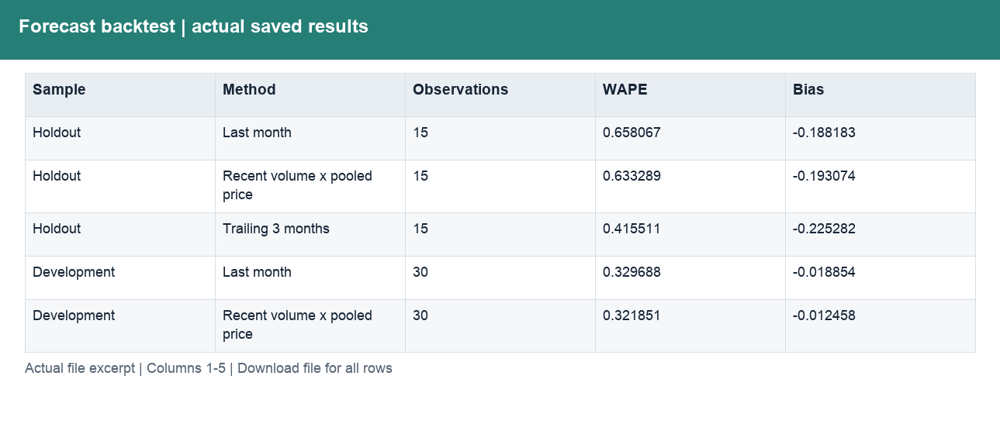
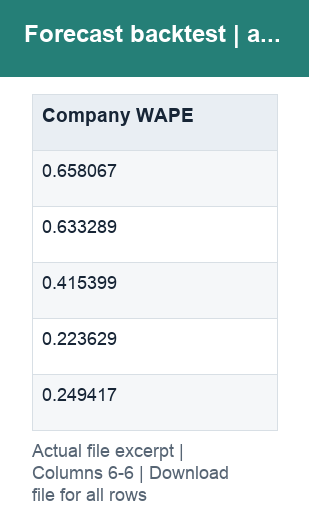

# Forecast backtest results

[Download summary](../outputs/FP&A_extensions/F11_Backtest_Summary.csv) · [Detailed results](../outputs/FP&A_extensions/F11_回测明细.json) · [SQL](../outputs/FP&A_extensions/F11_回测逻辑.sql)

Three methods are compared over the same rolling one-month horizon. April–September is the method-selection period; October–December is the holdout period. The trailing-three-month method is selected on development results.

| Column | Meaning | Format |
|---|---|---|
| Sample | Development or Holdout window | Text |
| Method | Forecast baseline | Text |
| Observations | Segment × target-month observations per method | Whole number |
| WAPE | Sum of absolute segment-level errors / absolute actual sales | Decimal, display 0.0% |
| Bias | Sum of forecast minus actual / absolute actual sales | Signed decimal, display 0.0% |
| Company WAPE | Aggregate segments first, then calculate monthly absolute errors | Decimal, display 0.0% |

WAPE is an error measure, not an accuracy percentage. These are historical simulations, not the performance of a deployed forecast.
