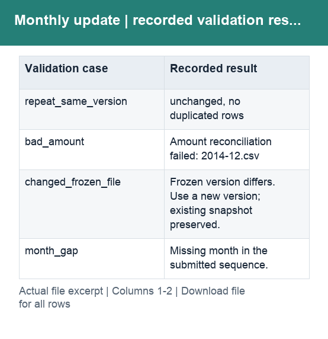

# Monthly update and version checks

[Original validation output](../outputs/FP&A_extensions/F18_验证记录.json) · [Frozen database](../outputs/FP&A_extensions/F18_已验证版本/sample_2014_12_v1.sqlite) · [Update script](../outputs/FP&A_extensions/F18_月度更新与版本冻结.py)

This local process checks monthly completeness and amount identities before creating a versioned database. Re-running identical data does not append duplicate records.

Both columns are text: **Validation case** identifies the test; **Recorded result** is the saved outcome. The frozen database contains sample records and provenance, not a live cloud connection.
