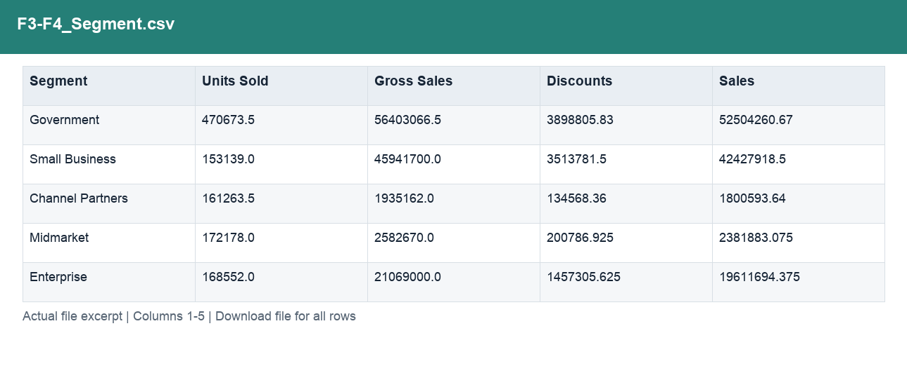
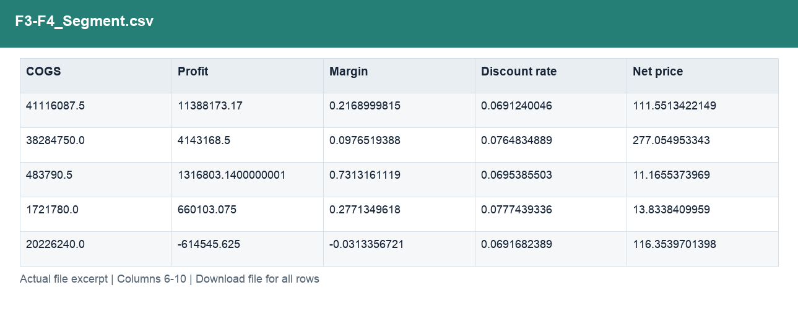

# F3-F4_Segment.csv

[Download the complete file](<../outputs/F3-F4_Segment.csv>) · [Back to data guide](../README.md)

**Purpose:** Compare product, country and segment economics.

**Rows:** 5. **Fields:** 10. CSV files store text; the type rules below describe how to interpret the values during import. The images render the actual first five records, with wide tables split into consecutive column panels. They are data excerpts, not screenshots of the Excel application.

## Fields and formats

| Field | Meaning / use | Import and display | Example |
|---|---|---|---|
| Segment | Grouping, filter or comparison label for segment. | Text / categorical label; preserve spelling and blanks | Government |
| Units Sold | Sample units sold; fractional values are preserved. | Numeric; counts as whole numbers, units/durations retain needed decimals | 470673.5 |
| Gross Sales | Units sold × sale price, before discounts. | Numeric; preserve full precision, display amount with 2 decimals where applicable | 56403066.5 |
| Discounts | Discount amount deducted from gross sales. | Numeric; preserve full precision, display amount with 2 decimals where applicable | 3898805.83 |
| Sales | Net sales after discounts. | Numeric; preserve full precision, display amount with 2 decimals where applicable | 52504260.67 |
| COGS | Cost of goods sold from the source sample. | Numeric; preserve full precision, display amount with 2 decimals where applicable | 41116087.5 |
| Profit | Sales less COGS; not full company net profit. | Numeric; preserve full precision, display amount with 2 decimals where applicable | 11388173.17 |
| Margin | Aggregate profit divided by aggregate sales. | Decimal ratio; display as 0.0% (0.10 = 10%) | 0.2168999815 |
| Discount rate | Total discounts divided by total gross sales. | Decimal ratio; display as 0.0% (0.10 = 10%) | 0.0691240046 |
| Net price | Net sales divided by units sold. | Numeric; preserve full precision, display amount with 2 decimals where applicable | 111.5513422149 |
