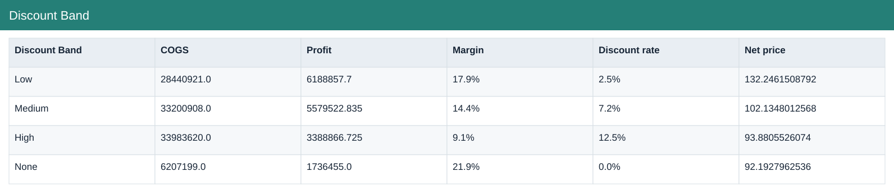

# Discount Band

[Download data](<../outputs/F3-F4_Discount Band.csv>) · [Back to data](../README.md)

## Discount Band

Compare product, country and segment economics.

### Fields

| Field | Meaning | Format | Example |
|---|---|---|---|
| Discount Band | — | Text | Low |
| Units Sold | Sample units sold; fractional values are preserved. | Number | 261858.5 |
| Gross Sales | Units sold × sale price, before discounts. | Number | 35515454.5 |
| Discounts | Discount amount deducted from gross sales. | Number | 885675.8 |
| Sales | Net sales after discounts. | Number | 34629778.7 |
| COGS | Cost of goods sold from the source sample. | Number | 28440921.0 |
| Profit | Sales less COGS; not full company net profit. | Number | 6188857.7 |
| Margin | Aggregate profit divided by aggregate sales. | Percentage | 17.9% |
| Discount rate | Total discounts divided by total gross sales. | Percentage | 2.5% |
| Net price | Net sales divided by units sold. | Number | 132.2461508792 |

