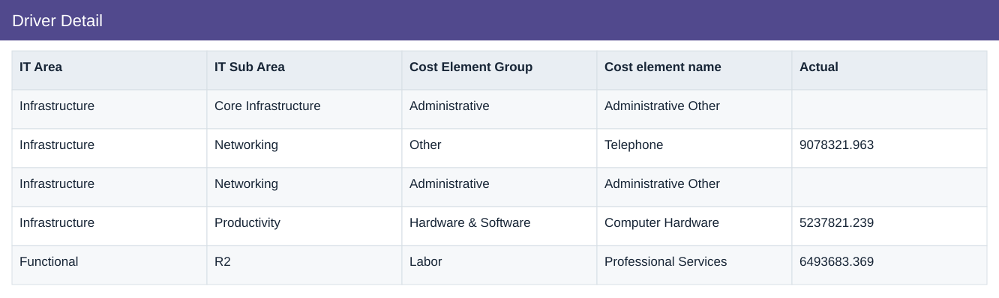
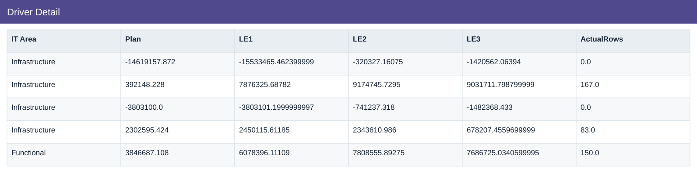
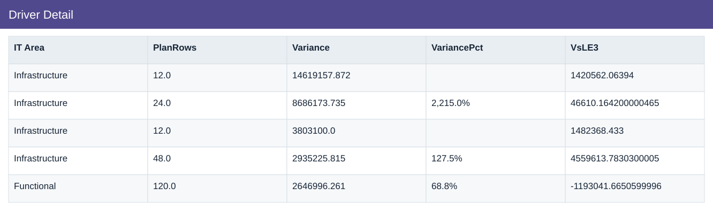

# Driver Detail

[Download data](<../outputs/I4_Driver_Detail.csv>) · [Back to data](../README.md)

## Driver Detail

Trace material cost variances to reviewable drivers.

### Fields

| Field | Meaning | Format | Example |
|---|---|---|---|
| IT Area | — | Text | Infrastructure |
| IT Sub Area | — | Text | Core Infrastructure |
| Cost Element Group | — | Text | Administrative |
| Cost element name | — | Text | Administrative Other |
| Actual | Actual scenario amount. | Number | 9078321.963 |
| Plan | Planned scenario amount. | Number | -14619157.872 |
| LE1 | Latest estimate version 1. | Number | -15533465.462399999 |
| LE2 | Latest estimate version 2. | Number | -320327.16075 |
| LE3 | Latest estimate version 3. | Number | -1420562.06394 |
| ActualRows | — | Number | 0.0 |
| PlanRows | — | Number | 12.0 |
| Variance | Actual less Plan. Positive IT cost variance means over plan. | Number | 14619157.872 |
| VariancePct | Variance divided by positive Plan; non-positive plans have no ordinary percentage. | Percentage | 2,215.0% |
| VsLE3 | Actual less LE3. | Number | 1420562.06394 |

