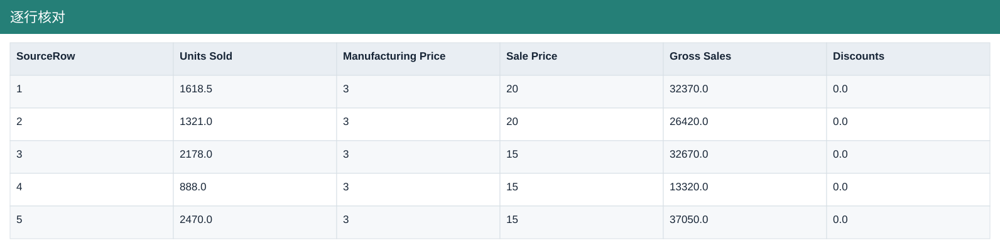
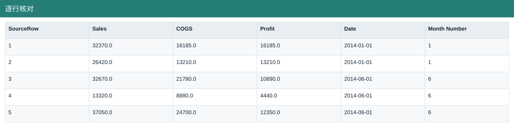
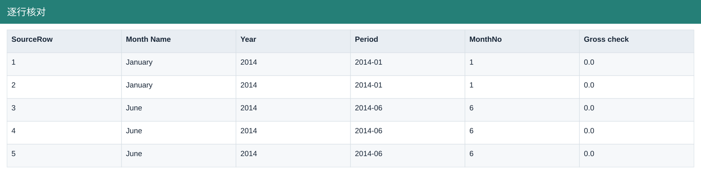
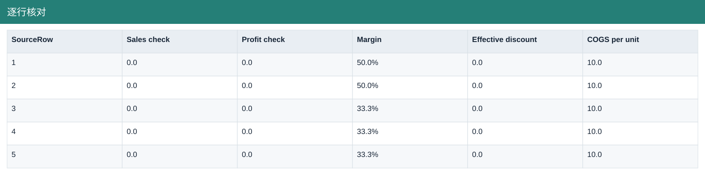

# 逐行核对

[Download data](<../outputs/F1_逐行核对.csv>) · [Back to data](../README.md)

## 逐行核对

Reconcile the revenue and profit chain and retain traceability.

### Fields

| Field | Meaning | Format | Example |
|---|---|---|---|
| SourceRow | Traceability row in this sample, not a business transaction ID. | Number | 1 |
| Segment | — | Text | Government |
| Country | — | Text | Canada |
| Product | — | Text | Carretera |
| Discount Band | — | Text | None |
| Units Sold | Sample units sold; fractional values are preserved. | Number | 1618.5 |
| Manufacturing Price | Source manufacturing-price field; not a substitute for unit COGS. | Number | 3 |
| Sale Price | — | Number | 20 |
| Gross Sales | Units sold × sale price, before discounts. | Number | 32370.0 |
| Discounts | Discount amount deducted from gross sales. | Number | 0.0 |
| Sales | Net sales after discounts. | Number | 32370.0 |
| COGS | Cost of goods sold from the source sample. | Number | 16185.0 |
| Profit | Sales less COGS; not full company net profit. | Number | 16185.0 |
| Date | — | Text | 2014-01-01 |
| Month Number | — | Number | 1 |
| Month Name | — | Text | January |
| Year | Calendar year. | Number | 2014 |
| Period | — | Text | 2014-01 |
| MonthNo | Month number used for chronological sorting. | Number | 1 |
| Gross check | — | Number | 0.0 |
| Sales check | — | Number | 0.0 |
| Profit check | — | Number | 0.0 |
| Margin | Aggregate profit divided by aggregate sales. | Percentage | 50.0% |
| Effective discount | Discounts divided by gross sales. | Number | 0.0 |
| COGS per unit | — | Number | 10.0 |

