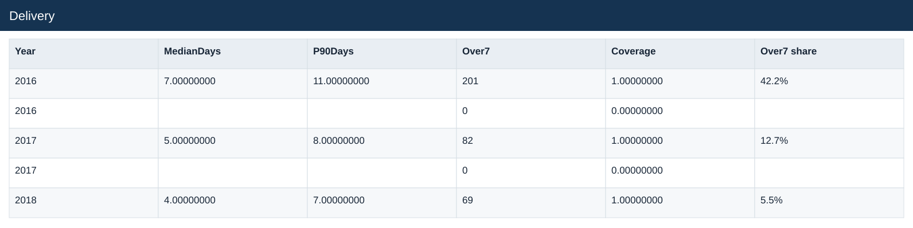

# Delivery

[Download data](<../outputs/E7_Delivery.csv>) · [Back to data](../README.md)

## Delivery

Analyse valid delivery times and illustrate exchange-rate treatment.

### Fields

| Field | Meaning | Format | Example |
|---|---|---|---|
| Year | Calendar year. | Number | 2016 |
| Channel | — | Text | Online |
| Orders | — | Number | 476 |
| Valid | — | Number | 476 |
| MeanDays | Mean valid delivery duration in days. | Number | 7.17226891 |
| MedianDays | Median valid delivery duration in days. | Number | 7.00000000 |
| P90Days | 90th percentile valid delivery duration in days. | Number | 11.00000000 |
| Over7 | Count of valid deliveries taking more than seven days. | Number | 201 |
| Coverage | Coverage definition for this output; consult the analysis context. | Number | 1.00000000 |
| Over7 share | Over7 divided by valid deliveries. | Percentage | 42.2% |

