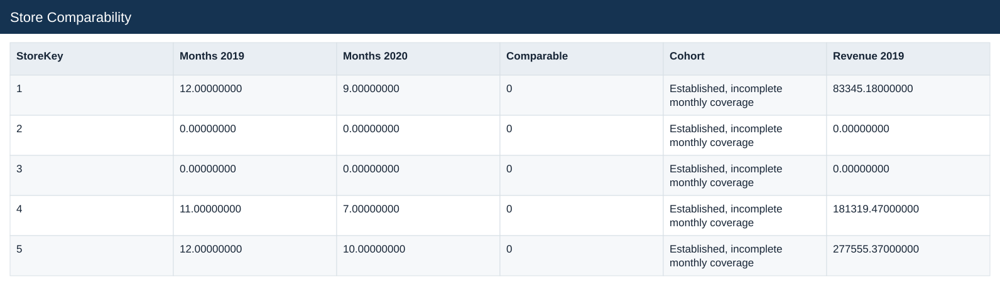
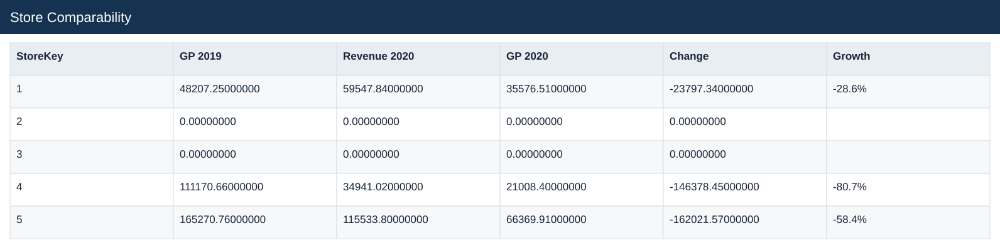
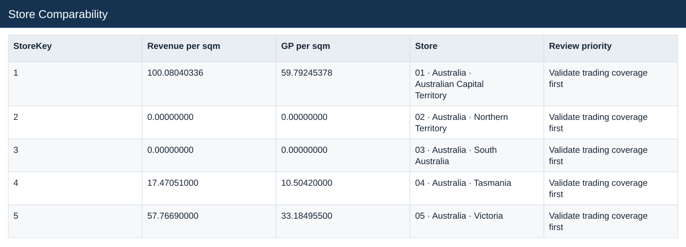

# Store Comparability

[Download data](<../outputs/E5_Store_Comparability.csv>) · [Back to data](../README.md)

## Store Comparability

Identify a consistent same-store comparison group.

### Fields

| Field | Meaning | Format | Example |
|---|---|---|---|
| StoreKey | — | Number | 1 |
| Store Country | — | Text | Australia |
| Store State | — | Text | Australian Capital Territory |
| Square Meters | — | Number | 595.00000000 |
| Open Date | — | Text | 2008-01-01 |
| Months 2019 | — | Number | 12.00000000 |
| Months 2020 | — | Number | 9.00000000 |
| Comparable | Flag for the strict comparable-store criteria. | Number | 0 |
| Cohort | — | Text | Established, incomplete monthly coverage |
| Revenue 2019 | — | Number | 83345.18000000 |
| GP 2019 | — | Number | 48207.25000000 |
| Revenue 2020 | — | Number | 59547.84000000 |
| GP 2020 | — | Number | 35576.51000000 |
| Change | — | Number | -23797.34000000 |
| Growth | Current comparable sales divided by prior sales, less one. | Percentage | -28.6% |
| Revenue per sqm | — | Number | 100.08040336 |
| GP per sqm | — | Number | 59.79245378 |
| Store | — | Text | 01 · Australia · Australian Capital Territory |
| Review priority | — | Text | Validate trading coverage first |

