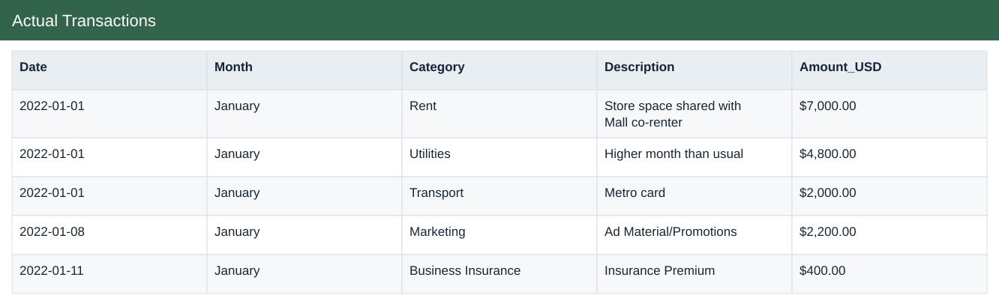

# Actual Transactions

[Download data](<../prepared_inputs/Actual_Transactions.csv>) · [Back to data](../README.md)

## Actual Transactions

View the budget, actual amounts and calculations.

### Fields

| Field | Meaning | Format | Example |
|---|---|---|---|
| Date | — | Text | 2022-01-01 |
| Month | Month label or month-start key. | Text | January |
| Category | — | Text | Rent |
| Description | — | Text | Store space shared with Mall co-renter |
| Amount_USD | — | US dollars | $7,000.00 |

