# Commercial_Performance.xlsx

[Download workbook](../worksheets/Commercial_Performance.xlsx) · [Back to data guide](../README.md)

This page renders saved cell values from the actual workbook. Excel workbooks mix schedules, assumptions and tables, so formats are documented by worksheet and column rather than treating the whole file as one dataset. No calculations or source cells were changed for these illustrations.

## F2 Performance

Measure monthly commercial performance.

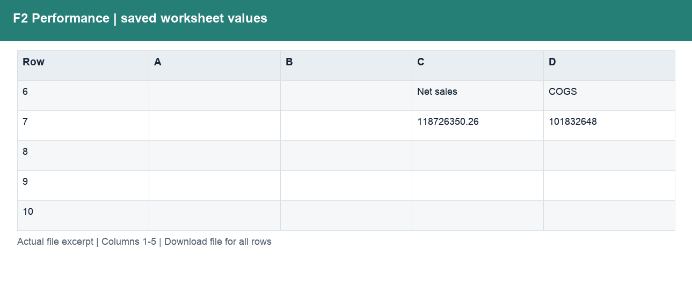

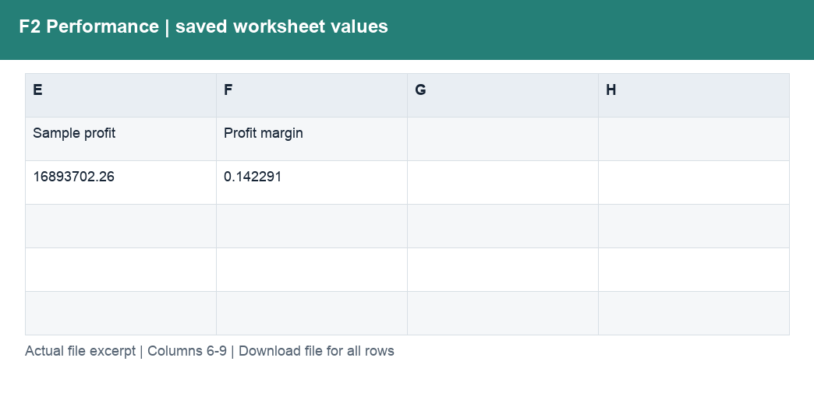

| Column | Labels / sample content | Stored type and Excel number format |
|---|---|---|
| A | Numeric schedule values | ;  |
| B | Numeric schedule values | ;  |
| C | F2. Sales and profit performance; Sample currency units. Profit = Sales − COGS; not company net income.; Net sales | float, str; #,##0;(#,##0);–; General |
| D | COGS; Net sales; Profit | float, int, str; #,##0;(#,##0);–; General |
| E | Sample profit; COGS | float, int, str; #,##0;(#,##0);–; General |
| F | Profit margin; Profit | float, str; #,##0;(#,##0);–; 0.0%;(0.0%);–; General |
| G | Margin | float, str; 0.0%;(0.0%);–; General |
| H | Units | float, int, str; #,##0.0; General |

Column labels may change between sections lower in the worksheet. Download the workbook to follow those schedules and formulas; the illustration shows only the opening populated section.

## F3 Portfolio

Compare product, country and segment economics.

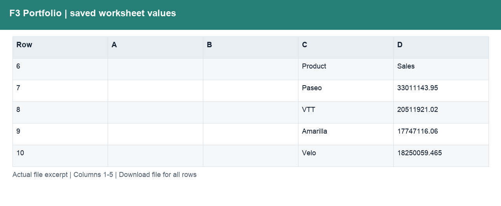

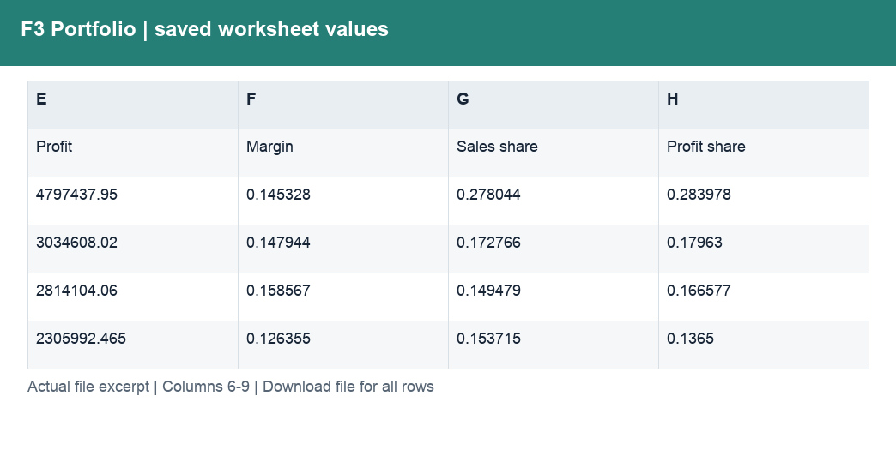

| Column | Labels / sample content | Stored type and Excel number format |
|---|---|---|
| A | Numeric schedule values | ;  |
| B | Numeric schedule values | ;  |
| C | F3. Scale and profitability; Sample currency units. Profit = Sales − COGS; not company net income.; Product | str; General |
| D | Sales; Sales; Sales | float, str; #,##0;(#,##0);–; General |
| E | Profit; Profit; Profit | float, str; #,##0;(#,##0);–; General |
| F | Margin; Margin; Margin | float, str; 0.0%;(0.0%);–; General |
| G | Sales share; Sales share; Sales share | float, str; 0.0%;(0.0%);–; General |
| H | Profit share; Profit share; Profit share | float, str; 0.0%;(0.0%);–; General |

Column labels may change between sections lower in the worksheet. Download the workbook to follow those schedules and formulas; the illustration shows only the opening populated section.

## F4 Discounts

Identify discount dependence and loss-making records.

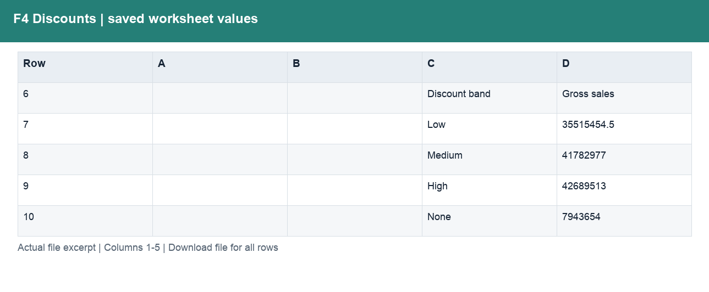

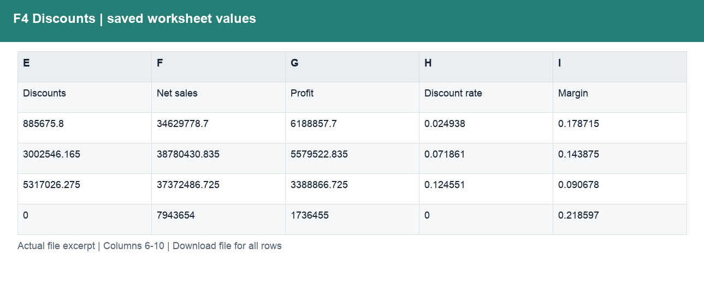

| Column | Labels / sample content | Stored type and Excel number format |
|---|---|---|
| A | Numeric schedule values | ;  |
| B | Numeric schedule values | ;  |
| C | F4. Discounts and loss-making records; Sample currency units. Profit = Sales − COGS; not company net income.; Discount band | int, str; General |
| D | Gross sales; Product; VTT | float, int, str; #,##0;(#,##0);–; General |
| E | Discounts; Country; Canada | float, int, str; #,##0;(#,##0);–; General |
| F | Net sales; Segment; Enterprise | float, int, str; #,##0;(#,##0);–; General |
| G | Profit; Discount; High | float, int, str; #,##0;(#,##0);–; General |
| H | Discount rate; Sales | float, int, str; #,##0;(#,##0);–; 0.0%;(0.0%);–; General |
| I | Margin; Profit | float, int, str; #,##0;(#,##0);–; 0.0%;(0.0%);–; General |

Column labels may change between sections lower in the worksheet. Download the workbook to follow those schedules and formulas; the illustration shows only the opening populated section.

## F5-F6 Growth

Explain growth over equal-length comparable periods.

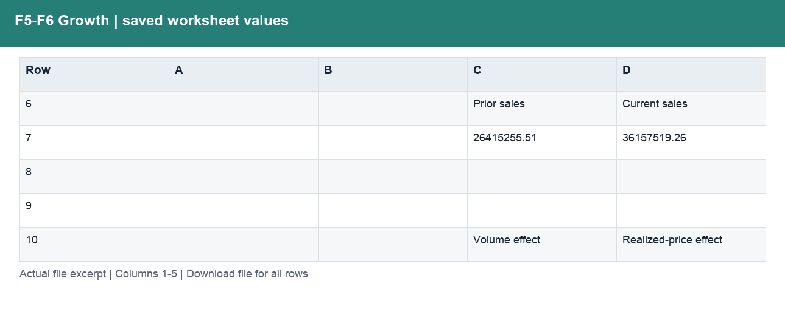

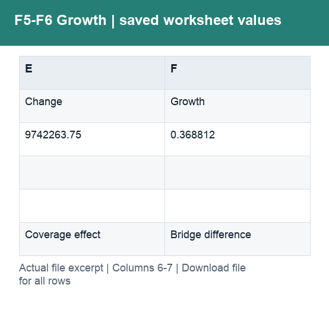

| Column | Labels / sample content | Stored type and Excel number format |
|---|---|---|
| A | Numeric schedule values | ;  |
| B | Numeric schedule values | ;  |
| C | F5–F6. Comparable growth and its drivers; Sep–Dec 2014 vs Sep–Dec 2013. Product × country × segment.; Prior sales | float, str; #,##0;(#,##0);–; General |
| D | Current sales; Realized-price effect; Country | float, str; #,##0;(#,##0);–; General |
| E | Change; Coverage effect; Segment | float, str; #,##0;(#,##0);–; General |
| F | Growth; Bridge difference; Prior units | float, int, str; #,##0;(#,##0);–; 0.0%;(0.0%);–; 0.00; General |

Column labels may change between sections lower in the worksheet. Download the workbook to follow those schedules and formulas; the illustration shows only the opening populated section.

## F7 Policy test

Test discount and volume scenarios.

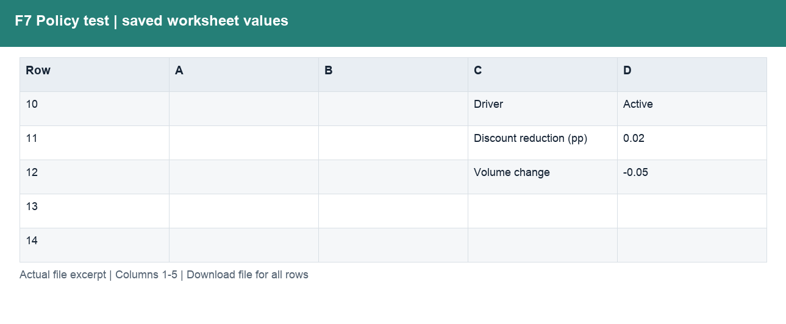

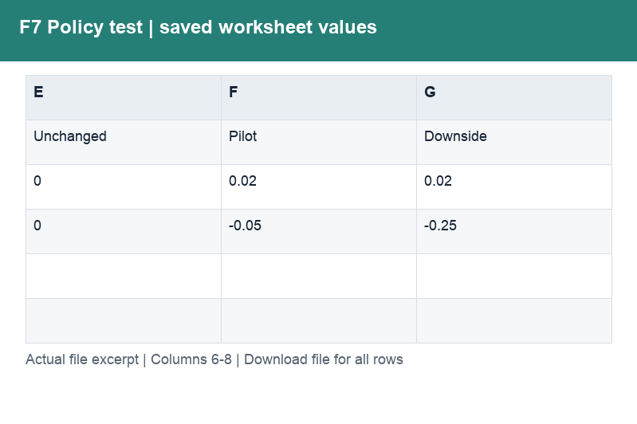

| Column | Labels / sample content | Stored type and Excel number format |
|---|---|---|
| A | Numeric schedule values | ;  |
| B | Numeric schedule values | ;  |
| C | F7. Discount policy pilot; Paseo / Small Business / 2014. Unit COGS held constant. No demand elasticity inferred.; Case number | int, str; General |
| D | Case selected; Pilot; Active | float, int, str; #,##0.00;(#,##0.00);–; 0.0%;(0.0%);–; General |
| E | Unchanged; Selected case | float, int, str; #,##0.00;(#,##0.00);–; 0.0%;(0.0%);–; General |
| F | Pilot | float, str; 0.0%;(0.0%);–; General |
| G | Downside | float, str; 0.0%;(0.0%);–; General |

Column labels may change between sections lower in the worksheet. Download the workbook to follow those schedules and formulas; the illustration shows only the opening populated section.

## F8-F9 Review

Explain quarterly profit contributions.

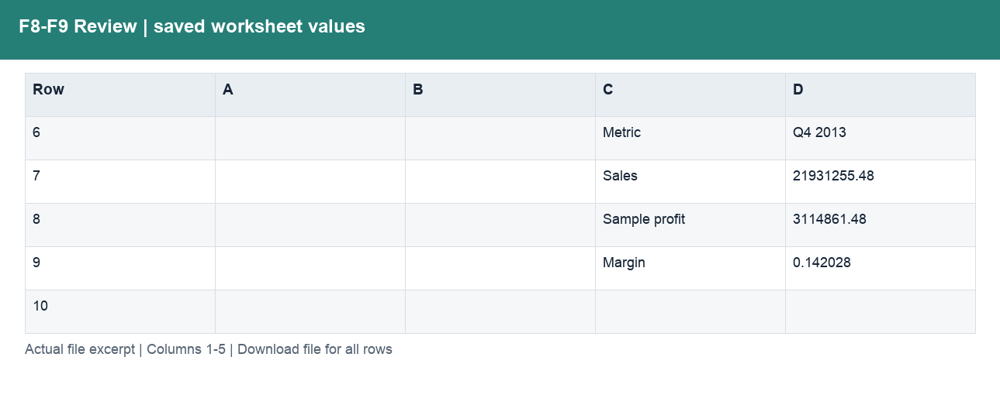

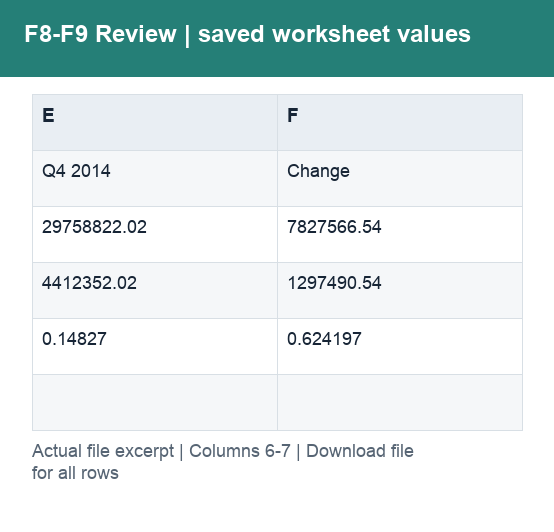

| Column | Labels / sample content | Stored type and Excel number format |
|---|---|---|
| A | Numeric schedule values | ;  |
| B | Numeric schedule values | ;  |
| C | F8–F9. Quarterly review and decisions; Q4 2014 vs Q4 2013. Recommendations require commercial validation.; Metric | str; General |
| D | Q4 2013; Next step; Test discount policy | float, str; #,##0;(#,##0);–; 0.0%;(0.0%);–; General |
| E | Q4 2014; Evidence needed; Contracts, demand response, fixed costs | float, str; #,##0;(#,##0);–; 0.0%;(0.0%);–; General |
| F | Change; Owner response | float, str; #,##0;(#,##0);–; 0.00" pp"; General |

Column labels may change between sections lower in the worksheet. Download the workbook to follow those schedules and formulas; the illustration shows only the opening populated section.

## F1 Source

Reconcile the revenue and profit chain and retain traceability.

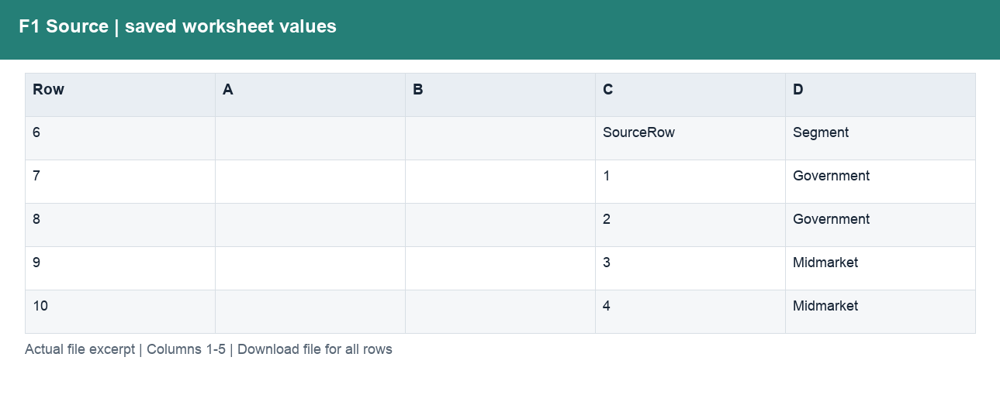

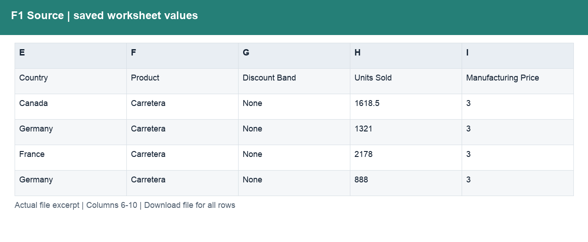

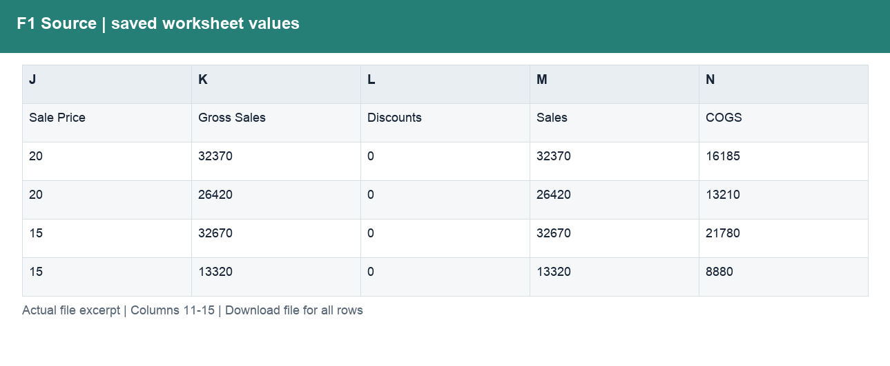

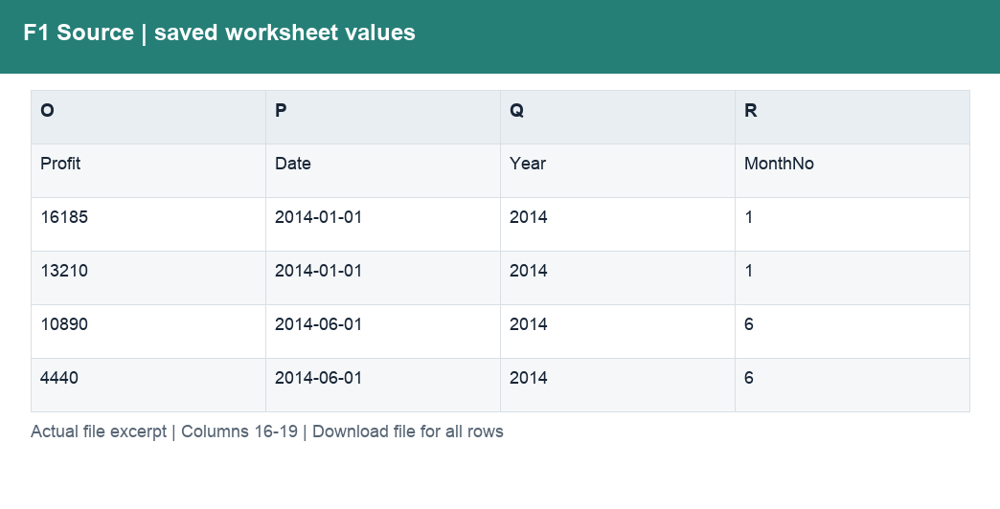

| Column | Labels / sample content | Stored type and Excel number format |
|---|---|---|
| A | Numeric schedule values | ;  |
| B | Numeric schedule values | ;  |
| C | F1. Original inputs and amount checks; https://learn.microsoft.com/en-us/power-bi/create-reports/sample-financial-download; SourceRow | int, str; General |
| D | Segment; Government; Government | str; General |
| E | Country; Canada; Germany | str; General |
| F | Product; Carretera; Carretera | str; General |
| G | Discount Band; None; None | str; General |
| H | Units Sold | float, int, str; #,##0.00;(#,##0.00);–; General |
| I | Manufacturing Price | int, str; #,##0.00;(#,##0.00);–; General |
| J | Sale Price | int, str; #,##0.00;(#,##0.00);–; General |
| K | Gross Sales | float, int, str; #,##0.00;(#,##0.00);–; General |
| L | Discounts | int, str; #,##0.00;(#,##0.00);–; General |
| M | Sales | float, int, str; #,##0.00;(#,##0.00);–; General |
| N | COGS | int, str; #,##0.00;(#,##0.00);–; General |
| O | Profit | float, int, str; #,##0.00;(#,##0.00);–; General |
| P | Date | datetime, str; General; mmm-yy |
| Q | Year | int, str; General |
| R | MonthNo | int, str; General |

Column labels may change between sections lower in the worksheet. Download the workbook to follow those schedules and formulas; the illustration shows only the opening populated section.

## F10 Refresh

Validate repeatable monthly inputs without double-counting.

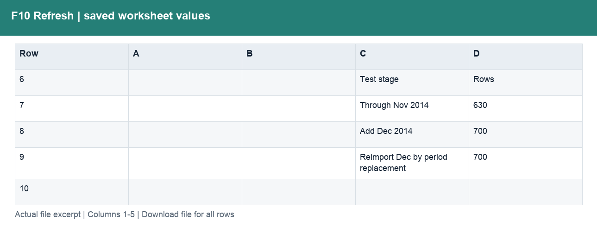

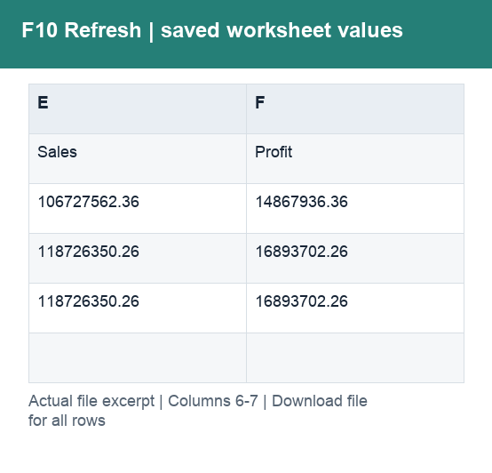

| Column | Labels / sample content | Stored type and Excel number format |
|---|---|---|
| A | Numeric schedule values | ;  |
| B | Numeric schedule values | ;  |
| C | F10. Repeatable monthly refresh; Sample currency units. Profit = Sales − COGS; not company net income.; Test stage | str; General |
| D | Rows; Difference | float, int, str; 0.00; General |
| E | Sales | float, str; #,##0;(#,##0);–; General |
| F | Profit | float, str; #,##0;(#,##0);–; General |

Column labels may change between sections lower in the worksheet. Download the workbook to follow those schedules and formulas; the illustration shows only the opening populated section.

