# Commercial Performance

[Download Excel file](<../worksheets/Commercial_Finance_1_Analysis.xlsx>) · [Back to data](../README.md)

## Performance

Performance: a preview of the figures in the workbook.

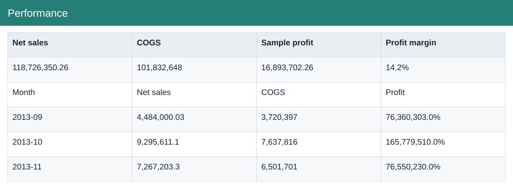

### Fields

| Field | Format | Example |
|---|---|---|
| Net sales | Number (2 decimals) | 118,726,350.26 |
| COGS | Whole number | 101,832,648 |
| Sample profit | Number (2 decimals) | 16,893,702.26 |
| Profit margin | Percentage | 14.2% |

## Portfolio

Portfolio: a preview of the figures in the workbook.

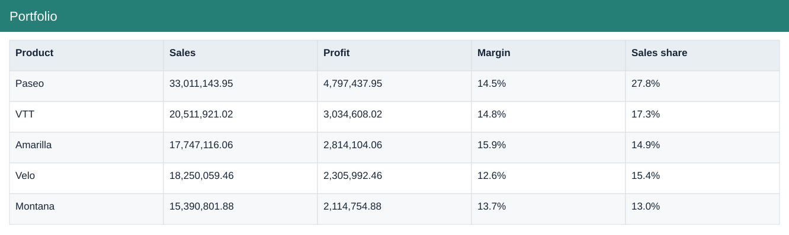

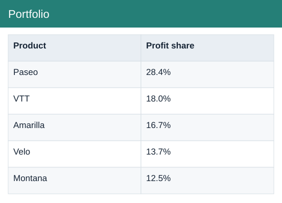

### Fields

| Field | Format | Example |
|---|---|---|
| Product | Text | Paseo |
| Sales | Number (2 decimals) | 33,011,143.95 |
| Profit | Number (2 decimals) | 4,797,437.95 |
| Margin | Percentage | 14.5% |
| Sales share | Percentage | 27.8% |
| Profit share | Percentage | 28.4% |

## Discounts

Discounts: a preview of the figures in the workbook.

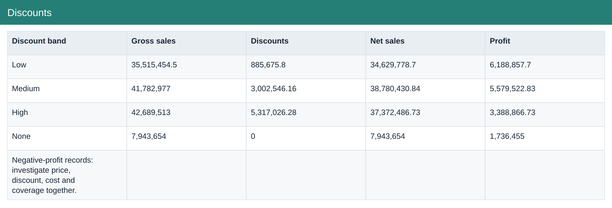

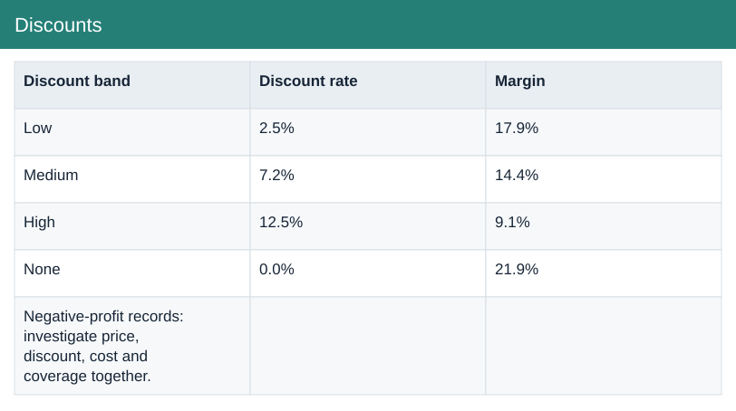

### Fields

| Field | Format | Example |
|---|---|---|
| Discount band | Text | Low |
| Gross sales | Number (2 decimals) | 35,515,454.5 |
| Discounts | Number (2 decimals) | 885,675.8 |
| Net sales | Number (2 decimals) | 34,629,778.7 |
| Profit | Number (2 decimals) | 6,188,857.7 |
| Discount rate | Percentage | 2.5% |
| Margin | Percentage | 17.9% |

## Growth

Growth: a preview of the figures in the workbook.

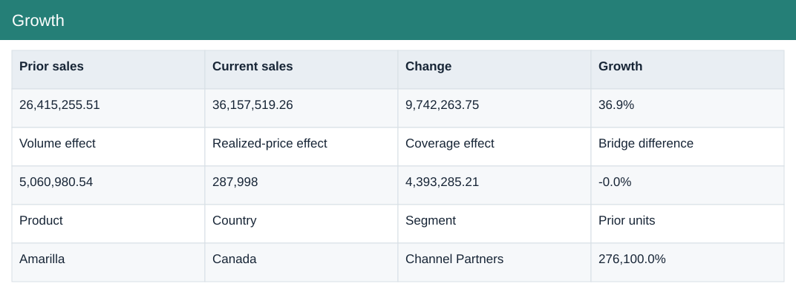

### Fields

| Field | Format | Example |
|---|---|---|
| Prior sales | Number (2 decimals) | 26,415,255.51 |
| Current sales | Number (2 decimals) | 36,157,519.26 |
| Change | Number (2 decimals) | 9,742,263.75 |
| Growth | Percentage | 36.9% |

## Policy test

Policy test: a preview of the figures in the workbook.

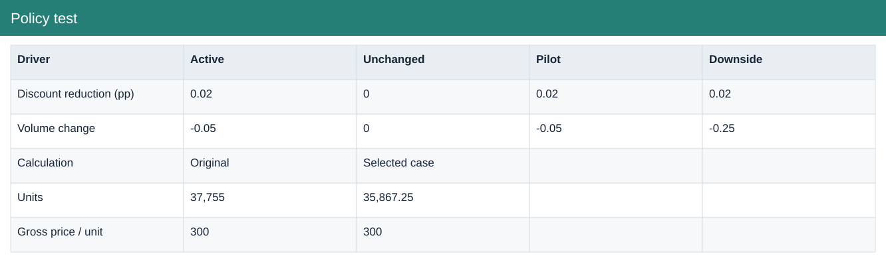

### Fields

| Field | Format | Example |
|---|---|---|
| Driver | Text | Discount reduction (pp) |
| Active | Number (2 decimals) | 0.02 |
| Unchanged | Whole number | 0 |
| Pilot | Number (2 decimals) | 0.02 |
| Downside | Number (2 decimals) | 0.02 |

## Review

Review: a preview of the figures in the workbook.

### Fields

| Field | Format | Example |
|---|---|---|
| Metric | Text | Sales |
| Q4 2013 | Number (2 decimals) | 21,931,255.48 |
| Q4 2014 | Number (2 decimals) | 29,758,822.02 |
| Change | Number (2 decimals) | 7,827,566.54 |

## Sales records

Source: a preview of the figures in the workbook.

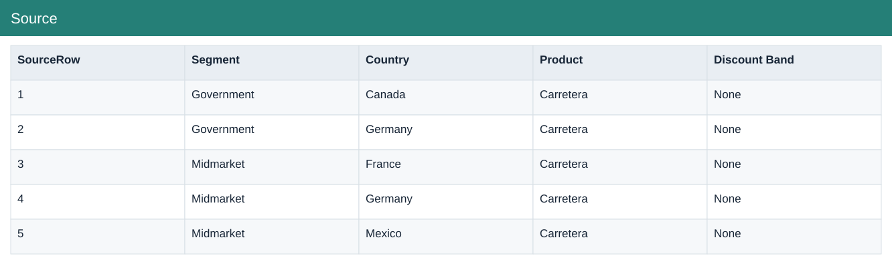

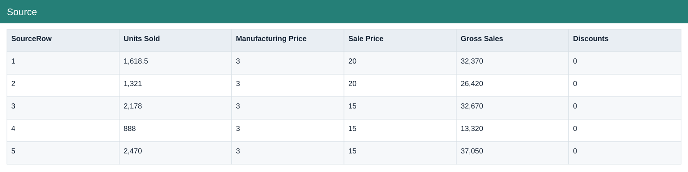

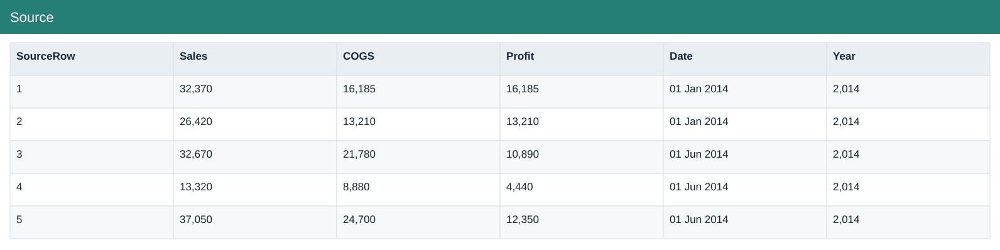

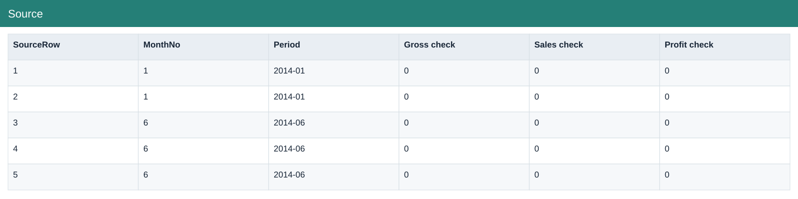

### Fields

| Field | Format | Example |
|---|---|---|
| SourceRow | Whole number | 1 |
| Segment | Text | Government |
| Country | Text | Canada |
| Product | Text | Carretera |
| Discount Band | Text | None |
| Units Sold | Number (2 decimals) | 1,618.5 |
| Manufacturing Price | Whole number | 3 |
| Sale Price | Whole number | 20 |
| Gross Sales | Whole number | 32,370 |
| Discounts | Whole number | 0 |
| Sales | Whole number | 32,370 |
| COGS | Whole number | 16,185 |
| Profit | Whole number | 16,185 |
| Date | Date | 01 Jan 2014 |
| Year | Whole number | 2,014 |
| MonthNo | Whole number | 1 |
| Period | Text | 2014-01 |
| Gross check | Whole number | 0 |
| Sales check | Whole number | 0 |
| Profit check | Whole number | 0 |

## Refresh

Refresh: a preview of the figures in the workbook.

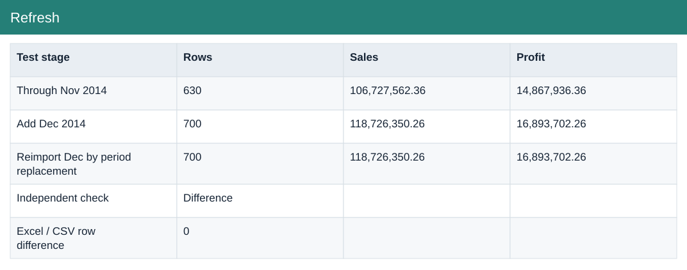

### Fields

| Field | Format | Example |
|---|---|---|
| Test stage | Text | Through Nov 2014 |
| Rows | Whole number | 630 |
| Sales | Number (2 decimals) | 106,727,562.36 |
| Profit | Number (2 decimals) | 14,867,936.36 |

