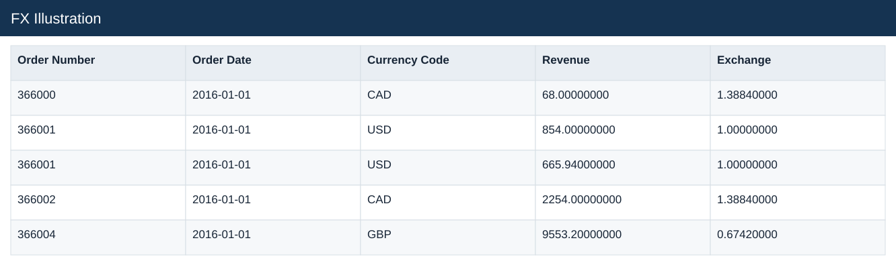
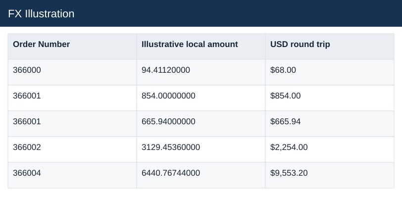

# FX Illustration

[Download data](<../outputs/E7_FX_Illustration.csv>) · [Back to data](../README.md)

## FX Illustration

Analyse valid delivery times and illustrate exchange-rate treatment.

### Fields

| Field | Meaning | Format | Example |
|---|---|---|---|
| Order Number | Order identifier; one order can contain several sales lines. | Number | 366000 |
| Order Date | — | Text | 2016-01-01 |
| Currency Code | — | Text | CAD |
| Revenue | Estimated sales: quantity × static product unit price. | Number | 68.00000000 |
| Exchange | Source exchange-rate factor; preserve the documented direction. | Number | 1.38840000 |
| Illustrative local amount | — | Number | 94.41120000 |
| USD round trip | Illustrative local amount converted back to USD as a check. | US dollars | $68.00 |

