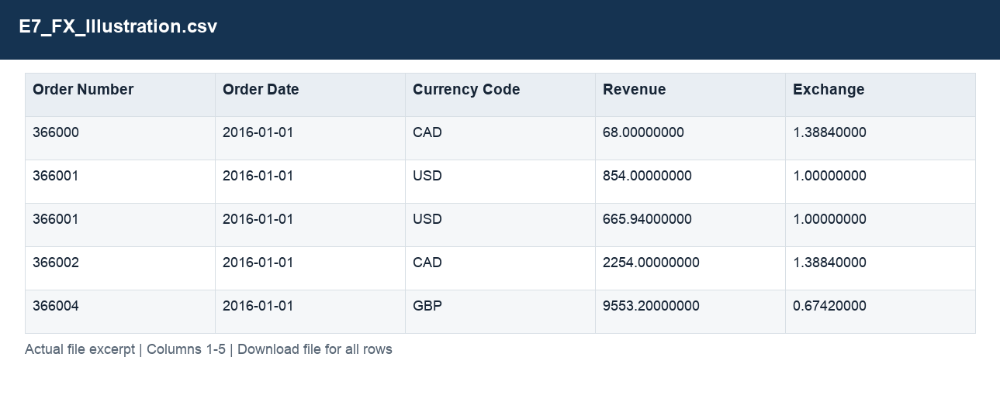
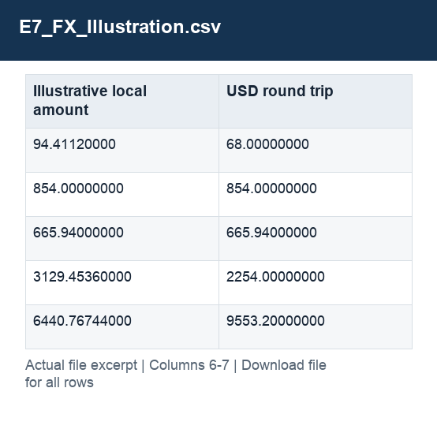

# E7_FX_Illustration.csv

[Download the complete file](../outputs/E7_FX_Illustration.csv) · [Back to data guide](../README.md)

**Purpose:** Analyse valid delivery times and illustrate exchange-rate treatment.

**Rows:** 10. **Fields:** 7. CSV files store text; the type rules below describe how to interpret the values during import. The images render the actual first five records, with wide tables split into consecutive column panels. They are data excerpts, not screenshots of the Excel application.

## Fields and formats

| Field | Meaning / use | Import and display | Example |
|---|---|---|---|
| Order Number | Order identifier; one order can contain several sales lines. | Identifier; preserve as text, including leading zeros | 366000 |
| Order Date | Field retained under its source/output label; interpret with the table purpose and displayed example. | Date / period; parse stated order, display YYYY-MM-DD or YYYY-MM | 2016-01-01 |
| Currency Code | Grouping, filter or comparison label for currency code. | Identifier; preserve as text, including leading zeros | CAD |
| Revenue | Estimated sales: quantity × static product unit price. | Numeric; preserve full precision, display amount with 2 decimals where applicable | 68.00000000 |
| Exchange | Source exchange-rate factor; preserve the documented direction. | Numeric; preserve full precision, display amount with 2 decimals where applicable | 1.38840000 |
| Illustrative local amount | Field retained under its source/output label; interpret with the table purpose and displayed example. | Numeric; preserve full precision, display amount with 2 decimals where applicable | 94.41120000 |
| USD round trip | Illustrative local amount converted back to USD as a check. | Numeric; preserve full precision, display amount with 2 decimals where applicable | 68.00000000 |
