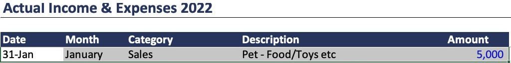
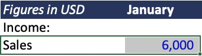

# 1 — Match January Sales

[← Back to 1](../../README.md#b1) · [Download the original Excel file](../../raw_data/Budget_vs_Actuals_Original.xlsx)

## 1. Actual: $5,000

The Actual sheet shows **January → Sales → 5,000**.

[View the full Excel screenshot](images/Actual_Excel_Clean.png) · Excel cells: **Actual!B14:F14**.

## 2. Budget: $6,000

The Budget sheet shows **January → Sales → 6,000**.

[View the full Excel screenshot](images/Budget_Excel_Clean.png) · Excel cells: **Budget!B4:C6**.

## Why they can be compared

**Same month. Same category. Same currency (USD).**

Actual **$5,000** − Budget **$6,000** = **−$1,000**. January Sales is **$1,000 below budget**.

For the full analysis, use January–May from both files. Add up actual transactions for each month and category before comparing them with the monthly budget.

The images above are cropped from Microsoft Excel screenshots. [Download the analysis workbook](../worksheets/Pets_More_1_Analysis.xlsx).
