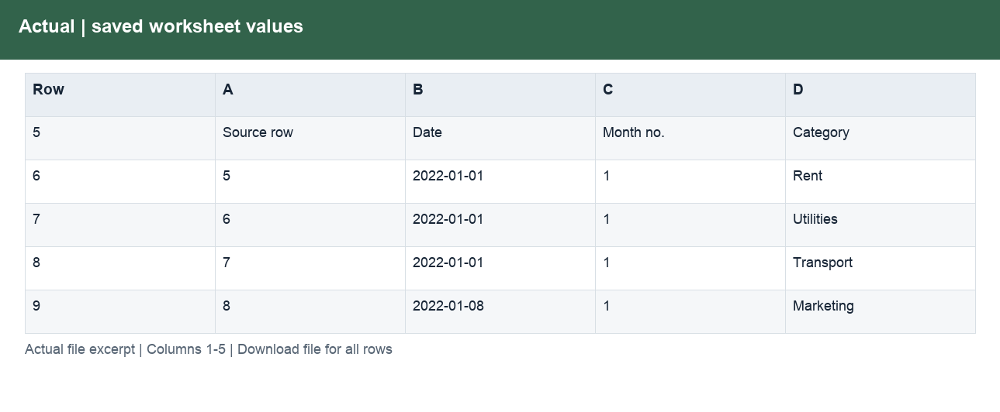

# B1_Analysis.xlsx

[Download workbook](../worksheets/B1_Analysis.xlsx) · [Back to data guide](../README.md)

This page renders saved cell values from the actual workbook. Excel workbooks mix schedules, assumptions and tables, so formats are documented by worksheet and column rather than treating the whole file as one dataset. No calculations or source cells were changed for these illustrations.

## B1

Provide a prepared table for consistent joins, filtering and analysis.

| Column | Labels / sample content | Stored type and Excel number format |
|---|---|---|
| A | B1  /  Data map and classification; Check; Transaction count | str; General |
| B | Source control; 2022-01-01 to 2022-05-28; Jan–Dec 2022 | int, str; 0.00; General |
| C | Prepared result | int, str; 0.00; General |
| D | Difference | int, str; 0.00; General |

Column labels may change between sections lower in the worksheet. Download the workbook to follow those schedules and formulas; the illustration shows only the opening populated section.

## Actual

Provide a prepared table for consistent joins, filtering and analysis.

| Column | Labels / sample content | Stored type and Excel number format |
|---|---|---|
| A | Actual transactions  /  USD; Source: Budget_vs_Actuals_Original.xlsx (2022); original retained; USD; Source row | int, str; General |
| B | Date | datetime, str; General; yyyy-mm-dd |
| C | Month no. | int, str; General |
| D | Category; Rent; Utilities | str; General |
| E | Type; Expense; Expense | str; General |
| F | Description; Store space shared with Mall co-renter; Higher month than usual | str; General |
| G | Amount USD | int, str; #,##0.00;(#,##0.00);"—"; General |
| H | Identical rows | int, str; General |
| I | Month valid | bool, str; General |
| J | Category; Sales; Services | str; General |
| K | Type; Income; Income | str; General |

Column labels may change between sections lower in the worksheet. Download the workbook to follow those schedules and formulas; the illustration shows only the opening populated section.

## Budget

Provide a prepared table for consistent joins, filtering and analysis.

| Column | Labels / sample content | Stored type and Excel number format |
|---|---|---|
| A | Budget by month and category  /  USD; Source: Budget_vs_Actuals_Original.xlsx (2022); original retained; USD; Month no. | int, str; General |
| B | Category; Sales; Sales | str; General |
| C | Type; Income; Income | str; General |
| D | Budget USD | float, int, str; #,##0.00;(#,##0.00);"—"; General |

Column labels may change between sections lower in the worksheet. Download the workbook to follow those schedules and formulas; the illustration shows only the opening populated section.

