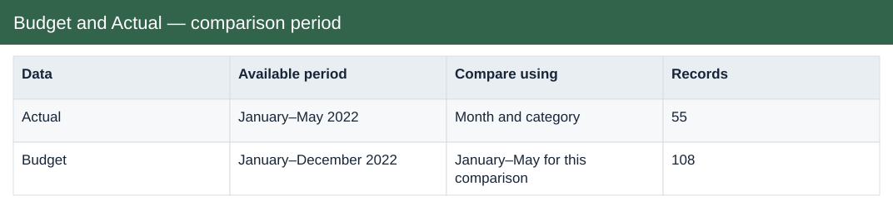
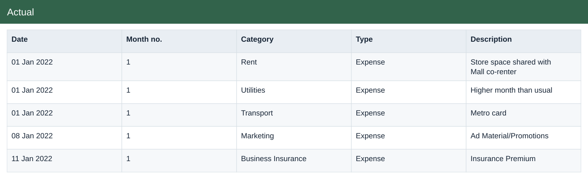

# Budget and Actual

[Download Excel file](<../worksheets/B1_Analysis.xlsx>) · [Back to data](../README.md)

## Budget and Actual — comparison period

Yes. Compare January–May 2022 by month and category. The annual budget has 108 category-month entries; only the 45 entries for January–May belong in this comparison.

## Actual

Actual income and expenses recorded by date and category.

### Fields

| Field | Format | Example |
|---|---|---|
| Date | Date | 01 Jan 2022 |
| Category | Text | Rent |
| Type | Text | Expense |
| Description | Text | Store space shared with Mall co-renter |
| Amount USD | US dollars | $7,000.00 |

## Budget

Planned income and expenses by month and category.

### Fields

| Field | Format | Example |
|---|---|---|
| Month no. | Whole number | 1 |
| Category | Text | Sales |
| Type | Text | Income |
| Budget USD | US dollars | $6,000.00 |

