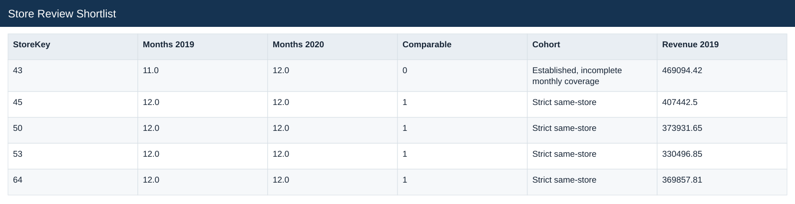
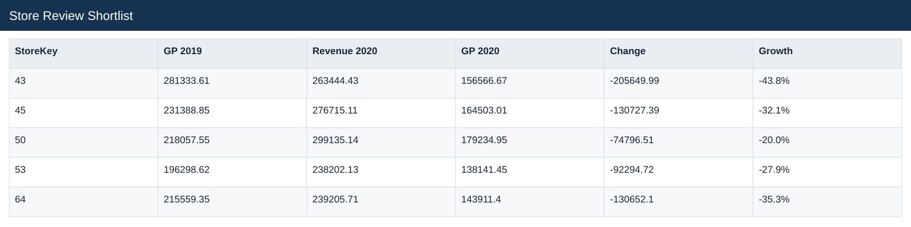
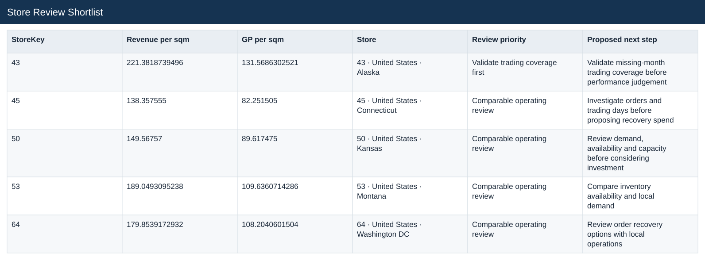

# Store Review Shortlist

[Download data](<../outputs/E9_Store_Review_Shortlist.csv>) · [Back to data](../README.md)

## Store Review Shortlist

Prioritise stores for business review.

### Fields

| Field | Meaning | Format | Example |
|---|---|---|---|
| StoreKey | — | Number | 43 |
| Store Country | — | Text | United States |
| Store State | — | Text | Alaska |
| Square Meters | — | Number | 1190.0 |
| Open Date | — | Text | 2015-01-01T00:00:00.000 |
| Months 2019 | — | Number | 11.0 |
| Months 2020 | — | Number | 12.0 |
| Comparable | Flag for the strict comparable-store criteria. | Number | 0 |
| Cohort | — | Text | Established, incomplete monthly coverage |
| Revenue 2019 | — | Number | 469094.42 |
| GP 2019 | — | Number | 281333.61 |
| Revenue 2020 | — | Number | 263444.43 |
| GP 2020 | — | Number | 156566.67 |
| Change | — | Number | -205649.99 |
| Growth | Current comparable sales divided by prior sales, less one. | Percentage | -43.8% |
| Revenue per sqm | — | Number | 221.3818739496 |
| GP per sqm | — | Number | 131.5686302521 |
| Store | — | Text | 43 · United States · Alaska |
| Review priority | — | Text | Validate trading coverage first |
| Proposed next step | — | Text | Validate missing-month trading coverage before performance judgement |

