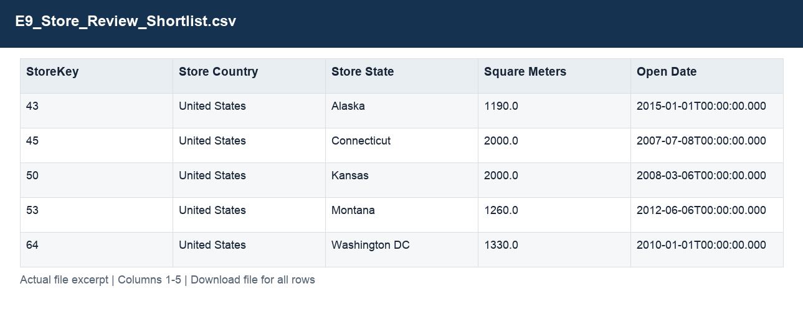
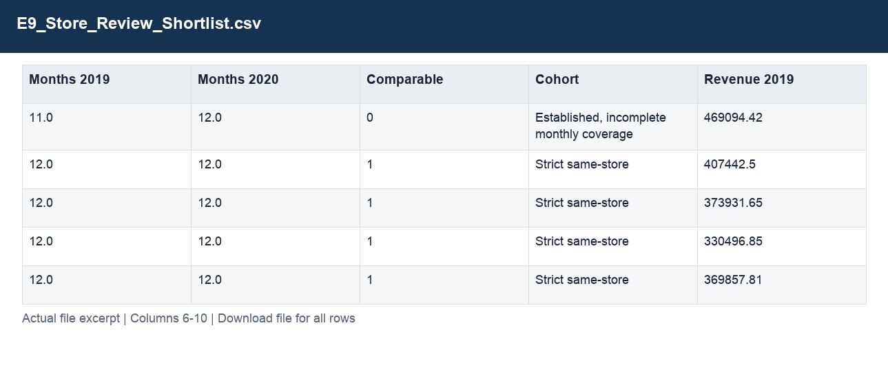
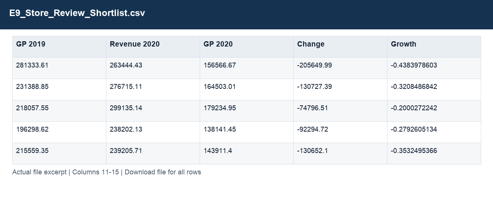
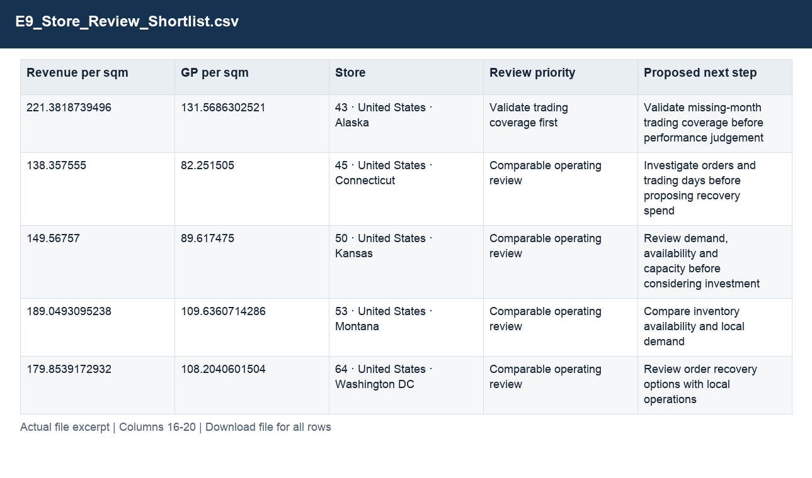

# E9_Store_Review_Shortlist.csv

[Download the complete file](../outputs/E9_Store_Review_Shortlist.csv) · [Back to data guide](../README.md)

**Purpose:** Prioritise stores for business review.

**Rows:** 5. **Fields:** 20. CSV files store text; the type rules below describe how to interpret the values during import. The images render the actual first five records, with wide tables split into consecutive column panels. They are data excerpts, not screenshots of the Excel application.

## Fields and formats

| Field | Meaning / use | Import and display | Example |
|---|---|---|---|
| StoreKey | Join key for the corresponding dimension; retain source values. | Identifier; preserve as text, including leading zeros | 43 |
| Store Country | Field retained under its source/output label; interpret with the table purpose and displayed example. | Text / categorical label; preserve spelling and blanks | United States |
| Store State | Field retained under its source/output label; interpret with the table purpose and displayed example. | Text / categorical label; preserve spelling and blanks | Alaska |
| Square Meters | Field retained under its source/output label; interpret with the table purpose and displayed example. | Numeric; counts as whole numbers, units/durations retain needed decimals | 1190.0 |
| Open Date | Field retained under its source/output label; interpret with the table purpose and displayed example. | Date / period; parse stated order, display YYYY-MM-DD or YYYY-MM | 2015-01-01T00:00:00.000 |
| Months 2019 | Field retained under its source/output label; interpret with the table purpose and displayed example. | Numeric; preserve full precision, display amount with 2 decimals where applicable | 11.0 |
| Months 2020 | Field retained under its source/output label; interpret with the table purpose and displayed example. | Numeric; preserve full precision, display amount with 2 decimals where applicable | 12.0 |
| Comparable | Flag for the strict comparable-store criteria. | Numeric; preserve full precision, display amount with 2 decimals where applicable | 0 |
| Cohort | Grouping, filter or comparison label for cohort. | Text / categorical label; preserve spelling and blanks | Established, incomplete monthly coverage |
| Revenue 2019 | Field retained under its source/output label; interpret with the table purpose and displayed example. | Numeric; preserve full precision, display amount with 2 decimals where applicable | 469094.42 |
| GP 2019 | Field retained under its source/output label; interpret with the table purpose and displayed example. | Numeric; preserve full precision, display amount with 2 decimals where applicable | 281333.61 |
| Revenue 2020 | Field retained under its source/output label; interpret with the table purpose and displayed example. | Numeric; preserve full precision, display amount with 2 decimals where applicable | 263444.43 |
| GP 2020 | Field retained under its source/output label; interpret with the table purpose and displayed example. | Numeric; preserve full precision, display amount with 2 decimals where applicable | 156566.67 |
| Change | Field retained under its source/output label; interpret with the table purpose and displayed example. | Numeric; preserve full precision, display amount with 2 decimals where applicable | -205649.99 |
| Growth | Current comparable sales divided by prior sales, less one. | Decimal ratio; display as 0.0% (0.10 = 10%) | -0.4383978603 |
| Revenue per sqm | Field retained under its source/output label; interpret with the table purpose and displayed example. | Numeric; preserve full precision, display amount with 2 decimals where applicable | 221.3818739496 |
| GP per sqm | Field retained under its source/output label; interpret with the table purpose and displayed example. | Numeric; preserve full precision, display amount with 2 decimals where applicable | 131.5686302521 |
| Store | Grouping, filter or comparison label for store. | Text / categorical label; preserve spelling and blanks | 43 · United States · Alaska |
| Review priority | Field retained under its source/output label; interpret with the table purpose and displayed example. | Text / categorical label; preserve spelling and blanks | Validate trading coverage first |
| Proposed next step | Field retained under its source/output label; interpret with the table purpose and displayed example. | Text / categorical label; preserve spelling and blanks | Validate missing-month trading coverage before performance judgement |
