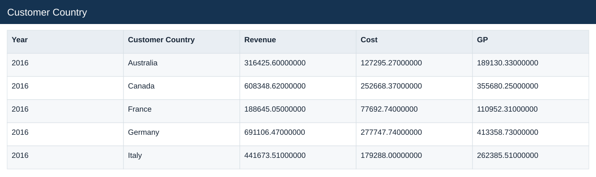
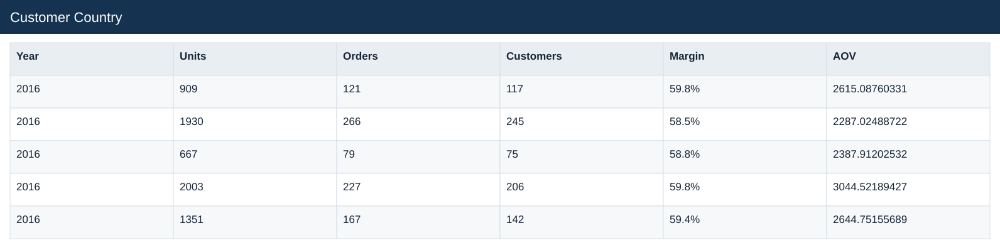
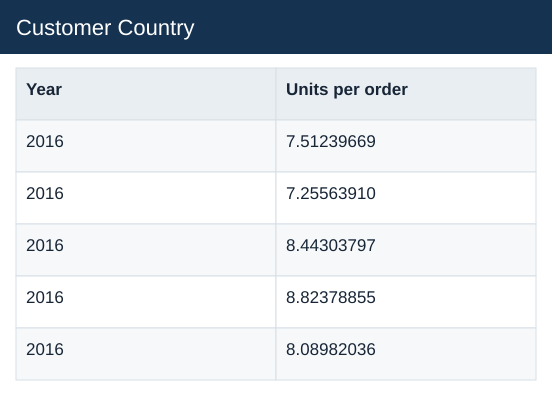

# Customer Country

[Download data](<../outputs/E4_Customer_Country.csv>) · [Back to data](../README.md)

## Customer Country

Compare product, store and market contributions.

### Fields

| Field | Meaning | Format | Example |
|---|---|---|---|
| Year | Calendar year. | Number | 2016 |
| Customer Country | — | Text | Australia |
| Revenue | Estimated sales: quantity × static product unit price. | Number | 316425.60000000 |
| Cost | Quantity × unit product cost. | Number | 127295.27000000 |
| GP | Estimated gross profit: revenue less cost. | Number | 189130.33000000 |
| Units | — | Number | 909 |
| Orders | — | Number | 121 |
| Customers | — | Number | 117 |
| Margin | Aggregate profit divided by aggregate sales. | Percentage | 59.8% |
| AOV | Revenue divided by distinct orders. | Number | 2615.08760331 |
| Units per order | Total units divided by distinct orders. | Number | 7.51239669 |

