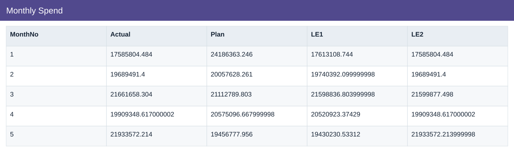
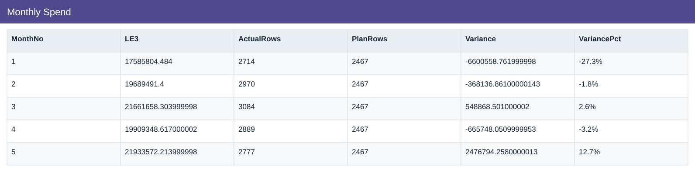
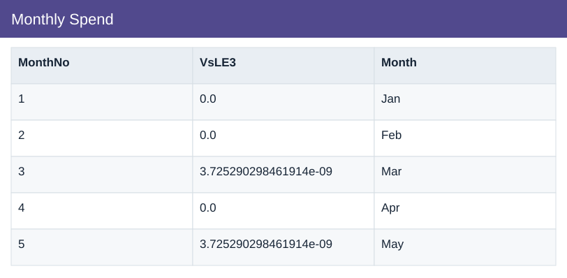

# Monthly Spend

[Download data](<../outputs/I2_Monthly_Spend.csv>) · [Back to data](../README.md)

## Monthly Spend

Measure spend against plan by month.

### Fields

| Field | Meaning | Format | Example |
|---|---|---|---|
| MonthNo | Month number used for chronological sorting. | Number | 1 |
| Actual | Actual scenario amount. | Number | 17585804.484 |
| Plan | Planned scenario amount. | Number | 24186363.246 |
| LE1 | Latest estimate version 1. | Number | 17613108.744 |
| LE2 | Latest estimate version 2. | Number | 17585804.484 |
| LE3 | Latest estimate version 3. | Number | 17585804.484 |
| ActualRows | — | Number | 2714 |
| PlanRows | — | Number | 2467 |
| Variance | Actual less Plan. Positive IT cost variance means over plan. | Number | -6600558.761999998 |
| VariancePct | Variance divided by positive Plan; non-positive plans have no ordinary percentage. | Percentage | -27.3% |
| VsLE3 | Actual less LE3. | Number | 0.0 |
| Month | Month label or month-start key. | Text | Jan |

