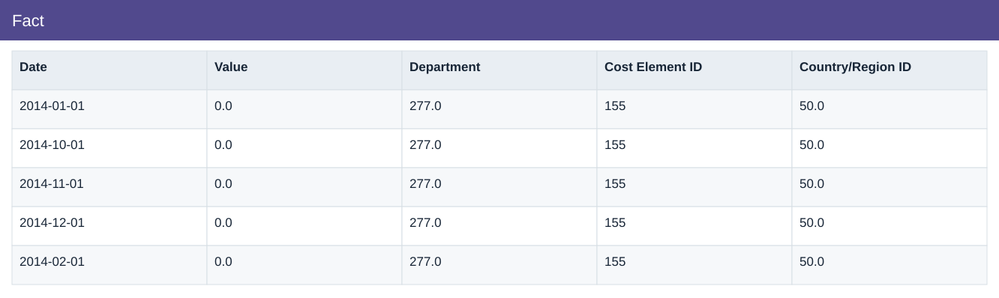
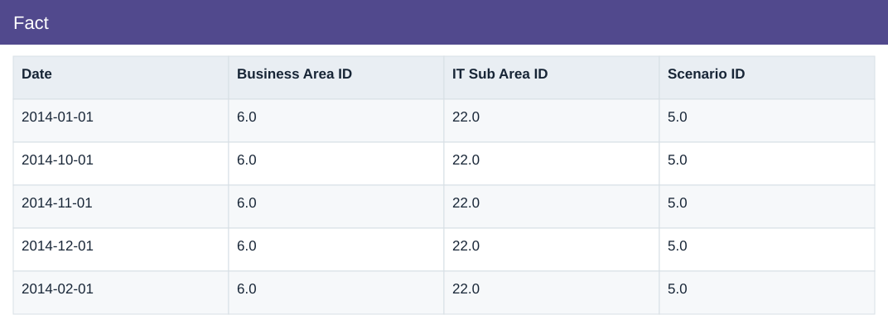

# Fact

[Download data](<../prepared_inputs/I1_Extracted_Data/Fact.csv>) · [Back to data](../README.md)

## Fact

View the budget, actual amounts and calculations.

### Fields

| Field | Meaning | Format | Example |
|---|---|---|---|
| Date | — | Text | 2014-01-01 |
| Value | Unscaled source-model value; reporting amount = Value × 0.3. | Number | 0.0 |
| Department | — | Number | 277.0 |
| Cost Element ID | — | Number | 155 |
| Country/Region ID | — | Number | 50.0 |
| Business Area ID | — | Number | 6.0 |
| IT Sub Area ID | — | Number | 22.0 |
| Scenario ID | — | Number | 5.0 |

