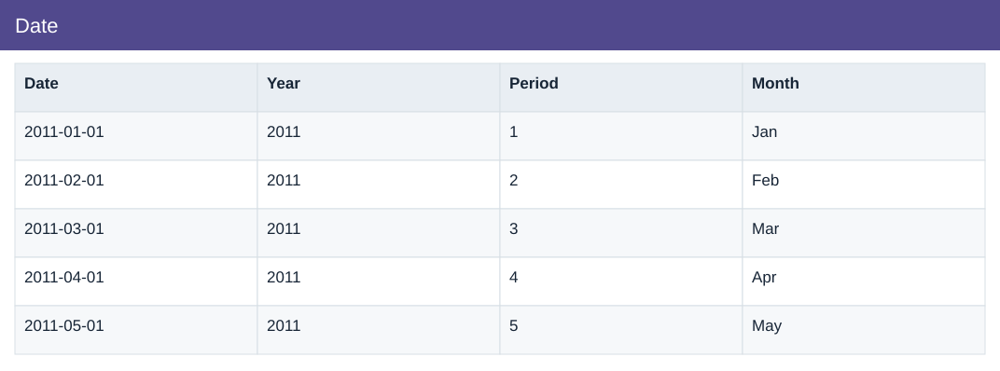

# Date

[Download data](<../prepared_inputs/I1_Extracted_Data/Date.csv>) · [Back to data](../README.md)

## Date

View the budget, actual amounts and calculations.

### Fields

| Field | Meaning | Format | Example |
|---|---|---|---|
| Date | — | Text | 2011-01-01 |
| Year | Calendar year. | Number | 2011 |
| Period | — | Number | 1 |
| Month | Month label or month-start key. | Text | Jan |

