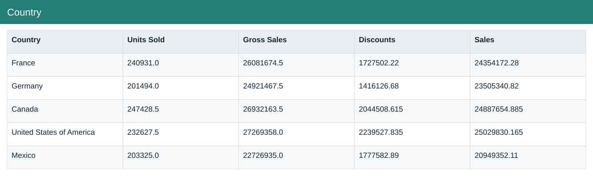
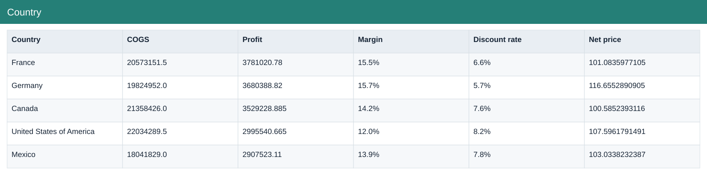

# Country

[Download data](<../outputs/F3-F4_Country.csv>) · [Back to data](../README.md)

## Country

Compare product, country and segment economics.

### Fields

| Field | Meaning | Format | Example |
|---|---|---|---|
| Country | — | Text | France |
| Units Sold | Sample units sold; fractional values are preserved. | Number | 240931.0 |
| Gross Sales | Units sold × sale price, before discounts. | Number | 26081674.5 |
| Discounts | Discount amount deducted from gross sales. | Number | 1727502.22 |
| Sales | Net sales after discounts. | Number | 24354172.28 |
| COGS | Cost of goods sold from the source sample. | Number | 20573151.5 |
| Profit | Sales less COGS; not full company net profit. | Number | 3781020.78 |
| Margin | Aggregate profit divided by aggregate sales. | Percentage | 15.5% |
| Discount rate | Total discounts divided by total gross sales. | Percentage | 6.6% |
| Net price | Net sales divided by units sold. | Number | 101.0835977105 |

