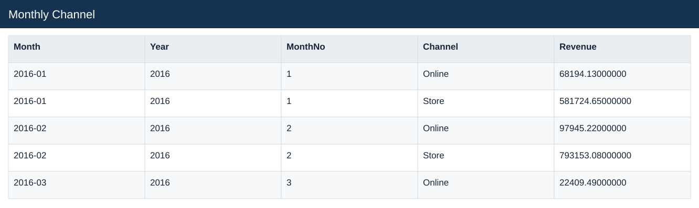
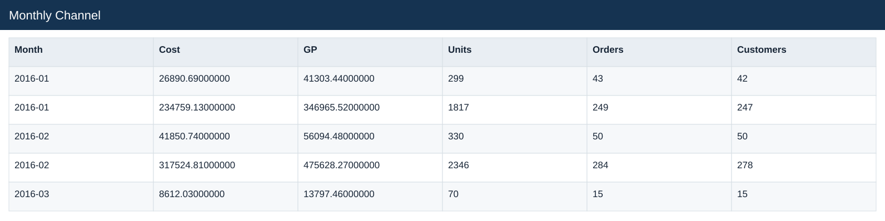
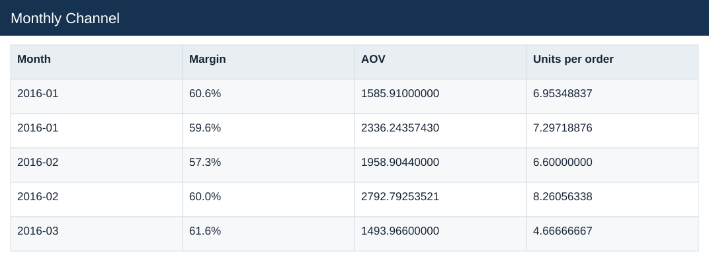

# Monthly Channel

[Download data](<../outputs/E3_Monthly_Channel.csv>) · [Back to data](../README.md)

## Monthly Channel

Explain order and channel performance over time.

### Fields

| Field | Meaning | Format | Example |
|---|---|---|---|
| Month | Month label or month-start key. | Text | 2016-01 |
| Year | Calendar year. | Number | 2016 |
| MonthNo | Month number used for chronological sorting. | Number | 1 |
| Channel | — | Text | Online |
| Revenue | Estimated sales: quantity × static product unit price. | Number | 68194.13000000 |
| Cost | Quantity × unit product cost. | Number | 26890.69000000 |
| GP | Estimated gross profit: revenue less cost. | Number | 41303.44000000 |
| Units | — | Number | 299 |
| Orders | — | Number | 43 |
| Customers | — | Number | 42 |
| Margin | Aggregate profit divided by aggregate sales. | Percentage | 60.6% |
| AOV | Revenue divided by distinct orders. | Number | 1585.91000000 |
| Units per order | Total units divided by distinct orders. | Number | 6.95348837 |

