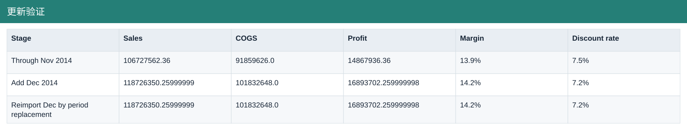

# 更新验证

[Download data](<../outputs/F10_更新验证.csv>) · [Back to data](../README.md)

## 更新验证

Validate repeatable monthly inputs without double-counting.

### Fields

| Field | Meaning | Format | Example |
|---|---|---|---|
| Stage | — | Text | Through Nov 2014 |
| Rows | — | Number | 630 |
| Units Sold | Sample units sold; fractional values are preserved. | Number | 1023470.0 |
| Gross Sales | Units sold × sale price, before discounts. | Number | 115423330.5 |
| Discounts | Discount amount deducted from gross sales. | Number | 8695768.14 |
| Sales | Net sales after discounts. | Number | 106727562.36 |
| COGS | Cost of goods sold from the source sample. | Number | 91859626.0 |
| Profit | Sales less COGS; not full company net profit. | Number | 14867936.36 |
| Margin | Aggregate profit divided by aggregate sales. | Percentage | 13.9% |
| Discount rate | Total discounts divided by total gross sales. | Percentage | 7.5% |

