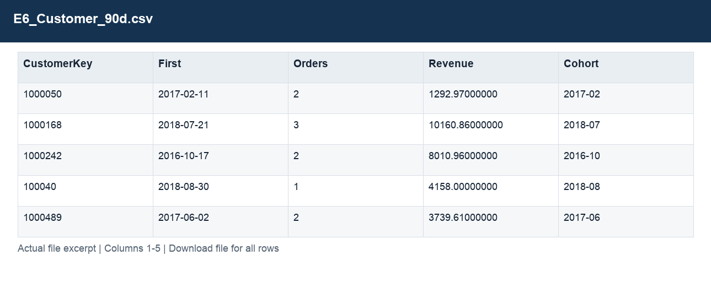
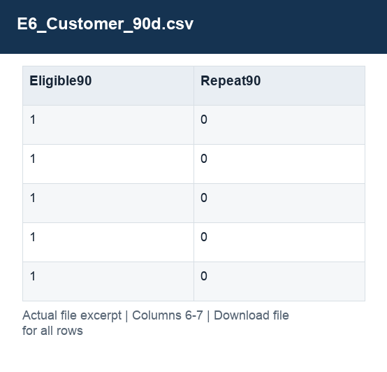

# E6_Customer_90d.csv

[Download the complete file](../outputs/E6_Customer_90d.csv) · [Back to data guide](../README.md)

**Purpose:** Measure repeat purchasing with complete observation windows.

**Rows:** 11,887. **Fields:** 7. CSV files store text; the type rules below describe how to interpret the values during import. The images render the actual first five records, with wide tables split into consecutive column panels. They are data excerpts, not screenshots of the Excel application.

## Fields and formats

| Field | Meaning / use | Import and display | Example |
|---|---|---|---|
| CustomerKey | Join key for the corresponding dimension; retain source values. | Identifier; preserve as text, including leading zeros | 1000050 |
| First | First observed purchase date. | Date / period; parse stated order, display YYYY-MM-DD or YYYY-MM | 2017-02-11 |
| Orders | Field retained under its source/output label; interpret with the table purpose and displayed example. | Numeric; counts as whole numbers, units/durations retain needed decimals | 2 |
| Revenue | Estimated sales: quantity × static product unit price. | Numeric; preserve full precision, display amount with 2 decimals where applicable | 1292.97000000 |
| Cohort | Grouping, filter or comparison label for cohort. | Date / period; parse stated order, display YYYY-MM-DD or YYYY-MM | 2017-02 |
| Eligible90 | Has a complete 90-day observation window after first purchase. | Numeric; preserve full precision, display amount with 2 decimals where applicable | 1 |
| Repeat90 | Repeat purchase within the defined 90-day window. | Numeric; preserve full precision, display amount with 2 decimals where applicable | 0 |
