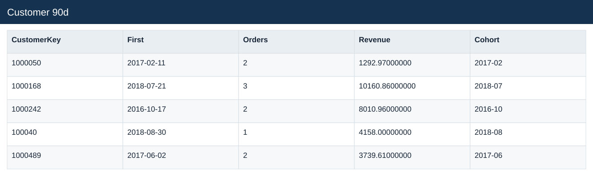
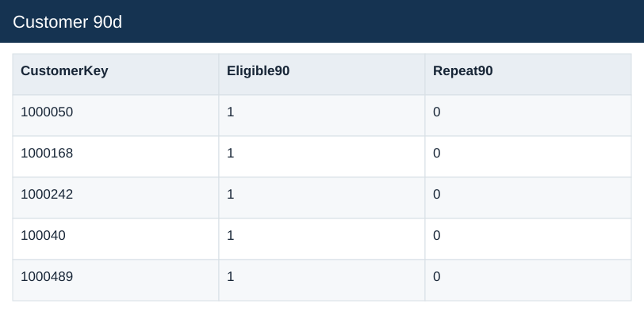

# Customer 90d

[Download data](<../outputs/E6_Customer_90d.csv>) · [Back to data](../README.md)

## Customer 90d

Measure repeat purchasing with complete observation windows.

### Fields

| Field | Meaning | Format | Example |
|---|---|---|---|
| CustomerKey | — | Number | 1000050 |
| First | First observed purchase date. | Text | 2017-02-11 |
| Orders | — | Number | 2 |
| Revenue | Estimated sales: quantity × static product unit price. | Number | 1292.97000000 |
| Cohort | — | Text | 2017-02 |
| Eligible90 | Has a complete 90-day observation window after first purchase. | Number | 1 |
| Repeat90 | Repeat purchase within the defined 90-day window. | Number | 0 |

