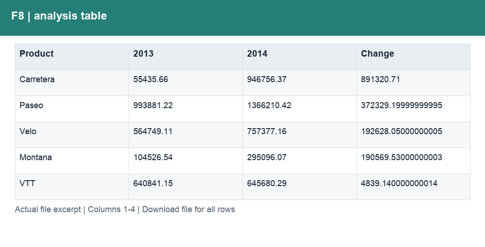

# F8_Q4_产品利润贡献.csv

[Download the complete file](../outputs/F8_Q4_产品利润贡献.csv) · [Back to data guide](../README.md)

**Purpose:** Explain quarterly profit contributions.

**Rows:** 6. **Fields:** 4. CSV files store text; the type rules below describe how to interpret the values during import. The images render the actual first five records, with wide tables split into consecutive column panels. They are data excerpts, not screenshots of the Excel application.

## Fields and formats

| Field | Meaning / use | Import and display | Example |
|---|---|---|---|
| Product | Grouping, filter or comparison label for product. | Text / categorical label; preserve spelling and blanks | Carretera |
| 2013 | Field retained under its source/output label; interpret with the table purpose and displayed example. | Numeric; preserve full precision, display amount with 2 decimals where applicable | 55435.66 |
| 2014 | Field retained under its source/output label; interpret with the table purpose and displayed example. | Numeric; preserve full precision, display amount with 2 decimals where applicable | 946756.37 |
| Change | Field retained under its source/output label; interpret with the table purpose and displayed example. | Numeric; preserve full precision, display amount with 2 decimals where applicable | 891320.71 |
