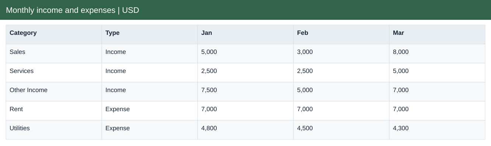
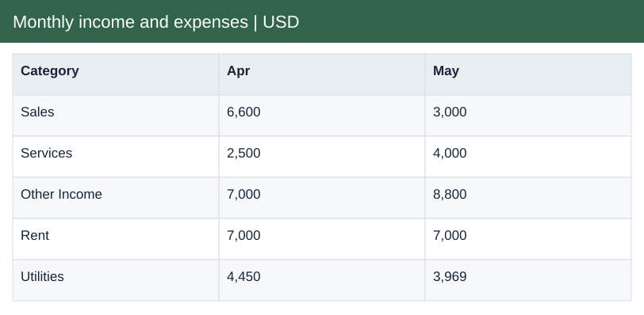

# Monthly income and expenses | USD

[Download Excel file](<../worksheets/B2_Analysis.xlsx>) · [Back to data](../README.md)

## Monthly income and expenses | USD

Monthly income and expenses | USD: a preview of the figures in the workbook.

### Fields

| Field | Format | Example |
|---|---|---|
| Category | Text | Sales |
| Type | Text | Income |
| Jan | Whole number | 5,000 |
| Feb | Whole number | 3,000 |
| Mar | Whole number | 8,000 |
| Apr | Whole number | 6,600 |
| May | Whole number | 3,000 |

## Actual

Actual income and expenses recorded by date and category.

### Fields

| Field | Format | Example |
|---|---|---|
| Date | Date | 01 Jan 2022 |
| Month no. | Whole number | 1 |
| Category | Text | Rent |
| Type | Text | Expense |
| Description | Text | Store space shared with Mall co-renter |
| Amount USD | US dollars | $7,000.00 |

## Budget

Planned income and expenses by month and category.

### Fields

| Field | Format | Example |
|---|---|---|
| Month no. | Whole number | 1 |
| Category | Text | Sales |
| Type | Text | Income |
| Budget USD | US dollars | $6,000.00 |

