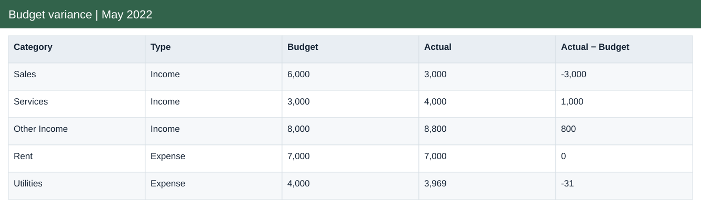
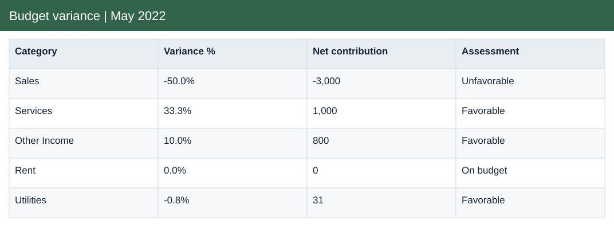

# Budget variance | May 2022

[Download Excel file](<../worksheets/B3_Analysis.xlsx>) · [Back to data](../README.md)

## Budget variance | May 2022

Budget variance | May 2022: a preview of the figures in the workbook.

### Fields

| Field | Format | Example |
|---|---|---|
| Category | Text | Sales |
| Type | Text | Income |
| Budget | Whole number | 6,000 |
| Actual | Whole number | 3,000 |
| Actual − Budget | Whole number | -3,000 |
| Variance % | Percentage | -50.0% |
| Net contribution | Whole number | -3,000 |
| Assessment | Text | Unfavorable |

## Actual

Actual income and expenses recorded by date and category.

### Fields

| Field | Format | Example |
|---|---|---|
| Date | Date | 01 Jan 2022 |
| Month no. | Whole number | 1 |
| Category | Text | Rent |
| Type | Text | Expense |
| Description | Text | Store space shared with Mall co-renter |
| Amount USD | US dollars | $7,000.00 |

## Budget

Planned income and expenses by month and category.

### Fields

| Field | Format | Example |
|---|---|---|
| Month no. | Whole number | 1 |
| Category | Text | Sales |
| Type | Text | Income |
| Budget USD | US dollars | $6,000.00 |

