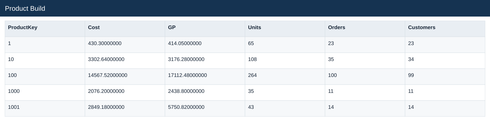
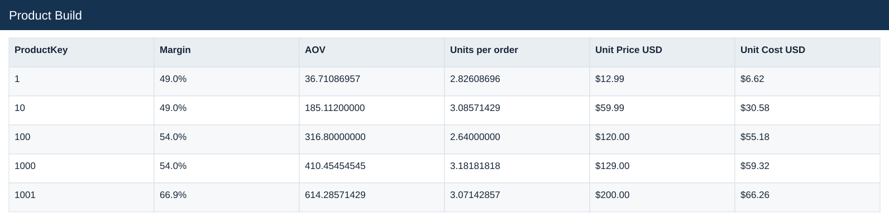

# Product Build

[Download data](<../outputs/E2_Product_Build.csv>) · [Back to data](../README.md)

## Product Build

Calculate sales, costs and gross profit from quantity and product rates.

### Fields

| Field | Meaning | Format | Example |
|---|---|---|---|
| ProductKey | — | Number | 1 |
| Product Name | — | Text | Contoso 512MB MP3 Player E51 Silver |
| Category | — | Text | Audio |
| Brand | — | Text | Contoso |
| Revenue | Estimated sales: quantity × static product unit price. | Number | 844.35000000 |
| Cost | Quantity × unit product cost. | Number | 430.30000000 |
| GP | Estimated gross profit: revenue less cost. | Number | 414.05000000 |
| Units | — | Number | 65 |
| Orders | — | Number | 23 |
| Customers | — | Number | 23 |
| Margin | Aggregate profit divided by aggregate sales. | Percentage | 49.0% |
| AOV | Revenue divided by distinct orders. | Number | 36.71086957 |
| Units per order | Total units divided by distinct orders. | Number | 2.82608696 |
| Unit Price USD | Static product list price in USD. | US dollars | $12.99 |
| Unit Cost USD | Static product unit cost in USD. | US dollars | $6.62 |

