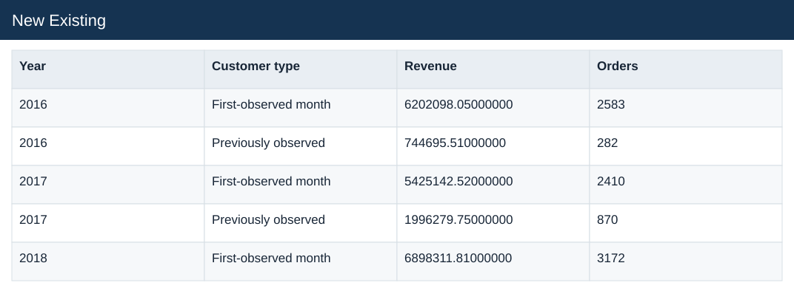

# New Existing

[Download data](<../outputs/E6_New_Existing.csv>) · [Back to data](../README.md)

## New Existing

Measure repeat purchasing with complete observation windows.

### Fields

| Field | Meaning | Format | Example |
|---|---|---|---|
| Year | Calendar year. | Number | 2016 |
| Customer type | New versus existing buyer classification. | Text | First-observed month |
| Revenue | Estimated sales: quantity × static product unit price. | Number | 6202098.05000000 |
| Orders | — | Number | 2583 |

